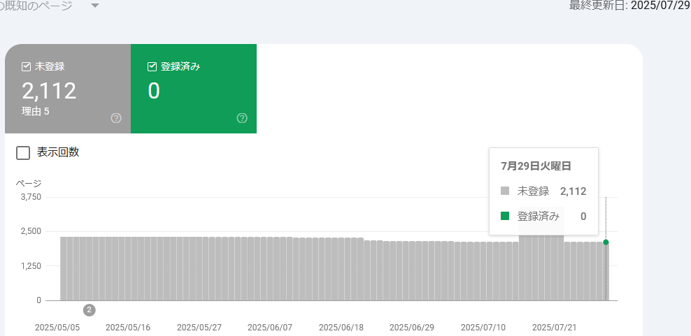

## はじめに

月初なのでこのページの管理をする。

* [Blogサイト管理](https://blog.hirokuma.work/tags/web.html)

## Google Search Console

登録済みの件数は 0件のままだ。

[前回](/2025/07/20250703-web.html)との間違い探しみたいな気持ちになる。  
未登録が30件減ったのかな？

## 最近の状況

日記形式は、毎日書いているときは良かったのだけど、
日が空いてしまうと記憶になくてたどるのが難しい。  
なので、「調査」の方にまとめるのを優先するようにし始めた。

最近はお仕事の都合で Nordic のチップをまったく触ってない。
せっかく SEGGER の JTAGデバッガまで入手したのに。。。  
などと思わなくもないが、優先順位の問題だ。

Rust の勉強しないとね～、と思ってやっていると、なぜか Golang 関係の作業がやってくる。  
今回で 3回目だ。  
まあ Golang もよいのだけど、私のメイン言語である C言語以外となると記憶が抜けやすい。  
それと同じくらい使いこなせている言語がないのがよくないのだけど、なんかもう今さらな気もしている。
親しんでない言語については AI の自動生成にお任せしたいのだが、それはそれで寂しい。  
趣味ならそれでも良いかもしれんが、書いたコードには責任を持たんといかんしね。
