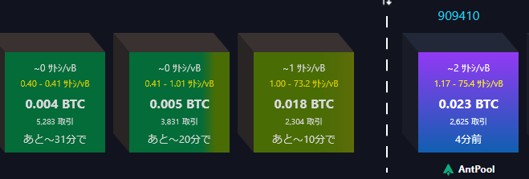

こちらは先ほど撮影した[mempool.space](https://mempool.space/)のスクリーンショットの一部である。

おわかりになるだろうか？  
...という書き方があるようだが、すまん、よく知らん。

fee rate が 1 sats/vbyte を下回っているということを言いたいのだ。

もう1枚。

fee rate の平均で、トランザクションサイズを下回らないというルールであれば 1 sats/vbyte 未満になることはないのだ。
そうなっているということは 1 sats/vbyte 未満のトランザクションが mempool(mempool.spaceじゃなくて)に載ることが許されているということになる。

Peter Todd がそういうトランザクションを紹介していたのでなんとなく覚えていたのだが、調べていなかった。  
そういう変更が Bitcoin Core に行われたという話は私は知らない。  
まあ、私の情報収集はあまり確かでないのだけど、それでも誰からか教えて・・・くれないかも。
友達少ないしね、ふふふ。

* [ChatGPTに訊ねた](https://chatgpt.com/share/68988818-1ae0-8010-ac50-0addd4197e30)

Bitcoin Core の `minRelayTxFee`がデフォルト値で 1000 sats/Kbyte だったし、悪い値じゃないってことでそのままだったのが、
昨今のトランザクション不足(?)によりマイナーが運用するノードが`minRelayTxFee`を下げ(少なくとも受け入れる方を下げた)、
より広くトランザクションを拾おうとしているというところだそうだ。

`minRelayTxFee` はコンセンサスルールではないので外部からは見えない。
mempool.space のグラフに載るので、少なくとも mempool.space はそうしているのだろう。

## 今のところ

まあ、sats 的には減るかもしれないが、対fiat の価格が上がっているのでそれでもよいという判断なのだろう。

Bitcoinではマイナーが持つ影響力は大きい。  
PoW系は少なくともそうだろう。

自分でノード運用していて、手数料が 1 sats/vbyte 未満なんて嫌だと思えば `minRelayTxFee` を今のままで運用すれば良いだけである。
ただ、マイナーのノードに直接トランザクションが展開されるようであれば関係がないだけだ。

手数料を自分で制御して世の中にもそれを受け入れさせたければ、自分が持つ影響力、つまりマイニング力を強くするしかない。
そして「こういうトランザクションは承認されないんだ」ということになれば、自然とそうなっていくだろう。

これが「検閲」である。  
Bitcoinはプロトコル的には検閲できないのだが、マイニング力が影響力に直結する世界なので経済力や地理的な力、あとは政治力が効きやすいような効きにくいような、そんな感じがある。
Bitcoin自体は単なるプロトコルなので、地理や政治が出てくると「うへぇ」と思ってしまう。  

オレンジや牛肉の自由化だとか、スーパー301条とか、昔はいろいろあったし、これからもいろいろあるだろう。  
ソフトウェアは暗号の輸出がされるようになったから、あまり考えなくてよくなったように思う。
私はその時代ではなかったので詳しいことは知らん。
