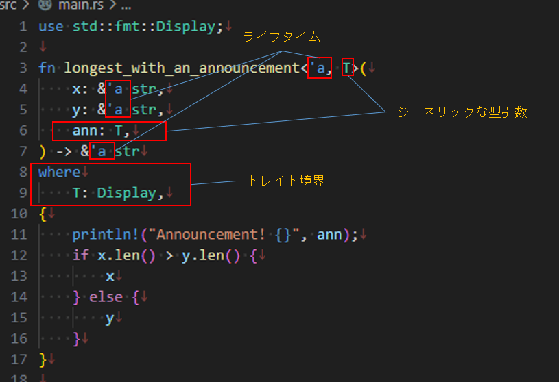

## 10章の最後

まとめのところだが、記憶に残っていない。。。

[ジェネリックな型引数、トレイト境界、ライフタイムを一度に](https://doc.rust-jp.rs/book-ja/ch10-03-lifetime-syntax.html#%E3%82%B8%E3%82%A7%E3%83%8D%E3%83%AA%E3%83%83%E3%82%AF%E3%81%AA%E5%9E%8B%E5%BC%95%E6%95%B0%E3%83%88%E3%83%AC%E3%82%A4%E3%83%88%E5%A2%83%E7%95%8C%E3%83%A9%E3%82%A4%E3%83%95%E3%82%BF%E3%82%A4%E3%83%A0%E3%82%92%E4%B8%80%E5%BA%A6%E3%81%AB)

この3つをまとめた章で説明するところが Rust の言語的な特徴を表しているのかもしれない。

もう記憶から抜けているので再履修しているところだが、「トレイト」がわかりづらい。  
「他の言語のインターフェースに似ている」という注釈がありがたい。
インターフェースというと、だいたいオブジェクト指向がどうのこうのという説明があるものだけど、あまりここでは触れていないように見えた。  
トレイトを説明するためにはジェネリックのことを先に話しておかないとなあ、ああ書き方に近いものがあるしライフタイムもその流れで説明しておくか、という感じだろうか。  
3つとも記載する箇所がコード本体ではなくシグネイチャとかそういう部分なのも特徴的かもしれない。

こういうのを覚えるのが面倒だとは思ってしまうのだが、C言語はこの辺が実装者任せになっているがために苦労することからすると、
記述での制約によってコンパイラがチェックできる箇所を増やすという方向性になるのか。

## トレイト境界、か

しかし・・・"トレイト境界"が何を指しているのかよくわからない。  
[過去の私](https://blog.hirokuma.work/2025/04/20250414-rst.html#%E3%83%88%E3%83%AC%E3%82%A4%E3%83%88%E5%A2%83%E7%95%8C)もやはり同じことを気にしている。

私としては `interface` という名称にしてほしかった。
どうせどの言語でも `interface` の内容は違っているのだから「ああ Rust の `interface` はこういう感じね」と割り切ったんじゃないかなあ。どうかなあ。

まあ、仮定の話をしても仕方ない。
