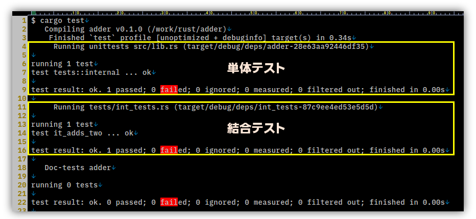

まだ前回から1週間も経っていないのに、何を書いたか覚えていないし、トレイト境界って結局何だったっけ？という感じだ。  
ただ、振り返ってもまた忘れるし、気にせず先に進もう。

## 11.1

`cargo new adder --lib` でプロジェクトを作るのだが、最初から `add()` という関数とそのテスト関数がある。  
プロジェクト名から読み取って自動生成したの？？すごい！！と思ったのだけど、他のプロジェクト名で作っても同じ中身だった。  
トリックの一端を垣間見た気分でしたわ。

`assert_eq!()` 系でありがたいのは、どっちが expected なのかじゃなくて left か right になっているところだ。  
どうにも覚えられないのよね。。。  
メッセージを出す方も「期待しているのは xx なのに yy でした」と出力したいなら順番は決めないといけないのでわかるんだけど、
左辺と右辺が違いました、くらいでいいんじゃないのとも思ってしまうのだ。

`assert_eq!()` 系は値を出力するので `#[derive(PartialEq, Debug)]` ができないといけない。  
面倒だったら `assert!()` を使えばよいので、まあ気分次第かな。  
しょっちゅう出力したいなら実装しておくのがよいだろうし。

`Result<T, E>` を返すパターンは、[panicってそんなに書くものなの？](https://doc.rust-jp.rs/book-ja/ch09-03-to-panic-or-not-to-panic.html)というところだろう。  
致命的な場合は使うようで、ここは golang とは違うところだろう。
まあ golang も panic を書いたらいかんというわけじゃないし、人それぞれか。

ここの例に載っている書き方だけだったら普通に assert などを使えばよさそうだが、[? 演算子が使えるようになる](https://doc.rust-jp.rs/rust-by-example-ja/testing/unit_testing.html#%E3%83%86%E3%82%B9%E3%83%88%E3%81%A8)というのがポイントか。  
`?` はテストではなく `Result<T, E>` に関するもので、エラーが起きたらすぐに return するようだ。  
おそらく、正常に終わるテストコードを書いているのだけど、テスト対象が元々 `Result<T, E>` を返す関数になっていれば assert などを書かずに済む、ということだと思う。  
他の使い方が分かったら追記しよう。

## 11.2

基本的なテストの書き方と動かし方が分かったので、ここではテストの動かし方をもう少し詳しく説明している。

まあ・・・ここは「そういうのがあるよ」くらいでいいか。。。  
vscode 使えば単独のテストは実行できるし、テストに時間がかかりすぎるようなコードを自分で書くのはまだ先になりそうだし、
テストを並行して動かすかどうかもまだ先になるだろう。  
あれだ、`make` を並列でやっていいんだっけどうだったっけ、みたいなものか？ いや、違うな・・・。  
単体テストではあまり良くないやり方だけど、順番に設定しながら進めるようなテストを書いたりするかもしれない。  
あるいは、通信やファイルなどのリソースを使うテストだと並列で動かすことで競合して失敗することもありうる。

ともかく、後回し！  
そういう制御もできるということだけ覚えておこう。

## 11.3

この章の最後はテストの種類というかタイプというか、タイトルに従うなら体系について。

テストをコードで書くと、以下のようなことができる。

* 関数レベルでテストする「単体テスト」
* ある程度の実用レベルでテストする「結合テスト」

それ以上となると、テスト書を書いて手順を書いてアプリレベルでテストするような「システムテスト」「運用テスト」みたいなものになるのかな？ 
細かい区分や名称は業界や会社によって違ったりするので、まあ深くは考えまい。
同じところでずっとやっていると、案外と自分たちがやっているのは他でも同じと思い込んでしまいがちなのよねぇ(反省)。

テストモジュールの頭に書いている `#[cfg(test)]` は `test` という configuration だそうだ。  
これは `cargo test` で動かすことができる。  
ならば `#[cfg(mogomogo)]` を `cargo mogomogo` で動かすことができるのでは？ と思ったがそうではなかった。  
`test` などを condition name と呼ぶそうで決まっているみたい。`test` は[これ](https://doc.rust-lang.org/reference/conditional-compilation.html#r-cfg.test)かな？

プライベート関数もテストできる。  
C/C++ はマクロを使ったりして強引にできる。jest はやりづらいね。  
私は、比較的プライベート関数もテストする方だと思う。
これは C言語を主に使っていてテストしやすいということもあるし、
割り込みハンドラとかだいたいプライベート関数だったし。  
まあ、その善し悪しは私が考えたいことではないのだ。

結合テストは `tests/` ディレクトリ、しかも `src/` と同じ高さに作ってそこに置くそうだ。  
そして `extern crate xxx` で `adder` パッケージを参照する。`use` ではないんだ。  
テスト関数も `#[cfg(test)]` を必要としない。
これは、単体テスト用にバイナリを作るのではないので `#[cfg(test)]` は含めないということだろう。  
実行ログでも 2つに分かれている。

「`tests/` 内の各ファイルは個別のクレートとしてコンパイルされる」という言葉の意味は、
`tests/` 直下の Rust ファイルはそれぞれテストするファイルとして実行されるといういうことらしい。  
共通する処理を置きたかったら `tests/` にディレクトリを作って `mod.rs` に書きなさい、と。
ディレクトリは `common/` でなくてもよさそうだった。

ここでは library クレートだったのでやりやすかったけど、binary クレートだったらそうはいかん。  
なので、binary クレートはライブラリを呼び出すだけの簡単な作りにして、メインのロジックは全部ライブラリに置くのがよいそうだ。
ライブラリとして使いそうにないのに分かれているプロジェクトがあったけど、そういうことなんだろうね。

## 終わりに

11章は日記 1回分で終わらせることができた。
しくみの話だから、そこまで重たくなかった。
