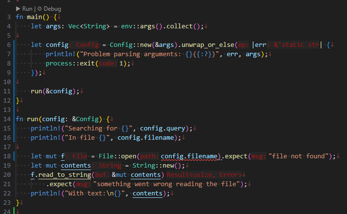

## 12章

簡単な grep コマンドを作る。  
こういう実習はいいものだ。

ただ、課題になっていて他にもやっている人が多いからか、AI がほぼテキストそのままの内容を提案してくる。  
TABキーを押すだけで済ましてしまうとなにやってるんだって気持ちになるので、なるべく頼らないようにしよう。

### 12.1

特になし。

### 12.2

`f.read_to_string()` のために `use` してもらおうと vscode に頼んだら、`std::io::prelude::*` ではなく `std::io::Read` になった。  
どちらでも動く。  
vscode で関数ジャンプすると同じ実装を指していたので、本体は同じだ。

[prelude.rs](https://doc.rust-lang.org/src/std/io/prelude.rs.html) は有効な行だとこれだけだ。

```rust
#![stable(feature = "rust1", since = "1.0.0")]
#[stable(feature = "rust1", since = "1.0.0")]
pub use super::{BufRead, Read, Seek, Write};
```

`stable()` はまだ知らないから見ぬふりをすると、`use` で 4つ import しているだけだ。  
(import は変か？ でも include ではない。"using `use` to bring items" と書いてあったので bring？ 素直に use？)  
「ファイル入出力を含む入出力処理をするのに有用なトレイトを色々含んでいます」という文章そのままだな。

なんとなく `f` は `mut` がつかないイメージだったのだが、外すと `f.read_to_string()` でエラーになる。  
`read_to_string(&mut self, buf: &mut String)` なので `f` も `contents` も `mut` がないとエラーになるのだ。
`mut` がない構造体は C でいうところの `const *` みたいに思っていたのだが、read して seek 位置が変わるのも変化には違いないので `mut` がいるという考えをすれば良いかな。

### 12.3

文章の「4番目は、異なるエラーを処理するのに `expect` を繰り返し使用しているので～」がよくわからない。  
引数が足りないのと `expect` は関係があるのだろうか。
単に `args` のサイズを確認すればよいし、ここでもそうやっている。  
`Config` にまとめているけど `expect` とは関係ないしなあ。

文字列を `clone()` してライフタイムを元の変数から切り離す、というのは確かに抵抗がある。。。  
そう思う人がいるからそういう解説を書いているのだろう。  
まあ、後の章で他の手段も教えてくれるそうなので手段の1つとして覚えておこう。
それに私も組み込みではないソフトウェア開発に慣れるべきなのだ。

#### 所有権の再履修

最後に `main()` から `run()` を呼ぶように変更している。  
ここは `&config` でいいんじゃないのかとやってみたが、`File::open()` でエラーになる。
"cannot move out of `config.filename` which is behind a shared reference" だそうだ。  
これ以降使わないから `config` の所有権を `run()` に渡しても良いのだけど、`&config` ではなぜダメなのか理解しておきたい。

`run(config)` とした場合、`config` の所有権は `main()` から `run()` 側の変数に移る。  
`main()` ではそれ以降に `config` を扱おうとしても所有権がないのでエラーになる。

`run(&config)` になると、`main()` が持つ `config` を `run()` が借用したことになる。  
そうすると `File::open()` のところでエラーになっている。



引数の `config.filename` は `&` を付けていないので、こちらはこちらで所有権が `File::open()` に移ろうとする。
しかし `config` が借り物なので所有権を移動させることができない。  
`Copy` トレイトを持つ型であればコピーされたらしいが `String` 型は `Copy` トレイトを持たない。  
よってエラーになる、ということらしい。  
ただ、`File::open()` の引数は参照でもよいそうなので(Gemini Code Assist)、`File::open(&config.filename)` とすればよい。

どっちでもよいというのはどういう実装なんだろう？  
シグネイチャは `fn open<P: AsRef<Path>>(path: P)` となっている。  
`Path` は構造体で、中に `inner: OsStr` を持つ。   
`AsRef<>` はトレイトでこうなっていた。

```rust
pub trait AsRef<T: PointeeSized>: PointeeSized {
    /// Converts this type into a shared reference of the (usually inferred) input type.
    #[stable(feature = "rust1", since = "1.0.0")]
    fn as_ref(&self) -> &T;
}
```

`T` が `Path` だから、`&Path` を返そうとしている？  
試しに `str` を `AsRef<>` で囲んだらどっちでも受け入れられた。

```rust
fn test_print<T: AsRef<str>>(text: T) {
    println!("{}", text.as_ref());
}

fn main() {
    let text = "hello";
    test_print(&text);
    test_print(text);
}
```

ちょっとまだ私には早いようだ。

#### closure

エラーの処理でクロージャというものが出てきた。  
クロージャ。囲い込み。。。産業革命。。。ではない(それはエンクロージャ)。  
関数の内側に関数を作り、内側の関数が外側の関数で定義されたローカル変数を参照できる、ということらしい。  
グローバル変数ではないので、外側の関数が呼ばれるたびにそれぞれ別のメモリになる。  
ローカル変数だし、やっぱりスタックメモリを使うのかな？　だとするとスタックメモリが潤沢な環境じゃないとつらいな。
クロージャだと分かったら別のメモリに配置するのかもしれないが、よくわからんな。

C/C++ にはないと思ったが [C++11にはある](https://ja.wikipedia.org/wiki/%E3%82%AF%E3%83%AD%E3%83%BC%E3%82%B8%E3%83%A3#C++)そうだ。  
説明文が「ラムダ式」として説明されている。
JavaScript のアロー関数みたいにその場で変数みたいに関数を定義すること？ 
そういった無名関数を実装として書き表すこと自体か、その書き表したものを「ラムダ式」と呼ぶのだと思う。  
変数とか関数とか、そういうのと同じ立ち位置の用語だと思っておこう。  
こういう、最近の(でもないと思うが)言語仕様が出てくると身構えてしまうのだ。よくないね。

内側の関数が外側の関数より先に終了するなら、あまり難しいことは考えなくてもよさそう。
1つの関数で書くと嫌なので分けたいけど、分けた方の関数名を考えるのがめんどくさい、くらいの気持ちで使ってよさそうに思う。  
ただ、役立つのは常駐、しかも複数が常駐するような処理だろう。
クロージャなしで実装しようと思えばできるけど、実行するたびにヒープメモリを用意して、値を移して、など考えずに実装できるのは楽だろう。
最近の言語は実装者が楽をできることが多く、それは実装効率にもつながるし、実装が減る分バグも減るしで、内容を理解した上で積極的に使った方がよいだろう。

そういう点では、C言語は書いたものがほぼそのまま実装される言語は、その素直さゆえに生き残ると思う。
特に組み込み環境だと意図しない実装が入り込むのを心配しないといけないから、
C++ も "struct ってデフォルトコンストラクタが作られるんだっけ？"とか心配するのが面倒で使うのを避けてしまう(私はね)。

いかんいかん、自分がどうプログラミング言語と向き合うべきかなんてことを考えてしまった。  
ここでは `Config::new()` が `Err` 型の値返したときは else として括弧の中に書いた関数が実行され、外側の `Err` 型を `err` という名前で扱う、というところがクロージャになる。
クロージャの中では `err` はもちろんだが `args` なども扱える。

### 12.4

11章で説明されたテストを組み込みつつ、実装も進めていく。

組み込み業界はねー、開発スタートでハードウェアが新規の場合、ハードウェアの動作確認用のソフトを作ったりするのよね。
工場の都合もあるのでウォーターフォールできっちり後ろを決めがちなのだけど、ソフトウェアはそういうのもあって結構つらいものがあった。
テスト期間が圧迫されたり。
冬に暖房が効かない深夜までテストをし続けた嫌な記憶が甦る。。。
今はそういう時代じゃなくなったことを期待したいものだ。

テストと実装を両方進めるというのは精神的によいと思う。
コンパイルできたからといって正しく動くわけでもないので、いちいち確認したいのだ。  
言語のシステムに含まれていると、C言語みたいに「どうやってテストしようか」と悩まなくて済む。

「失敗するテスト」というのは、わざと失敗するようにテストを書くのではなく、
まだ中身を実装してないので今のところ失敗するけど最終的には成功になるテストを書くのだ。  
あえて言うなら、中身を書かないと失敗するテストにするということか。
文字数を返す関数に対して、仮実装で取りあえずゼロを返すようにしているときに、テストで空文字列を与えると成功してしまうので、
そうならないようなテストにする。  
Rust だからどうのこうのというところではなく、普通にテストドリブンなやり方でやっていけばよい。

どうしようもないのだけど、`search()` でループして配列を作り、それを `run()` に戻してまたループで出力するというところに無駄を感じてしまう。  
そう、たぶんこういうところなのだ、私が直さねばならないところは。  
ただまあ、これは私の昔からの怠惰でもある。
メモリのサイズ見積がうまくできないので、とにかく削減しようとしてしまうのだ。
お金の使い方が下手で自由に使えないのと同じだ。

### 12.5

環境変数なので `export` しておくと反応してしまう。  
値が `1` だろうと `0` だろうと、設定があるかどうかだけしか見ていないので、これは仕方ない。

sensitive かどうかを `CASE_INSENSITIVE` で決め、内部では `case_sensitive` を使うというのはなかなか悩ましいところだ。  
「もっともよく通るルートを `if` の最初の条件にする」(そうしないと else などを通ることが多くなって結果として遅くなる)、という観点からすると
デフォルトは環境変数を設定しない=大文字小文字区別あり、なので `case_sensitive` が最初の条件になるのは望ましい。  
ただまあ、間違えやすいんじゃないかと気になっただけだ。

### 12.6

`e` が付くと標準エラー出力になるというのは楽で良いね。

## おわりに

ギリギリ、一日で 12章を終わらせることができた。
