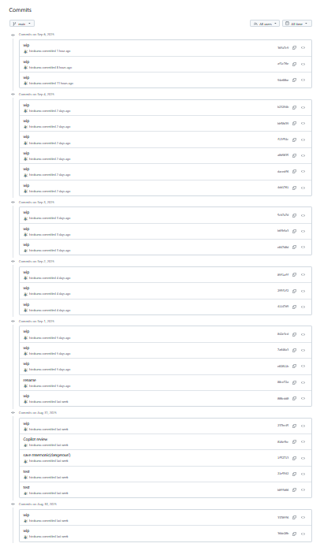
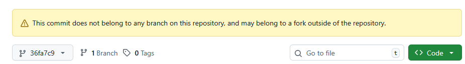

このブログでは、ときどき GitHub のリンクでコードの紹介をすることがある。  
`main` や `master` のブランチでの URL だと変更されることが多いので commit-id での URL をなるべく使っている。

いま、個人で開発している[リポジトリ](https://github.com/hirokuma/wally-sample-keypath) がある。  
設計も何もせずに実装しているので、コードの修正は多いし、ファイル名やディレクトリの構成すらもしばしば変わる。  
今のところ 27件 commit している。

`main` ブランチになっているが、GitHub の手順がそうだったからそうしただけで、まだちゃんと動かないので `devel` の方が良かったと思う。
いや、GitHub のせいにしてはいけないのだけどね。

GitHub の commit 履歴は、意味がある履歴がよいと思う。  
何を「意味がある」とするかはそれぞれで、誰が更新したかに重きを置くとか、更新周期に重きを置くとか、判断基準があるだろう。

私の場合は、とりあえず今は PC が死んでしまうと困るので変更したら push しているというくらいだ。
記録に残したいというものはまったく無いのでコメントも適当だ。

何もないところから始めるなら、first commit は最低限のファイルだけにして、それ以降は各人がブランチを作って作業していくだろう。  
GitHub ならそこから pull request をするだろう。そうでない環境でも似たようなしくみがあるなら使うだろうし、
なければ管理者的な人に直接連絡してマージ依頼するのだろう。

そういった話はよいとしよう。  
今はまだ `main` ブランチに push だけしている状況だ。  
これを rebase して squash までして全部まとめてしまったらどうなるのだろう？  
もちろん `main` ブランチは残るのでよいが、それまで commit していたものも commit-id としては残っている。  
残っているが、GitHub サービスとしては無限にストレージがあるわけでもないので、どこかで使わなくなったデータを削除するはずだ。

ブランチがあって履歴を簡単に見ることができるなら削除しにくいだろう。  
では、squash などしてブランチはあるけど履歴がなくなったら？  
今までも commit-id で URL を残したことがあったが、見たときにはそれらが消えていることはなかった。  
しかし長期的に観察したことはなかった。  
27 commits の全部を見るのは面倒なので、そこから 5つくらい URL を残した後に squash してみよう。

* [最初](https://github.com/hirokuma/wally-sample-keypath/tree/36de20b6f27b598b78034fd5121e8a7dbb52bb0d)
* [2025/08/31](https://github.com/hirokuma/wally-sample-keypath/tree/237bc45523402f876f54a537dc012d658554f4c6)
* [2025/09/01](https://github.com/hirokuma/wally-sample-keypath/tree/842e3cd1e4649cd3d773300e4f48405c597ff061)
* [2025/09/02](https://github.com/hirokuma/wally-sample-keypath/tree/89f1aff85a983c2b1bcc53e06ea3d53f5fe15834)
* [2025/09/03](https://github.com/hirokuma/wally-sample-keypath/tree/5cb7a7dad32b4332196e866f0a0ccc7cf3715598)
* [2025/09/04](https://github.com/hirokuma/wally-sample-keypath/tree/b23294b3587ef97ee56e0e00855be01c1efa6eb7)
* [2025/09/05](https://github.com/hirokuma/wally-sample-keypath/tree/36fa7c925314f16e90b7afada221445b86a3c62d)

観測地点が 7つになってしまった。  
まあ、毎日作業して commit して push するとこうなる。

では、rebase で squash して 1つにまとめる！とやってみたが、2 commit になってしまう。
複数なので 2 commits か。  
どうしても 1 commit に縮めたかったらブランチでまとめて切り替えるしかなさそうだ。

まずは 2 commits の状態で push。  
先頭 commit は残っているのでそのままだが、それ以外についてはこんなメッセージが出力される。

まあ属してないしね。  
思い出したときにリンクが残っているか見ることにしよう。