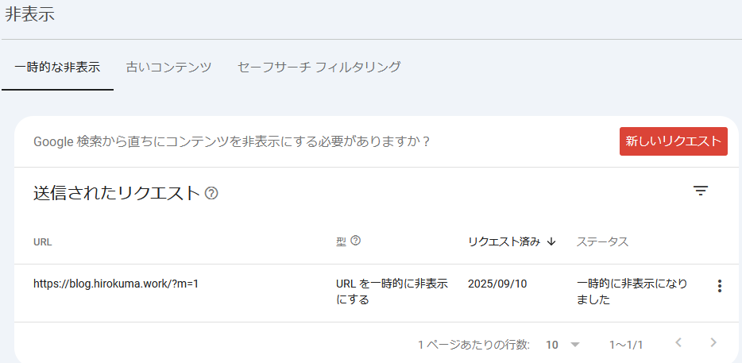
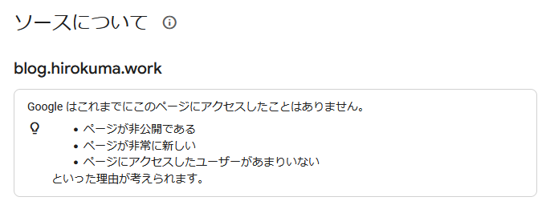
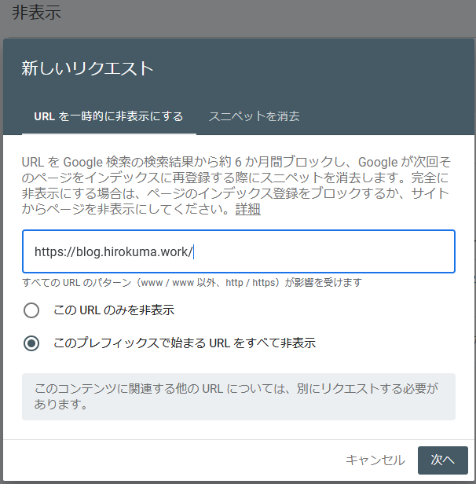

もうどうでもよくなってきたこのページの管理。  
月一で報告しているので続けよう。

## Google Search Console

相変わらず登録済みの件数は 0件だ。

`https://blog.hirokuma.work/?m=1` がエラーになっていたので、
なんだかもう面倒に思いインデックスを「非表示」設定した。  
「代替ページ（適切な canonical タグあり）」って言われてもねぇ。

昔は「削除」だったけど今は「非表示」だ。  

だいたい `?m=1` ってどこから出てきたんだろう？  
おそらくは `blog.hirokuma.work` が Google Blogger の方で使われていたときの名残だ。  
何も考えずに、せっかくドメインを購入したのだからと Blogger の方に設定していて、
GitHub Pages に切り替えるときに「誰も参照してないだろう」と指す先を変更したのだ。  
何か残ってるんじゃないかと思う。

どうせ検索に引っかからないなら、ぜーんぶ非表示にして6ヶ月後になんかしてくれるのを待ってもよさそうだ。

来年の3月半ばには再インデックスが行われてすっきりしているかもしれない(たぶんしてない)。  
がまあ、これくらいしか設定でやれることをやったと言えるものがなさそうだ。よしとしよう。
