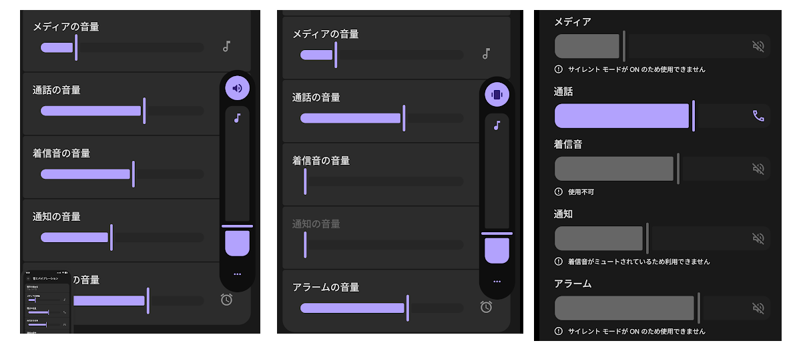

Android 16 の Pixel 6 Pro や Pixel 7a を使っている。

Android だけではないと思うが、バイブレーションを有効にしても着信音や通知音の音量はゼロになるがそれ以外はそのままである。  
「バイブレーション有効」はフィーチャーフォンにあった「マナーモード」という概念と違うので仕方ないと言えば仕方ない。  
サイレントモードにするのが確実そうな気がするのだが、あんまり自信がない。
屋外に行って WiFi 圏外になったときにサイレントモードにしたのだが、WiFi 圏内になってもサイレントモードは解除されなかった。

せっかく Pixel には「ルール」が設定できて WiFi AP のどこにつないだらどうするという設定があるのだが、WiFi につながらなかったらどうするという設定がない。
手動で WiFi をオフにしてもルールが反映されなさそうだけど、されたときもあったりして何だかよくわからない。

あんまり安定しないものを信用してもしょうがないので、適当にアプリでも作ってみようかと調べた。  
たぶん、WiFi が無効なときはメディア音量をゼロにできればよいと思う。アプリの音量ではなく全体の方。  
探せば誰か作っていそうではあるが、たまには自分で作るのも良かろう。

音量の操作にするかサイレントモードの有効・無効にするかは決めていないが、バックグラウンドでネットワークの状態を監視する必要がある。  
フォアグラウンドサービスにして常駐させるのだが、最近はその辺が厳しくなっていて `AndroidManifest.xml` や `startForeground()` でサービスのタイプを指定する必要がある。  
もう Google Play にアップロードできないので困ったときの `DATA_SYNC` にしたのだが、実行すると `FOREGROUND_SERVICE` の権限がいるといってきた。  
いやいや `FOREGROUND_SERVICE_DATA_SYNC` で設定しているじゃないかと思っていたのだが、どうやら `FOREGROUND_SERVICE` もいるっぽい。  
Android Studio(Narwhal 3 Feature Drop) では警告っぽい波線が出てくるのに！

確かに [フォアグラウンド サービスの権限をリクエストする](https://developer.android.com/develop/background-work/services/fgs/declare?hl=ja#request-permissions) にも両方書いてあるのだけどさ。  
両方はいらんやろうと思って違うところをいろいろ調べ回っていたのでがっくりだ。
