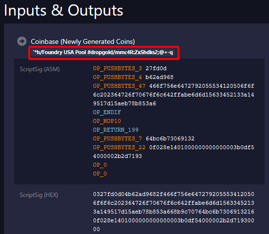

Bitcoin でのブロック承認は Proof-of-Work でがんばって計算して、
ある閾値以下になる値の組み合わせを見つけた人が承認者になり、認められれば報酬をもらえる。

うちでも数年前からブロックの承認に関する勉強ということで自作マイニングアプリを動かしているのだが、まあ成功しない。  
Raspberry Pi 4 で、mainnet 以外に testnet4 のノードも動かしていて、
自宅用に Electrs やら Esplora やら動かしているし、
Windows のファイル共有用に samba も立ててるし、
全然本気度がうかがえないような構成である。

アプリも JavaScript でグリグリ回しているだけで、高速化も何もしていない。
おかげで CPUの温度も上がらないし、たぶん消費電力も低いだろう。  
自作アプリを止めて求めなくてもそんなに変わらないんじゃないかと思ってる。

それはよいのだが、そもそも世の中のマイニングプールはどのくらいのことをしているのか気になった。  
mempool.space に出ていたランキングはこちら。

* [Mining Pools - mempool - Bitcoin Explorer](https://mempool.space/graphs/mining/pools)

これを書いている時点での 一位は Foundry USA で、ハッシュレートは 361.08 EH/s。  
単位が分からんね。  
1 E(エクサ) = 1,000 P(ペタ) = 1,000,000 T(テラ)。  
ハードディスクの容量かよ、ってくらいの値だ。

マイニングといえばブロックデータの nonce 4バイトを変化させながら計算するイメージだったので、
ChatGPT に 1 EH/s だと nonce 4バイトを全探索するのにどのくらい時間がかかるか計算してもらった。  
約 4.3 nsec。まさかのナノ秒台だった。。。  
たぶん、うちのアプリが「あ、ブロック変わったから新しいブロックに切り替えよう」とか
やってる間に終わってしまうのだと思う。

にもかかわらず、今でもブロックが 1時間くらい見つからないときがときどきある。  
もはや時代は nonce だけでなく timestamp や extraNonce をいじらないといかんそうだ(ChatGPTによると)。  
timestamp も 4バイトなのだが、どちらかというと extraNonce をいじるようだった。  
extraNonce は coinbaseトランザクション、つまりマイニングした人への報酬などを表したトランザクションで、
その scriptSig の規定外の部分にいろいろ書いて調整するそうだ。  
scriptSig なのでデータ長は増やしやすく、実質的に組み合わせの値を見つけられないことはないことになっている。

なのでうちのマイニングアプリが勝てる可能性があるとしたら、
scriptSig の規定部分(他のマイニングノードと同じにならない部分。図のような箇所)が偶然当てはまった、というときしかあり得ない。

ちなみに、マイニング報酬は収入になるので現金化しなくても課税対象らしい。  
あまりちゃんと調べていないが、成功してからでも遅くないだろう。
