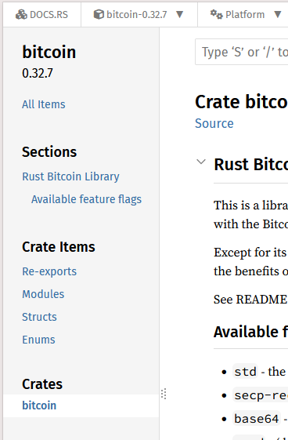
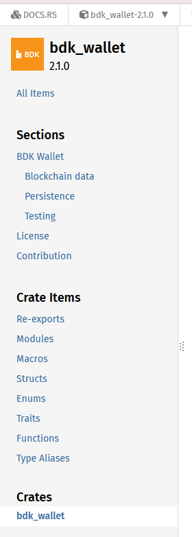

rust-bitcoin や BDK のサンプルコードを見て自分でもちょっと書いたりしているのだが、
ドキュメントの見方が分かっていないのでいろいろ時間がかかっていることに気付いた。

例えば、こちらは rust-bitcoin のドキュメントページである。
これを書いている時点では 0.32.7 だ。

* [bitcoin - Rust](https://docs.rs/bitcoin/latest/bitcoin/)

これはページ左側のスクリーンショットだ。

目次のように見えるのだが、一番下の「Crates」のところがこのページ自体を指している。  
いつも「ライブラリ」と呼んでいるのだが、正しくは「library crate」。  
ライブラリクレートは最大でも 1つまでしか持てないので、ページの左側に出てくる Crates も 1つしか出てこない。  
もしかしたらバイナリクレートも表示されるのかもしれないが、今回はいいや。

crateは【木箱】なので、箱に詰める「パッケージ」を想像してしまうが、
さっきの「ライブラリクレートは最大でも 1つ」というのはパッケージに関する制約だ。
`use` するクレートではなく自分が所有するライブラリクレートの数のはずである。

自分のライブラリクレートが他のライブラリクレートを使い、それを再度 export することで自分のライブラリクレートを経由して他のライブラリクレートを呼び出せるようにすることができる。  
それが "Re-exports"。

ここまでは、まあなんとか理解できていると思う。  
よくわかってないのはここから下だ。
rust-bitcoin だと項目は 3つしかないが、bdk_wallet だとまあまあ数が多い。  

ここから使いたいメソッドを探すというのは結構大変だと思う。  
私はいつも探し出せず、サンプルコードをまねするか AI に質問するかだ。
DeepWiki に質問するとよさそうだが、BDK のようにクレートが複数あってどれを使うのが良いのかもわからないとなかなかつらい。

次回はそういうときの探し方なりドキュメントのさまよい方なりを調べていこう。
