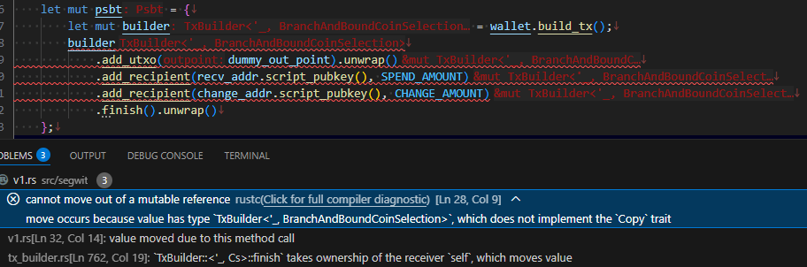

[前回](20250929-rst.md)の続き。

Rust のドキュメントの読み方が分かっていないのでなんとか理解しようとしているところ。

## メソッドを探す

メソッドは `struct` に `impl` するので、左側の "Structs" で一覧に飛んで該当する `struct` を探す。  
見つけたらクリックしてページに飛ぶと左側に "Methods" があるのでそこから探しても良いしページ検索しても良いし。

探すものが分かっている場合はよいのだ。  
それにテキストエディタによってはメソッド名の上にカーソルを乗せてホバーに説明文が出てくるので、そっちの方が早いかもしれない。

このライブラリクレートに機能がありそうだけどどれかわからない、というときは AI の方がよいかもしれない。

* [bitcoindevkit/bdk_wallet - DeepWiki](https://deepwiki.com/bitcoindevkit/bdk_wallet)

今やっている、トランザクションの作り方を質問してみた。  
ほどほどに出てきてなかなかよい。

* [トランザクションを作りたい](https://deepwiki.com/search/_98666012-7557-439a-9790-b54e77f69488)

## おまけ

### エラーをとるのに時間がかかった

今回の件とは関係ないけど、deepWiki や bdk_wallet のメソッド説明では `psbt` の括弧の中で `wallet.build_tx()` を呼び出しているのだが、
Cookbook の[Transaction Builder](https://bookofbdk.com/cookbook/transactions/transaction-builder/) の方はドットで連結して呼ぶように書いてある。  
私は先に Cookbook を読んでいたので連結させていたのだが、これだとどうやってもエラーになってしまう("cannot move out of a mutable reference")。

赤い波線がばーっと出ているので舞い上がって(?)しまい、`&mut` が何とかかんとか言っているので、
これは `let mut psbt` のことだろうと考えたのだ。  
戻り値の型を決めかねていて `Result<>` にするか `Transaction` だけを返して abort させるかで簡単にできそうな方をやろうとしていて、
じゃあ `.unwrap()` がよいのか、いやいや `?` でシンプルにした方がよいかとゴチャゴチャやっていた。  
こういう "move" とかそういうのはきっと timeline 関係で、どれかが参照になっているからダメとかそういうことだろうと当たりを付けたのだ。  
まあ、当たっていないのだが。

`cargo run` などしてエラーを吐き出させた方がわかりやすかったかもしれない。

これだと `builder` に何かありそう、とさっさと気付いたかもしれない。  
Cookbook に書いてあるんだから大丈夫だろう、と疑っていなかったのだが、メジャーバージョンも違うしね。

[Example Usage Patterns](https://deepwiki.com/bitcoindevkit/bdk_wallet/2.2-transaction-building#example-usage-patterns) を見ると `builder` から
カスケードさせて続けて `finish()` まで呼べるのは `unwrap()` のようなことをしないでよい場合だけなのかな？  
`finish()?` もあるのだし続けて良いかと思っていたのだが、ここら辺は理解不足だな。

あと、`cargo run` できても vscode のエラー表示がそのままになっていることがあった。  
`git checkout` でブランチを切り替えたせいかもしれないが、解消法が分からず Reload Window したら直った。  
rust-analyzer の reload なんとかでもよかったのかも。
