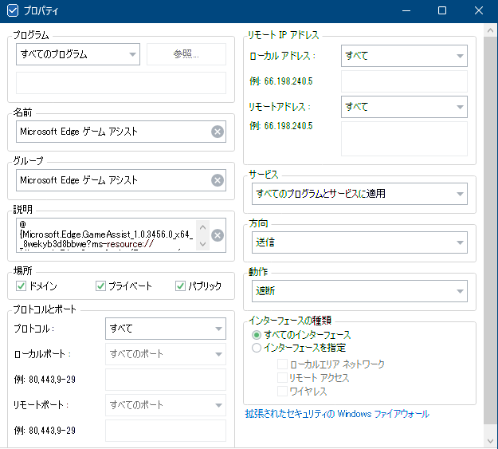

Windows11 にはファイアウォール機能がある。  
設定は「セキュリティが強化された Windows Defender ファイアウォール」という長い名前だ。
直訳しただけかもしれないが、なんでそんな名前なんだろうね。。。

ファイアウォールというと許可していない通信は行わないイメージがあるのだが、そんなに許可を求める通知は出てこない。  
特に OS に関連する通信は最初からファイアウォールで許可登録していることが多いので通知されなかったりする。

そうなると、自分でもうちょっと手軽に管理したいと考えるわけで、私は Windows Firewall Control というアプリを使っている。

* [Windows Firewall Control](https://www.binisoft.org/wfc.php)

特定のアプリについて制御するのは簡単なのだが、Windowsアプリだったか Storeアプリと呼ぶんだったか、
ともかくあの系統のアプリはバージョンごとにディレクトリが変わる。  
ファイアウォールの設定で指定できるのはフルパスなので、アップデートが行われるとディレクトリが変わって設定がなくなってしまう。  
フルパス以外で指定できないだろうか？

## ファイアウォールを設定するといろいろ面倒

ただまあ、通知が出ない事情もわかる。  
通知が出るということはその通信を一時的に止めているということになり、
アプリにとっては「あれ、通信が失敗した？？」となってしまう。  
そうすると、リトライするアプリもあるが、エラー判定になることも多い。  
ありがちなのは、アプリをインストールしようとして失敗する、などだ。  
通信を許可して再度実行すれば良いだけではあるが、面倒といえば面倒。

ときどき、以前に拒否設定したアプリのせいで今のアプリがうまく動かない、ということもあった。  
そういうときはファイアウォールの拒否履歴を確認して解除するしかない。

一番困ったのは、Windows で BitLocker を解除しないといけない状態になったのだが、
BitLocker の解除キーをまず Microsoftアカウントに確認しようとするのだが、
そのタイミングだとファイアウォールのアプリ設定ができない状態なので失敗し、
しかも手動でのキー入力にならずにエラーになって何もできない、というときだったと思う。  
通信できなくても解除はできると思うのだが、そういったことも起きるのだ。

ともかく、いろいろ面倒ごとが起きやすいのだ。  
かといって、アプリが通信を希望したからというだけで許可するのも心配である。  
困ったものだ。

## Windows ファイアウォール規則

原本を確認するのが良かろう。

* [Windows ファイアウォール規則 - Microsoft Learn](https://learn.microsoft.com/ja-jp/windows/security/operating-system-security/network-security/windows-firewall/rules)
  * `C:\*\teams.exe` などのワイルドカードパターンはアプリケーションルールではサポートされていません

できないのだ。。。  
ただ「アプリケーションルールでは」とわざわざ書いているので別のルールがあるはずだ。

おそらく「[アプリコントロールのタグ付けポリシー](https://learn.microsoft.com/ja-jp/windows/security/operating-system-security/network-security/windows-firewall/rules#app-control-tagging-policies)」がそれだと思われる。  
Application ID(AppID)タグなのかプロセスタグなのかわからないが、絶対パスを使用しなくてもよいようなことが書かれている。  
しかし・・・名前が「App Control for Business」なので Active Directory とかそういうのじゃないかという気がしてきた。

## よくわからん

やっぱりよくわからなかった。  
それに、特定のプログラムを指定せず、IPアドレスやポート番号、サービスなども指定せず拒否設定しているのに通信できていたりする。

しかし、そのせいか Windows設定アプリのホームでは通信できていないことになっていたり。

設定なしで拒否して、その上により設定した項目で許可すれば局所的に許可するようになっているのだろうか。  
それとも、これは送信設定で受信設定はまた別とか？  
よくわからん。。。
