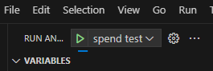

BDK をメインで使うことに決めたので、ちまちまと気付いたことを書いていこう。  
あとでまとめページを作ることを前提にしているので、メモ程度で良いのだ。

正直なところ [DeepWiki](https://deepwiki.com/bitcoindevkit/bdk_wallet) 先生がいればだいたいのことは尋ねるとわかる。  
わかるだろうけど、こういうサービスも急に使えなくなるかもしれないので、記録しておくとよいこともあるだろう。

## The Book of BDK の v2.2.0 対応

Cookbook がまだ v1 系だからなあ、と思っていたら更新されていた。

* [Starter Example - The Book of BDK](https://bookofbdk.com/cookbook/starter-example/)

## ウォレットの新規作成

ウォレットを作るとなると、BIP-32 としては master private key を作ることになる。  
今は descriptor というかハードコーディングした xprv を使ってウォレットの復元をしているので
ストレージなりなんなりに保存しなくてはならん。

* [DeepWiki](https://deepwiki.com/search/wallet_14bc5dd9-b5af-4b1f-991e-ce8e06076e54)

ウォレットの DBファイルがあれば `Wallet::load()` の経路が成功するので、
失敗したときのルートで行えば良かろう。

* [code](https://github.com/hirokuma/bdk-example/blob/e060686a3a6e6e8be8630c5664b7f740bd787273/src/segwit/wallet.rs#L35-L44)

`bip32::Xpriv::generate(())` が最も簡単ということでお任せした。  
一応 RNG は使われているそうなので最低ラインはクリアしているだろう。  
心配ならカスタマイズすることもできるそうだ。

## 永続化

ウォレットは作ることができて、ファイルも生成された。  
しかし、新しくアドレスを振り出しても次回開くとそのアドレスを忘れてしまっている。  
これは `.persist()` して更新的なことをしないといけなかった。
`mut` じゃないとできないメソッドを呼び出したら `.persist()` する感じかな。

* [SQLite Database - The Book of BDK](https://bookofbdk.com/cookbook/persistence/sqlite/)

## ブレークポイントに止まらない(vscode)

ブレークポイントに止まらない。。。  
どうやら、シンボリックリンクのパスが挟まっているとダメらしい。  
回避案がこちらにあって、やったらうちでも止まった。

* [UbuntuのVSCodeでlldbを使ってRustコードをデバッグしたらブレークポイントが効かなくて困った - ま、そんなところで。](https://zv-louis.hatenablog.com/entry/2021/07/06/102907)

シンボリックリンクのディレクトリの中にあるディレクトリをさらにシンボリックリンクして。。。とかだと正式名称?がわからなくなってくる。  
`readlink -f <ディレクトリ名>` などで正式名称が取得できるので `"sourceMap": {"<readlink -f . したパス>": "pwd したパス"}` などでよいのかな。

## `cargo` の後ろにオプションが付けられる

"spend" というコマンドをテストしたかったので `cargo run spend ....` のような感じで実行するので `launch.json` もそう書いた。  
しかしなぜか "spend" という名前までわかっているのに失敗する。  
理由は、コマンドラインオプションで "spend" のときに取る引数の数をチェックして不一致だと失敗させているのだが、
vscode のデバッガが最後の方に `--message-format=json` とか引数を追加していたのだ。  
どうしようもないらしく、`cargo` の方ではなく普通に `program` として実行するしかなさそうだ。

* ["--message-format=json" is automatically appended to the cargo command · Issue #677 · vadimcn/codelldb](https://github.com/vadimcn/codelldb/issues/677)

## 署名できない

ブレークポイントを設定したかったのは、署名に失敗したからだ。  
エラーではなく `.sign()` で `false` が戻ってくる。  
PSBT の finalize の過程で失敗しているところまではわかった。

## デバッグが始まらない(vscode)

vscode でブレークポイントに止まらない現象は `sourceMap` を書くことで対応できた。  
その後、別の PC で引き続き作業をしようとしたのだが、そちらではデバッグが始まらない。  
デバッグ開始のボタンを押すと、エラーにもならずプログレスバーっぽい青いマークが流れ続けるだけになる。

わからない。。。  

翌日、動いている環境と並べて比較しよう！とやったのだが・・・動いた・・・。  
CodeLLDB の再インストールがよかったのだろうか。

## まだ署名できない

ブレークポイントに止まるようになったので、状況を確認できるようになった。  
それについて DeepWiki に質問しながら進めている。

* [署名について - DeepWiki](https://deepwiki.com/search/previous-transaction-bitcointr_11c7bf5a-a386-4a1f-ba6c-80aacef8d42e)

いろいろ変更して、`builder.only_witness_utxo()` や `SignOptions.trust_witness_utxo = true` を追加している。  
しかし、まだ署名できない。

* [bdk-example/src/segwit/v1.rs at 6eec9f0134cc2ed56b8ccc0c782567fb784073ab · hirokuma/bdk-example](https://github.com/hirokuma/bdk-example/blob/6eec9f0134cc2ed56b8ccc0c782567fb784073ab/src/segwit/v1.rs)

今は [desc.satisfy()](https://github.com/bitcoindevkit/bdk_wallet/blob/wallet-2.1.0/wallet/src/wallet/mod.rs#L2029-L2035) で L.2054 の `Err` の方に流れていて `false` が戻っている。  
せめて `Err(_)` の中身が分かればよいのだが、確認できるんだろうか？  
Arm 系なら `r4` だろうけど、あれは C/C++ だけ？  そもそも戻り値といってもアドレスになりそうだ。

たどり着いたのが、bitcoin-miniscript の `get_satisfaction()`。  
ここで `Error::CouldNotSatisfy` を返している。

* [tr.rs - source](https://docs.rs/miniscript/12.3.5/src/miniscript/descriptor/tr.rs.html#386)

`if let Witness::Stack(stack) = satisfaction.stack {` って、Rust は `if` の中に代入文を書けるのか。

* [if let - Rust By Example 日本語版](https://doc.rust-jp.rs/rust-by-example-ja/flow_control/if_let.html)

しかし CodeLLDB は gdb みたいなものっぽくて、C/C++ のデバッグをしているような `$variants$` みたいな表示になっていてつらい。  
なんかありそうな気はするのだけど、わからんのよね。
