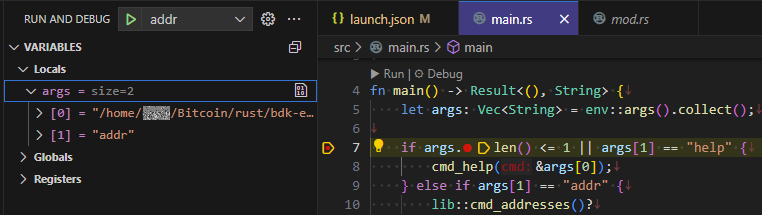

lldb-dap を使うと vscode のデバッガから値を見ることができそうだった。  
WSL2 の Ubuntu 22.04.5 LTS を使っている。

## LLVM

lldb-dap の実行ファイルがないのでビルド済み LLVM からもらってくる。

* [Release LLVM 21.1.3 · llvm/llvm-project](https://github.com/llvm/llvm-project/releases/tag/llvmorg-21.1.3)
  * [Linux x86_64](https://github.com/llvm/llvm-project/releases/download/llvmorg-21.1.3/LLVM-21.1.3-Linux-X64.tar.xz)

`tar xf LLVM-21.1.3-Linux-X64.tar.xz` などで展開し、どこかに置く。  
どこがよいかよくわからんので `sudo mv LLVM-21.1.3-Linux-X64 /usr/local/LLVM-21.1.3` とした。

パスをいくつか通す。

```bash
LLVM_PATH=/usr/local/LLVM-21.1.3
export PATH=$LLVM_PATH/bin:$PATH
export LD_LIBRARY_PATH=$LLVM_PATH/lib:$LD_LIBRARY_PATH
export PYTHONPATH=`lldb -P`
```

`PYTHONPATH` は [lldb用](https://lldb.llvm.org/use/tutorials/implementing-standalone-scripts.html) の設定にあったので書いているが、必要かどうかよくわからない。

通した後で `lldb-dap` を実行してエラーにならず何も出力されなければひとまずOK。
Ctrl+Cで終わらせて良い。

## Python 3.10

私の環境では Python 3.10.12 が入っていたのだが、そうではない環境もあるだろう。  
そうすると `lldb-dap` を実行したとき、libpython3.10 なんとか so がない、みたいなエラーが出ると思う。  
環境変数 `PYTHONPATH` の先が `python3.10` なのでバージョン固定なのだろう。
`pyenv` をインストールして 3.10 の最新版を使えばよさそうだった。  
`lldb-dap` のときだけそのバージョンにすれば良いのだが、よくわからないので `pyenv global` で切り替えた。

```bash
export LD_LIBRARY_PATH=$LD_LIBRARY_PATH:`pyenv prefix`/lib
```

## rust

[rust/src/etc/](https://github.com/rust-lang/rust/tree/master/src/etc) にあるファイルを使うのだが、
直接読み込むファイル以外にも必要そうだったのであきらめて git clone でまるまる持ってくる。

`git clone --depth=1 https://github.com/rust-lang/rust.git` などして適当に取ってくる。  
履歴管理しないので ZIP で持ってきても良い気がしてきたが、好みで。

このあとでパスを指定して参照するので、自分の隙な場所で良い。  
ここでは `/opt/rust` に置いた。

## vscode

Extension "lldb-dap" をインストール。

## launch.json

こういう感じで。

* `type` を `lldb-dap` にする
* `initCommands` を追加して設定

```json
        {
            "name": "addr",
            "type": "lldb-dap",
            "request": "launch",
            "program": "${workspaceFolder}/target/debug/bdk-starter-example",
            "args": ["addr"],
            "initCommands": [
                "command script import /opt/rust/src/etc/lldb_lookup.py",
                "command source /opt/rust/src/etc/lldb_commands"
            ],
            "sourceMap": {"/mnt/wsl/home2/xxx/Bitcoin/rust/bdk-example": "/home/xxx/Bitcoin/rust/bdk-example"},
            "cwd": "${workspaceFolder}"
        }
```

毎回設定するのは面倒なので、Settings に追加するのもよいだろう。

```json
    "lldb-dap.initCommands": [
        "command script import /opt/rust/src/etc/lldb_lookup.py",
        "command source /opt/rust//src/etc/lldb_commands"
    ]
```

## このように見える

デバッグ実行して止めると、コマンドライン引数の `args` が展開できて文字も見えた。



整数値はもともと見えていたし、配列と文字列が見えるようになったくらいなのか・・・？  
まあ、見えないよりは良いだろう。
