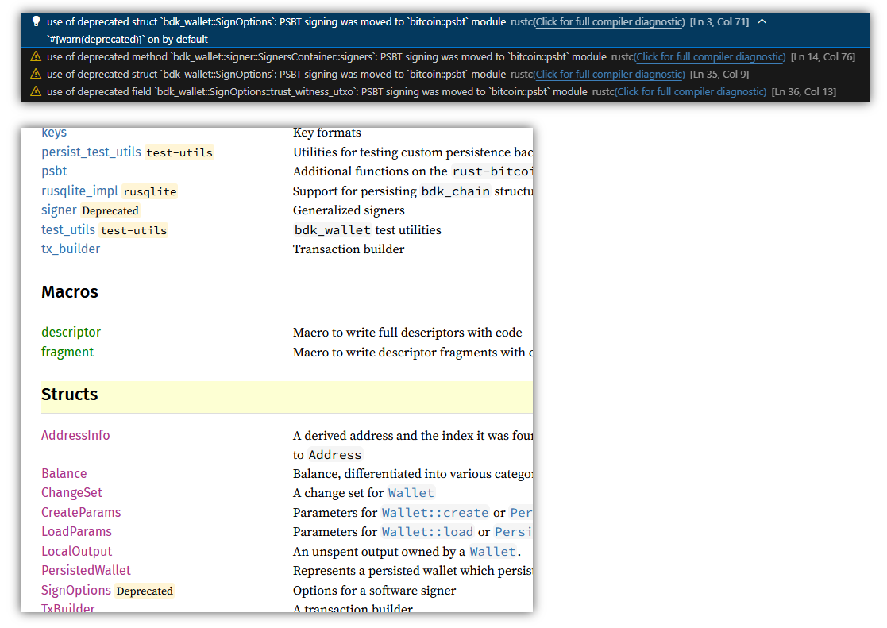

Rust の勉強がてら [BDK](https://bitcoindevkit.org/) を使って Bitcoin トランザクションに署名するプログラムを作っている。  
[bdk_wallet](https://github.com/bitcoindevkit/bdk_wallet) が v2.2.0 になっていたので v2.1.0 から更新したのだが、署名周りで deprecated 警告が出てきた。



ただ、前回からのコード差分を見ても `#![allow(deprecated)]` が付いたくらいな気がする。見逃しているだけかもしれないが。

* [chore: deprecate `wallet::signer` mod · bitcoindevkit/bdk_wallet@4c4e0b1](https://github.com/bitcoindevkit/bdk_wallet/commit/4c4e0b19e5f8f1754ca8c627e147f6c3166741d0)

## Attributes

`#![～]` はアノテーションだろう、と予想を立てたのだが、残念、アトリビュートであった。

* [Attributes - The Rust Reference](https://doc.rust-lang.org/reference/attributes.html)
* [アトリビュート - Rust By Example 日本語版](https://doc.rust-jp.rs/rust-by-example-ja/attribute.html)

Inner が `#![～]` で、Outer が `#[～]`。

### allow(C)

attributes の中身 `allow(C)` は、`C` のチェック機構を無効にして警告を表示しなくなるという意味。  
`ignore(C)` の方がわかりやすい気もするが、英語は苦手なので下手なことはいうまい。

* [Diagnostics - The Rust Reference](https://doc.rust-lang.org/reference/attributes/diagnostics.html#lint-check-attributes)

### deprecated

`deprecated` で deprecated にするバージョンの範囲などを指定するものだ。

* [The deprecated attribute](https://doc.rust-lang.org/reference/attributes/diagnostics.html#the-deprecated-attribute)

```rust
#[deprecated(
    since = "2.2.0",
    note = "PSBT signing was moved to `bitcoin::psbt` module"
)]
pub mod signer;
```

attributes が影響を及ぼすのは次の行だけなのかな？  
であれば [pub mod signer](https://github.com/bitcoindevkit/bdk_wallet/blob/wallet-2.2.0/wallet/src/wallet/mod.rs#L59-L63) だけである。

それを `#![allow(deprecated)]` で無視しているということか。  
無視するが警告は出すので今回のようになったということなのかね。

## 対処

`note` は代替手段をなるべく書くらしいので、それを信じるなら `bitcoin::psbt` を使えば良いことになる。  
[以前試した(https://blog.hirokuma.work/2025/09/20250918-rst.html)ときは PSBT ではなく普通にやっただけだった。
`bitcoin::psbt` を使ってみよう。

* [Constructing and Signing Multiple Inputs - Taproot - Rust Bitcoin Cookbook](https://rust-bitcoin.org/book/psbt/multiple_inputs_taproot.html)
