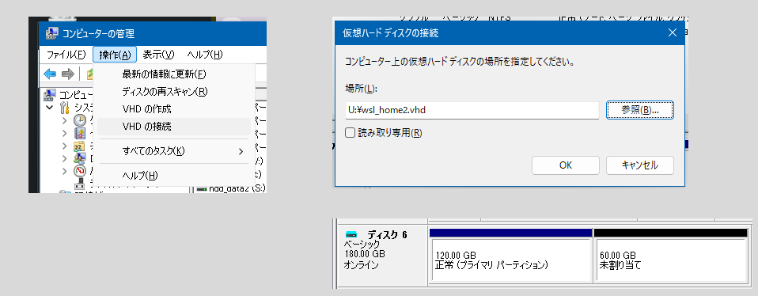
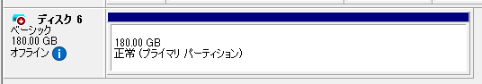

WSL2 を使っている。  
Cドライブの `ext4.vhdx` が肥大化するのはあまりよくない気がするし、もし Cドライブが壊れたらと思うと怖いので、仮想ディスクの VHD ファイルを作って mount している。  
これで節約できていると思ったが、既に `ext4.vhdx` は 84GB を超していた。  
Cドライブはスカスカだし、気にするのも馬鹿らしい気がしている。  
けど、やる。

今まで VirtualBox などで作っていた VHD ファイルを使い回していたのだが、新規で VHD ファイルを作ってマウントしてみたいと思った。

## VHD ファイルの作成

エクスプローラで「PC」のアイコンを右クリックしたコンテキストメニューから「管理」を選択(スタートメニューの "Windowsツール" の中にもあると思う)。  
「コンピュータの管理 ＞ ディスクの管理」でドライブ一覧が表示される。

メニュー「操作 ＞ VHDの作成」から作成することができる。  
拡張子は VHD でも VHDX でもよさそうだ。今回は VHDX かつ可変容量にした。

作成すると、ディスクの管理画面に追加されている。  
「操作 ＞ VHDの接続」をしたのと同じ状態だろう。「不明」と表示されていた。

## パーティション作成の手前

VHDファイルを接続しても、まだまっさらなので何もできない。  
パーティションを作ることができる状態まで持っていく。

これもディスクの管理画面からできる。  
右クリックしてコンテキストメニューから「ディスクの初期化」を選択。  
パーティションスタイルは、私が分かるのが MBR なのでそうした。  
サイズは 64GB。

このときに出てきたディスク番号が、物理ディスクの番号になっているようだ。  
今の私だと `7` になっている。

## WSL2 の現状を見ておこう

この状態で WSL2 にて `ls /dev/sd*` などとして認識しているドライブを見ておこう。

```shell
$ ls /dev/sd*
/dev/sda  /dev/sdc  /dev/sde   /dev/sdf
/dev/sdb  /dev/sdd  /dev/sde1  /dev/sdf1
```

## bare マウント

フォーマット済み VHD ファイルをマウントする場合はだいたいこんな感じである。

`wsl.exe --mount --vhd "$VHDFILE" --partition $PARTNUM --name $MNTNAME`

しかしまだフォーマットしていないからか、まだ使ったことが無いからか分からないが WSL2 上で何かしてもアタッチに失敗する。  
管理者モードの PowerShell ならできそうだ。

```posh
PS S:\> wsl --mount \\.\PHYSICALDRIVE7 --bare
この操作を正しく終了しました。
```

先ほどの `7` を使ったが、心配なら `GET-CimInstance -query "SELECT * from Win32_DiskDrive"` で一覧を見てからやると良いだろう。  
私は確認した。

```posh
> GET-CimInstance -query "SELECT * from Win32_DiskDrive"

DeviceID           Caption                 Partitions Size          Model
--------           -------                 ---------- ----          -----
\\.\PHYSICALDRIVE4 KBG5AZNV256G LA KIOXIA  1          256052966400  KBG5AZNV256G LA KIOXIA
\\.\PHYSICALDRIVE1 ADATA SP550             1          240054796800  ADATA SP550
\\.\PHYSICALDRIVE2 TOSHIBA DT01ACA100      1          1000202273280 TOSHIBA DT01ACA100
\\.\PHYSICALDRIVE0 Samsung SSD 870 QVO 1TB 1          1000202273280 Samsung SSD 870 QVO 1TB
\\.\PHYSICALDRIVE3 TOSHIBA DT01ACA100      1          1000202273280 TOSHIBA DT01ACA100
\\.\PHYSICALDRIVE5 WD_BLACK SN7100 1TB     4          1000202273280 WD_BLACK SN7100 1TB
\\.\PHYSICALDRIVE6 Microsoft 仮想ディスク  1          858990666240  Microsoft 仮想ディスク
\\.\PHYSICALDRIVE7 Microsoft 仮想ディスク  0          68713989120   Microsoft 仮想ディスク
```

## ext4 フォーマット

この状態で WSL2 にて `ls /dev/sd*` などとして見ると、PowerShell 前に比べて増えていると思う。  
ここでは `/dev/sdg` だ。

```shell
$ ls /dev/sd*
/dev/sda  /dev/sdc  /dev/sde   /dev/sdf   /dev/sdg
/dev/sdb  /dev/sdd  /dev/sde1  /dev/sdf1

$ sudo fdisk -l /dev/sdg
Disk /dev/sdg: 64 GiB, 68719476736 bytes, 134217728 sectors
Disk model: Virtual Disk
Units: sectors of 1 * 512 = 512 bytes
Sector size (logical/physical): 512 bytes / 4096 bytes
I/O size (minimum/optimal): 4096 bytes / 4096 bytes
Disklabel type: dos
Disk identifier: 0xfc541691
```

Virtual Disk だし、64 GiB だし、たぶん間違いないだろう。  
あとは Linux でやるように、`fdisk` で `n` とか `p` とか `w` とかで適当に Linux のパーティションを作って、
`sudo mkfs -t ext4 /dev/sdg1` などとして ext4 フォーマットすればよい。

## PowerShell から WSL2 にマウント

管理者モードの PowerShell コンソールからこんな感じで WSL2 側にマウントさせることができる。

```posh
PS S:\> wsl --mount --vhd T:\wsl_work2.vhdx --partition 1 --name work2
ディスクは '/mnt/wsl/work2' として正常にマウントされました。
注: /etc/wsl.conf で automount.root 設定を変更した場合、場所は異なります。
ディスクのマウントを解除してデタッチするには、'wsl.exe --unmount \\?\T:\wsl_work2.vhdx' を実行します。
```

WSL2 だと `/mnt/wsl/` 以下に `--name` で指定したディレクトリ名でマウントされている。

## WSL2 だけでマウントする(sudoなし)

今までの VHD ファイルはこんな感じのスクリプトを作り、`~/.profile` で `bash mnt.sh` で呼び出してもらっている。  
特に `sudo` もせずにマウントできている。よく考えたら不思議だ。

```bash
#!/bin/bash

function mount() {
  VHDFILE=$1
  MNTNAME=$2
  PARTNUM=$3
  wsl.exe --mount --vhd "$VHDFILE" --partition $PARTNUM --name $MNTNAME > /dev/null
}

if [ ! -d /mnt/wsl/home2 ]; then
  mount "u:\\wsl_home2.vhd" "home2" 1
fi
```

しかし今回作った VHD ファイルはエラーになってしまう。  
VHDX(可変容量) も VHD(固定容量) も試してみたが、どちらもダメだ。

```bash
$ wsl.exe --mount --vhd "t:\\wsl_work2.vhdx" --partition 1 --name work2
ディスク '\\?\T:\wsl_work2.vhdx' を WSL2 にアタッチできませんでした: アクセスが拒否されました。
エラー コード: Wsl/Service/AttachDisk/MountDisk/HCS/E_ACCESSDENIED
```

これは Windows 側で VHDファイルの「セキュリティ」で Users グループにフルコントロールの権限を与えるとできるようになった。  
理由は分からんが、なんかできた。

## VHDのパーティション拡大

半年くらい使っていて、空き容量がなくなってしまった。
no space は怖い。。。  
`wsl_home2.vhd` と拡張子が変わっているのだが、作り直したのかどうかも記憶にない。
サイズも違うようだし作り直したのだろう。
ともかく、これのパーティションを拡大したい。  
WSL2自体が使っている `ext4.vhdx` の例はよく出てくるのだが、外部ファイルの方はあまりやる必要がないのか出てこない。
私もハードディスクが空いてるし使ってやろう、くらいの気持ちだし。

Windowsで「コンピュータの管理 > 操作 > VHDの接続」で開いたダイアログで対象を指定する。



はて・・・パーティションが2つあるし片方が空いているではないか。
ということは、これはWindowsではなくWSL2というかext4というかの方で対処すればよいだけのはず。  
なのだが、`resize2fs` などはアンマウントしたドライブに対して行うコマンドである。

この状態でWSL2のUbuntuをマウントしないようにして起動。  
念のため `ls /dev/sd*` で確認。

```shell
$ ls /dev/sd*
/dev/sda  /dev/sdb  /dev/sdc  /dev/sdd
```

PowerShell側でbare mountを実行。  
今日は6番だった。

```powershell
PS C:\WINDOWS\system32> wsl --mount \\.\PHYSICALDRIVE6 --bare
この操作を正しく終了しました。
```

もう一度 `ls /dev/sd*` で確認。

```shell
$ ls /dev/sd*
/dev/sda  /dev/sdb  /dev/sdc  /dev/sdd  /dev/sde  /dev/sde1
```

念のため `mount` を `grep` したが sde はマウントされていない。
ならば `resize2fs` してよいはずだ。

* [31.4. ext4 ファイルシステムのサイズ変更 - ファイルシステムの管理 - Red Hat Enterprise Linux - 8 - Red Hat Documentation](https://docs.redhat.com/ja/documentation/red_hat_enterprise_linux/8/html/managing_file_systems/resizing-an-ext4-file-system_getting-started-with-an-ext4-file-system)

怖いなあ。でも60GB空いているのでまるまる割り当ててみよう。
概算して表示しているサイズだろうから、たぶん空いていないで失敗するだろう.....
と思ったら先に `e2fsck` がいるそうだ。

```shell
$ sudo resize2fs /dev/sde1 180G
[sudo] password for XXX:
resize2fs 1.47.0 (5-Feb-2023)
Please run 'e2fsck -f /dev/sde1' first.
```

ではと実行するとちょっと指摘はあったが、まあいいんじゃないかな。

```shell
$ sudo e2fsck -f /dev/sde1
e2fsck 1.47.0 (5-Feb-2023)
Pass 1: Checking inodes, blocks, and sizes
Inode 7792188 extent tree (at level 2) could be narrower.  Optimize<y>? yes
Inode 7792705 extent tree (at level 2) could be narrower.  Optimize<y>? yes
Pass 1E: Optimizing extent trees
Pass 2: Checking directory structure
Pass 3: Checking directory connectivity
Pass 4: Checking reference counts
Pass 5: Checking group summary information

home: ***** FILE SYSTEM WAS MODIFIED *****
home: 1319289/7864320 files (0.9% non-contiguous), 28467988/31456768 blocks
```

ではやってみます。  
最初は単位を付けていなかったのでブロック単位と思われた？ 
`B` を付けてみたが invalid と言われた。

```shell
$ sudo resize2fs /dev/sde1 180G
resize2fs 1.47.0 (5-Feb-2023)
The containing partition (or device) is only 31456768 (4k) blocks.
You requested a new size of 47185920 blocks.

$ sudo resize2fs /dev/sde1 180GB
resize2fs 1.47.0 (5-Feb-2023)
resize2fs: Invalid new size: 180GB
```

ネットで検索するとみんな単位無しで `M` を使っている。
`resize2fs` 自体は `M` や `G` で megabytes, gigabytes になりそうなんだけどなあ。

* [Ubuntu Manpage: resize2fs - ext2/ext3/ext4 file system resizer](https://manpages.ubuntu.com/manpages/focal/man8/resize2fs.8.html)

1024掛けて `M` にすると `G` と同じことを言われた。
`GB` のようなのはダメなことはわかったが、はてさて。

```shell
$ sudo resize2fs /dev/sde1 184320M
resize2fs 1.47.0 (5-Feb-2023)
The containing partition (or device) is only 31456768 (4k) blocks.
You requested a new size of 47185920 blocks.
```

`47185920 blocks` といっているから、それが上限なのかしら。

別のサイトで `parted` を使っている例があった。
GUI版はしばしば使っていたし、こちらの方がわかりやすそうだ。

* [partitioning - Ubuntu does not use full disk space - how to extend? - Ask Ubuntu](https://askubuntu.com/questions/1417938/ubuntu-does-not-use-full-disk-space-how-to-extend)

```shell
$ sudo parted /dev/sde
GNU Parted 3.6
Using /dev/sde
Welcome to GNU Parted! Type 'help' to view a list of commands.
(parted) print
Model: Msft Virtual Disk (scsi)
Disk /dev/sde: 193GB
Sector size (logical/physical): 512B/512B
Partition Table: gpt
Disk Flags:

Number  Start   End    Size   File system  Name  Flags
 1      1049kB  129GB  129GB  ext4

(parted) resizepart 1
End?  [129GB]? 100%
(parted) quit
Information: You may need to update /etc/fstab.
```

特に手応えなく終わったが・・・。  
Windowsの管理ツールを見るとパーティションサイズがフルフルになってる！



WSL2を立ち上げ直して `df` で確認すると・・・変わってない。  
askubuntuの人は手順の最後に `pvresize` を使っているけど、これはたぶん LVM だからだと思う。
今こそ `resize2fs` の出番か。今回はパーティションもフルフルなのでサイズは指定しなくて良いと思う。

```shell
$ sudo resize2fs /dev/sde1
resize2fs 1.47.0 (5-Feb-2023)
Resizing the filesystem on /dev/sde1 to 47185659 (4k) blocks.
The filesystem on /dev/sde1 is now 47185659 (4k) blocks long.
```

WSL2を立ち上げ直して `df` で確認すると・・・増えていた。
よかったよかった。
