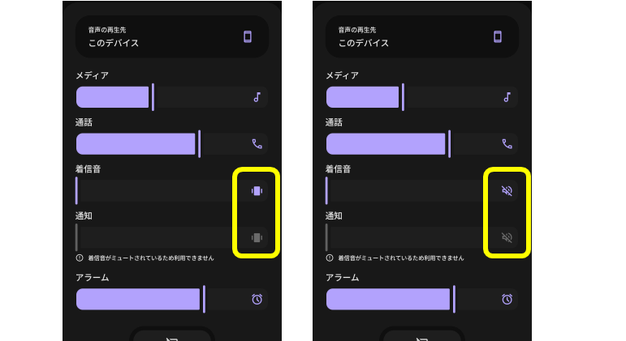
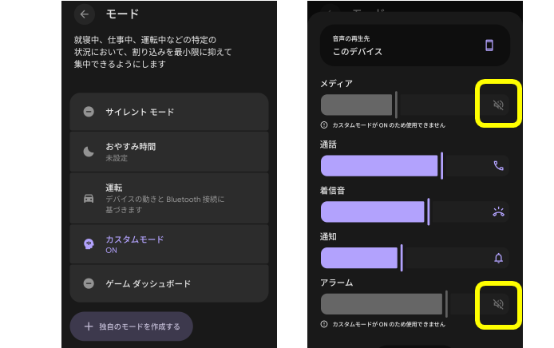

先月作っていたアプリをまだいじっている。  

* [android: uses-permission に FOREGROUND_SERVICE もいるのか - hiro99ma blog](https://blog.hirokuma.work/2025/09/20250928-and.html)
* [android: サイレントモードにするとサイレントになる - hiro99ma blog](https://blog.hirokuma.work/2025/10/20251005-and.html)

やりたいことはいろいろ変わって、今は外出中にメディア音量をゼロにする、ということになっている。  
「外出中」の定義は、家にある WiFi ルータに接続していないことと考えている。  
なのでフォアグラウンドサービスで `ConnectivityManager.NetworkCallback()` を動かして `onLost()` でゼロ音量、`onAvailable()` で戻す、としていた。

しかし、この通知が外出していてもときどき呼ばれていることに気付いた。  
どうなっているのかよくわからないので、とりあえずログに SSID名でも出力すれば何か分かるだろうと考えた。  
それがうまくいかない。

API 36 向けに作っていて ses-permission はこうしている。  
取得はできているので `WIFI_STATE` 系はいらないんじゃないかと思っている。自信はない。

```xml
    <uses-permission android:name="android.permission.ACCESS_FINE_LOCATION" />
    <uses-permission android:name="android.permission.ACCESS_COARSE_LOCATION" />
    <uses-permission android:name="android.permission.ACCESS_NETWORK_STATE" />
    <uses-permission android:name="android.permission.CHANGE_NETWORK_STATE" />

    <uses-permission android:name="android.permission.MODIFY_AUDIO_SETTINGS"/>
    <uses-permission android:name="android.permission.POST_NOTIFICATIONS" />
    <uses-permission android:name="android.permission.FOREGROUND_SERVICE"
        tools:ignore="ForegroundServicesPolicy" />
    <uses-permission android:name="android.permission.FOREGROUND_SERVICE_DATA_SYNC" />
```

SSID 名は `onCapabilitiesChanged()` で取るものらしいので、こんな感じで取得している。

```kotlin
  val info = (networkCapabilities.transportInfo as? WifiInfo)
  Log.d("SSID", "${info.ssid}")
```

これで取得できるときはできる。  
`WifiManager.UNKNOWN_SSID`、文字列では `"<unknown ssid>"` になることもある。
Android端末の電源ボタンを押して画面消灯させ、画面タップなどで復帰させると `onCapabilitiesChanged()` が呼ばれるのだが、このときはダメなようだ。  
コルーチンで `connectivityManager.getNetworkCapabilities()` を取り直しているが、どうもそういうのではダメなよう。  
`WifiInfo` を見ても、Supplicant state は COMPLETE だし、IPアドレスは取れているし、そこまでいけば SSID くらいわかってるんじゃないのー、という気がする。  
その後で SSID 名が分かるくらいでもう一度 `onCapabilitiesChanged()` が呼ばれると良いのだけど、それはなさそうだ。

これはスマホがロック状態になっているから、そちら側の制限によって取得できないとかだろうか。  
確かに、接続している SSID 名がリアルタイムで取得できるとアプリに位置情報がわかることで悪用できそうな気がする。  
考えても分からんな。

おそらく `onLost()` はちゃんと呼ばれるので、音量をゼロにするのはそこでよいだろう。  
間違って音量を戻す方が怖いので、SSID 名が取得できないようだったら戻すのは止めるか。  
`onResume()` だと取得できるので、そこまであきらめるか？  
でもせっかくフォアグラウンドサービスにしているのになあ。。。

## 2025/11/02追記

`FOREGROUND_SERVICE_DATA_SYNC` を使っているけど `FOREGROUND_SERVICE_CONNECTED_DEVICE` か `FOREGROUND_SERVICE_TYPE_LOCATION` ではないのかと思った。  
なんとなく位置情報の方じゃないかと思った。

* [フォアグラウンド サービスのタイプ  -  Background work  -  Android Developers](https://developer.android.com/develop/background-work/services/fgs/service-types?hl=ja)

## 2025/11/03追記

今日はうまくいったような気がする。  
タイミングなのか何なのか分からないけど、絶対に今まで失敗していた、というほどではなかったので1回だけでは何とも言えない。

それよりも、Pixel のルールが作動していない。  
WiFi 圏外でのバイブレーションモード移行は成功しているが WiFi 接続時に戻す方が作動していない。  
ネットワーク変化のコールバックは 2つ同時に動かないとか、何か制限があるのだろうか？

あ、いまスマホのロックを外したらルールが作動した。  
それまでにロック解除したときは作動しなかったし、またバックグラウンド状態での自動復帰はできなかったのだと思われる。

## 2025/11/08追記

今日は全然ダメだった。

* 圏外に出る
  * Pixelルールでのバイブレーションモード移行は成功
  * アプリの WiFi 圏外検知は失敗
* 圏内に戻る
  * Pixelルールは検知せずバイブレーションモードのまま
  * アプリは WiFi 圏内検知している

という文章を書いたりスマホを扱っているうちに Pixelルールが作動してバイブレーションモードが解除された。
`onLost` を拾い損なうのは今までなかったので残念だ。

同時に検知することができないタイプなのか、フォアグラウンドサービスだから起きるのかがよくわからない。
フォアグラウンドにいるなら成功しそうな気がする。

`FOREGROUND_SERVICE_TYPE_LOCATION` から `FOREGROUND_SERVICE_TYPE_CONNECTED_DEVICE` にしてみた。  
いきなりバックグラウンド状態での SSID 取得に失敗した。  
`FOREGROUND_SERVICE_TYPE_LOCATION` だと起きないのはうまくいっているからなのか、あるいは通知のしくみが何か違うのか。。。  
とりあえず location に戻した。

機能的にそういうことができるアプリもあるようなのだが([Automate](https://llamalab.com/automate/)など)、
アプリをインストールしてまでやるほどのことでもないなあと思って試していない。アプリ自体は面白そうだけどね。

そもそも、自分のアプリや設定アプリにあるルールですら正しく動作しないことがあるのに他のアプリでできるのだろうか？ 
できているならポーリングして検知しているのかもしれないが、それだと電力消費が大きくなりそうだしなあ。
それに Alarm を使ってのポーリングだと周期が長めになっていたように思う。

フィーチャーフォンのマナーモードのように、音は一切鳴らず、通知は全部バイブレーションになるだけでよいのよね。。。  
バイブレーションモードとサイレントモードが影響するのはおそらく黄色で囲んだ部分だけ、つまり着信音と通知だけだろう。
"通話" は電話での話し声(受話音)だろうか。会話したくないときは電話に出なければ良いだけなので、これは設定できなくても良い。  
そうなるとメディアとアラームの音量か。



せっかく Pixel watch を持っているので、そっちにも通知は来てほしいというくらいか。  
Pixel watch とスマホのサイレントモードを連動させないようにすれば通知は来てくれるかもしれない。

サイレントモードにすると何もかもが通知されないようになっていたように思ったが、最近のサイレントモードはカスタマイズができるようだ。  
どの通知をフィルタするかの設定ができるので、メディアとアラームはそこで止められるだろう。
ただ音量設定画面で変化しているのがメディアとアラームだけなので、これでは足りない。
バイブレーションモードなどと組み合わせることで通話音以外を抑制できるだろう。



Pixelルールでサイレントモード＋バイブレーションモードを同時に設定できれば良いのだが、
そもそも設定できるのが「WiFi が接続したときの動作」なのだ。  
近いけどちょっと違うんだよなぁ。。。

## 2025/11/10追記

試しに、手動で音量を全部ゼロ設定にした。  
アラームはそうしても小さな音で鳴動するようだ。それすらもオフにしたいならサイレントモードを使うしかなさそうだ。

サイレントモードでできるのは通知を許可する設定で、誰からの着信なら受けるのかや、どのアプリからの通知なら受けるのか、アラームはどうだ、タッチ操作音はどうだ、みたいな項目がある。  
アプリの設定が面倒で、1つ1つ設定するか全部無しかのどちらかしかない。  
うーん、面倒。

そもそも、アラームが鳴る状況ってほとんどないと思うのだ。  
それなら通話音だけ普通にして、あとは最低音量にしておけばよいはず。

ただ、通知があったのに気付かないという可能性が結構ある。普段見てないのだ。  
いっそのこと、未読の通知があったら定期的に何かするようなアプリの方が私の運用としてよいのかもしれない。  
次の課題はそれにしよう。
