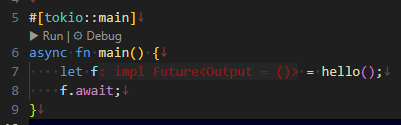

「ジュリ～！」、というわけで今回は Rust の非同期関連だ。  
TOKIO といえば沢田研二氏だと思う。

使っているライブラリに `async` と `.await`、あと `#[tokio::main]` が出てきたので調べておく。

## async / await は昔は無かった

昔購入した Rust の本があるのだが、それにはキーワードも含めて `async` と `await` が載っていなかった。
おそらく [The Rust Programming Language 日本語版](https://doc.rust-jp.rs/book-ja/#the-rust-programming-language-%E6%97%A5%E6%9C%AC%E8%AA%9E%E7%89%88) を冊子にしたものなので、
途中から追加されたキーワードなのだろう。  
[原本](https://doc.rust-lang.org/book/)には [Fundamentals of Asynchronous Programming: Async, Await, Futures, and Streams](https://doc.rust-lang.org/book/ch17-00-async-await.html#fundamentals-of-asynchronous-programming-async-await-futures-and-streams) の章があるので
そちらを読んだ方がよいか。

技術書の翻訳だと原文の方が意味が通じやすかったり、あとで検索するときのために英語での表現を知っていた方が助かったりすることもある。
しかし初学者(かつ英語苦手)にとっては、とりあえず AI に尋ねてみるか、本家筋に近い日本語の資料を手始めにしそうだ。  
自動翻訳は便利なのだが、文字だけだと例えば `Future` のような普通の英単語にもあるキーワードを「将来」と訳したり「フューチャー」とカタカナになっていたりすると読む人に迷いが生じてしまう。
原文も `Future` とキーワードっぽく書いてあったり、タイトルでは "Futures" と複数になっていたり、イタリック小文字で "futures" と書いてあったりでわざとそうしているのか私では判断できなかった。

ともかく原本の 17章を読むのがよさそうだ。
16章の「恐れるな！並行性(Fearless Concurrency)」も読まないといかんだろう。  
タイトルだけでも書いておいて、自分の読む気を高めよう。

* 17 Fundamentals of Asynchronous Programming: Async, Await, Futures, and Streams
* 17.1 Futures and the Async Syntax
* 17.2 Applying Concurrency with Async
* 17.3 Working with Any Number of Futures
* 17.4 Streams: Futures in Sequence
* 17.5 A Closer Look at the Traits for Async
* 17.6 Futures, Tasks, and Threads

## てきとーな予備知識...

「The Rust Programming Language 日本語版」にキーワードとしては載っていたので抜粋。

* `async` - 現在のスレッドをブロックする代わりにFutureを返す
* `await` - Futureの結果が準備できるまで実行を停止する

ライブラリで使う必要があったのでサンプルコードを見てなんとなくは使っている。  
感覚的にこのようなものか。

* `async fn` の関数は非同期関数になる。  
* `async fn` を呼び出した関数もまた `async fn` になるのだが、これは `block_on()` などとして同期にすることができる。  
* `.await` は `async fn` 関数の呼び出しに付ける。付けないと `Future` を返す。
* `.await` を付けるとその関数は同期呼び出しになるが、呼び出した関数は `async fn` になる。
* `main()` は `#[tokio::main]` を付けると非同期にできる
* `async` と `await` は言語仕様だが tokio はエンジン的なもので他にも種類はある
* `Future` は JavaScript の `Promise` みたいなもの

「適当」とか「いい加減」って元の文字からすると悪い意味はなさそうなのだが、口頭で使うと悪い方の意味になってしまいがちだ。
良い方の意味にするなら「適切」とか「よい具合」とかか？  
悪い方の意味なら「てきとー」とか「いーかげん」みたいな力の抜けた口頭のような書き方がよいのかもしれん。

## async / await / Future

例えば、これはエラーにはならないが warning が出る。  
実行すると何も出力されずに終わる。

```rust
async fn hello() {
    println!("hello");
}

fn main() {
    hello();
}
```

warning はこういう内容だ。  
unused な `Future` の実装と言われている。

```
warning: unused implementer of `Future` that must be used
 --> src/main.rs:6:5
  |
6 |     hello();
  |     ^^^^^^^
  |
  = note: futures do nothing unless you `.await` or poll them
  = note: `#[warn(unused_must_use)]` on by default
```

これで `.await` を付ければよいかというと、それはそれでエラーになる。  
呼び出している `main()` が `async` じゃないのでダメなのだ。

```
error[E0728]: `await` is only allowed inside `async` functions and blocks
 --> src/main.rs:6:13
  |
5 | fn main() {
  | --------- this is not `async`
6 |     hello().await;
  |             ^^^^^ only allowed inside `async` functions and blocks
```

じゃあ `main()` を `async` にすればよいかというと、それもエラーになる。  
どうしろというんだー。

```
error[E0752]: `main` function is not allowed to be `async`
 --> src/main.rs:5:1
  |
5 | async fn main() {
  | ^^^^^^^^^^^^^^^ `main` function is not allowed to be `async`
```

ライブラリのサンプルコードでは [tokio::main](https://docs.rs/tokio/latest/tokio/attr.main.html) を使っていたのでまねをする。

```shell
$ cargo add tokio --features "macros,rt-multi-thread"
```

```rust
async fn hello() {
    println!("hello");
}

#[tokio::main]
async fn main() {
    hello().await;
}
```

----

[17.1章](https://doc.rust-lang.org/book/ch17-01-futures-and-syntax.html#our-first-async-program) を読むとわかりやすい。  
出てくる [trpl](https://docs.rs/trpl/latest/trpl/) クレートはこの章の説明用に作られたものなのでそのまま使えず `tokio` を使ったのである。  
非同期のコードを実行するにはランタイムが必要だけど、ランタイムは Rust の標準にないから別途クレートで入手するなり作るなりしないといけないらしい。
まあ、この章のためにランタイムを用意しているくらいだからシンプルであれば簡単なのかも？ 
と思ったが `tokio` を使っていると書いてあったのでそうでもないんだろう。  
理由は 17.1 章にちょっとだけ書いてあるので読んでくだされ。たぶんもっといろいろ理由はあるんだろう。

`async` を付けた関数は `impl std::future::Future<Output = 戻り値>` という戻り値を持つのと同じになる...と読み取ったのだが、あまり自信がない。  
vscode の補助機能ではそういう型を持つのと同じように見えるが、実際に書いてみるとコンパイルエラーになる。



単に `let` で受け取って使う分には問題ないようだ。

```rust
#[tokio::main]
async fn main() {
    let f = hello();
    f.await;
}
```

`.await` は非同期が終わるまで待つというよりもランタイムに処理を返すところらしい。
`await` ポイントと書いてあった。
そう考えると非同期関連はほとんどランタイムがやっているのかね。  
ChatGPT氏にランタイムをいくつか列挙してもらった。

* `futures`
* `tokio`
* `monoio`
* `glommio`
* `Bastion`

`tokio` が強いが、Linux 5.1 以降のカーネルが提供する非同期I/Oインターフェースの `io_uring` を直接利用するタイプはスループットの高さから使われるようになるかもみたいな評価だった。  
よくある `select` や `epoll` を使っていたところを `io_uring` なるもので置き換えられそうな感じ。  
Linux 専用になるという点は気にする必要があるだろうが、気にはなるね。

(WIP)
