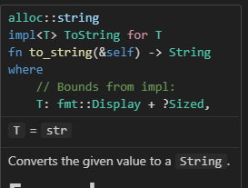

Rust は型の不一致判定が厳しいので(C言語の人目線)、何かと型を変換する作業が発生する。  
`&str` を `String` にするのは `.to_string()` を使うが、`&String` が `&str` としても使えるのは deref があるからだ。  
そうかと思えば [.as_str()](https://docs.rs/toml/latest/toml/enum.Value.html#method.as_str) みたいに "as" だったり、
[::from()](https://docs.rs/toml/latest/toml/enum.Value.html#method.from) のようなものもある。  
`::new()` も引数があったりなかったりするが、引数があるなら `::from()` でもいいんじゃないのかなどと考えたりする。  
それ以外にも、文字列から別の型を作り出す場合に `"文字列".ほにゃほにゃ()` という `&str` や `String` にはないメソッドを呼び出していると思われる箇所を見たこともある。

こういった変換についてのあれこれを把握しておかないと、今のところいちいち AI などに訊いていて効率が悪いのだ。  

## なんとなく

`.as_～()` と `.to_～()` はなんとなくわかる気がする。  
"as" はキャストっぽい感じで「～とみなす」ということだろう。使っても負荷がほとんど無いのだと思う。  
"to" は「(今のから)～にする」といった感じだろう。as じゃないなら何かデータの移し替えなどが発生すると思っている。  
`.to_～()` が今のデータを別のデータに変換するなら、`～::from()` は別のデータから今のデータ(`Self`)に変換する方向だろう。  
名前についてのガイドラインがあった。

* [Naming - Rust API Guidelines](https://rust-lang.github.io/api-guidelines/naming.html#ad-hoc-conversions-follow-as_-to_-into_-conventions-c-conv)
  * [naming conventions - When to use as_* vs to_* vs into_* in Rust? - Stack Overflow](https://stackoverflow.com/questions/72996050/when-to-use-as-vs-to-vs-into-in-rust)
  * [as_str()とかto_string()とかinto_vec()とか紛らわしい！ #Rust - Qiita](https://qiita.com/wada314/items/343137b6140d5ff2182b)


[String の Example](https://doc.rust-lang.org/stable/std/string/index.html#examples) を見ると `.to_string()` もあれば `String::from()` もある。  
`.into()` というのもあるのか。。。  
まあちょっとそっちは置いておくとして、`from()` は `String` の関数ではなく [Fromトレイト](https://doc.rust-lang.org/stable/std/convert/trait.From.html#examples) の `From<&str>` らしい。  
そして `.to_string()` も [ToStringトレイト](https://doc.rust-lang.org/stable/std/string/struct.String.html#impl-ToString-for-T) なのかな？

よく考えると `"abc".to_string()` は `&str` 側に実装があるはずだ。  
自作のクレート `UmaUma` を作っても `"abc".to_umauma()` を `&str` に作ってもらうのは無理だろう。  
`UmaUma::from("abc")` であれば自分でも作ることはできそうだ。  
たぶん `"abc".to_umauma()` も作ることができるのではないかと思う。どうだろう。
`.parse::<UmaUma>()` はできそうな感じがする。

## as

`.as_～()` ではなく単なる `as`。

* [Keyword as](https://doc.rust-lang.org/std/keyword.as.html)

主にプリミティブ型のキャストや `use` の別名のために使われる。

## From と Into

`From` も `Into` もトレイトだそうだ。

* [FromおよびInto - Rust By Example 日本語版](https://doc.rust-jp.rs/rust-by-example-ja/conversion/from_into.html)

### From

`std::convert::From` が本名?のようで、中身はこんな感じ。

```rust
pub trait From<T>: Sized {
    /// Converts to this type from the input type.
    #[rustc_diagnostic_item = "from_fn"]
    #[must_use]
    #[stable(feature = "rust1", since = "1.0.0")]
    fn from(value: T) -> Self;
}
```

よく使いそうな `String::from()` はこうなっていた。

```rust
impl From<&str> for String {
    /// Converts a `&str` into a [`String`].
    ///
    /// The result is allocated on the heap.
    #[inline]
    fn from(s: &str) -> String {
        s.to_owned()
    }
}
```

`.to_owned()` は別のトレイト `ToOwned` で、実装はこう。

```rust
impl ToOwned for str {
    type Owned = String;

    #[inline]
    fn to_owned(&self) -> String {
        unsafe { String::from_utf8_unchecked(self.as_bytes().to_owned()) }
    }

    #[inline]
    fn clone_into(&self, target: &mut String) {
        target.clear();
        target.push_str(self);
    }
}
```

まだ `.to_owned()` がある。。。

```rust
impl<T: Clone> ToOwned for [T] {
    type Owned = Vec<T>;

    fn to_owned(&self) -> Vec<T> {
        self.to_vec()
    }

    ...略...
}
```

`.to_vec()` ...

```rust
    pub fn to_vec(&self) -> Vec<T>
    where
        T: Clone,
    {
        self.to_vec_in(Global)
    }
```

この次の `.to_vec_in()` が大きい。
大きいというか、中に trait が 1つと impl が 2つもある。  
`String` は `Vec<u8>` をメンバーに持つだけなので最悪でもデータをコピーするだけだと思っていたのにこんなに大変なんだ。

#### おまけ : to_string()

では `.to_string()` もこのくらい大変なのだろうか？

こちらは `Display` トレイトだ。  
vscode でジャンプしたのだが、`ToString` トレイトじゃなかったのか？  

```rust
impl Display for str {
    fn fmt(&self, f: &mut Formatter<'_>) -> Result {
        f.pad(self)
    }
}
```

ホバーさせると `ToString for T` だな。トレイト境界の方のコードに飛んだのだろうか。




`.pad()` も 40行くらいあるそこそこ大きめの関数だ。
手軽に使っていたけど、どうなんだろうか。  
[ChatGPT氏](https://chatgpt.com/share/6915ed1b-a378-8010-81b6-78675c4cd706) からすると、inline なっていたりして実質的に重たくはないらしい。  
ただよくだまされるから、信用しづらいなあ。

(更新中。。。)

