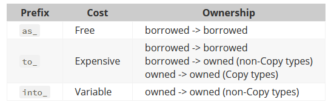

## はじめに

Rust は型の不一致判定が厳しいので(C言語の人目線)、何かと型を変換する作業が発生する。  
`&str` を `String` にするのは `.to_string()` を使うが、`&String` が `&str` としても使えるのは deref があるからだ。  
そうかと思えば [.as_str()](https://docs.rs/toml/latest/toml/enum.Value.html#method.as_str) みたいに "as" だったり、
[::from()](https://docs.rs/toml/latest/toml/enum.Value.html#method.from) のようなものもある。  
`::new()` も引数があったりなかったりするが、引数があるなら `::from()` でもいいんじゃないのかなどと考えたりする。  
それ以外にも、文字列から別の型を作り出す場合に `"文字列".ほにゃほにゃ()` という `&str` や `String` にはないメソッドを呼び出していると思われる箇所を見たこともある。

`.as_～()` と `.to_～()` はなんとなくわかる気がする。  
"as" はキャストっぽい感じで「～とみなす」ということだろう。使っても負荷がほとんど無いのだと思う。  
"to" は「(今のから)～にする」といった感じだろう。as じゃないなら何かデータの移し替えなどが発生すると思っている。  
`.to_～()` が今のデータを別のデータに変換するなら、`～::from()` は別のデータから今のデータ(`Self`)に変換する方向だろう。  
名前についてのガイドラインがあった。

* [Naming - Rust API Guidelines](https://rust-lang.github.io/api-guidelines/naming.html#ad-hoc-conversions-follow-as_-to_-into_-conventions-c-conv)
  * [naming conventions - When to use as_* vs to_* vs into_* in Rust? - Stack Overflow](https://stackoverflow.com/questions/72996050/when-to-use-as-vs-to-vs-into-in-rust)
  * [as_str()とかto_string()とかinto_vec()とか紛らわしい！ #Rust - Qiita](https://qiita.com/wada314/items/343137b6140d5ff2182b)

[String の Example](https://doc.rust-lang.org/stable/std/string/index.html#examples) を見ると `.to_string()` もあれば `String::from()` もある。  
`.into()` というのもあるのか。。。  
まあちょっとそっちは置いておくとして、`from()` は `String` の関数ではなく [Fromトレイト](https://doc.rust-lang.org/stable/std/convert/trait.From.html#examples) の `From<&str>` らしい。  
そして `.to_string()` も [ToStringトレイト](https://doc.rust-lang.org/stable/std/string/struct.String.html#impl-ToString-for-T) なのかな？

よく考えると `"abc".to_string()` は `&str` 側に実装があるはずだ。  
自作のクレート `UmaUma` を作っても `"abc".to_umauma()` を `&str` に作ってもらうのは無理だろう。  
`UmaUma::from("abc")` であれば自分でも作ることはできそうだ。  
たぶん `"abc".to_umauma()` も作ることができるのではないかと思う。どうだろう。
`.parse::<UmaUma>()` はできそうな感じだ。

こういった変換についてのあれこれを把握しておかないと、今のところいちいち AI などに訊いていて効率が悪いのだ。  

## as

`.as_～()` ではなく単なる `as`。

* [Keyword as](https://doc.rust-lang.org/std/keyword.as.html)

主にプリミティブ型のキャストや `use` の別名のために使われる。

`From` や `Into` とも関係ありそうだが、まだ知識がないのでわからない。

## (更新中)
