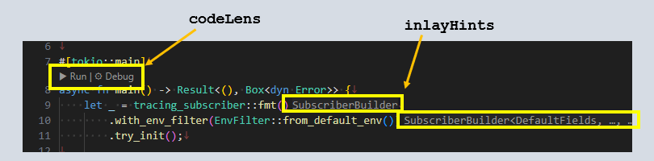

Rust のファイル編集に Visual Studio Code を使っているのだが、これらの表示がしばしば気になる。

vscode のパラメータ名が分からず苦労した。。

## inlayHints: 型推論など

inlayHints はだいたい役に立っているのだが、1行の長さがわからなくなる。
改行位置はフォーマッタにお任せすれば良いのだが、自分の中でこのくらいの長さだったら改行したいという気持ちもあるので、
その感覚がうまく一致しないのがもどかしい。  
また私は引数を並べるとき `変数, 変数, ` のようにコンマの後ろにスペースを1つ入れたいのだが、
inlayHints があると型表示が挟まってスペースがあるのかどうかよくわからなくなる。

これは設定で ON/OFF だけでなくキーを押している間だけ ON/OFF があるのでそちらで対応しようかと思う。  
キーは Alt + Ctrl(Windows) だけなのかな？  
キーを押したまま入力するのは難しいので、普段は非表示で見たいときだけキーを押すことにするかな。

押している間だけ表示するのであれば、色設定も parameter と type で別々にするか。  
常時表示していたときは区別が付くように普段使わない && 目立たない色にしていたのだが、
一時的な表示であれば目立つ色で構わない。

Alt + Ctrl というキーはバインド一覧に出てこないので変更できないのかもしれない。

## codeLens: 行と行の間

行と行の間にガイダンスのようなヒントのような、なんと言って良いかわからない項目が表示されることがある。  
あれは code lens というそうだ。

こちらは inlayHints と違って ON/OFF のどちらかしか設定がない。  
また、キーバインドでトグルするようなことができない。
この件は ChatGPT 氏にいろいろだまされながら試して、結局ないことがわかった。

マクロのようなことができる Extension があるのでそれを勧められたのだがあまり気が乗らない。  
そうすると「ないなら自作すればいいじゃないの」(意訳)と言い出した。

* [Your First Extension - Visual Studio Code Extension API](https://code.visualstudio.com/api/get-started/your-first-extension)

コードの中身は ChatGPT 氏が提案してくれた(またちょっとだまされたが)。  
他にも自分の好みにしたいことがあれば Extension を作ればいいんだということが分かったのは大きい。  
なんとなく MIT ライセンスにしているが、特に意味は無い。

* [hirokuma/vsix-toggle-codelens: vscodeでeditor.codeLensをトグルする](https://github.com/hirokuma/vsix-toggle-codelens)

Alt + Ctrl を押している間だけ ON にするということができれば両方一緒にできてよいのだが、
そもそも「押している間だけ」というのがなさそうに思う。  

WSL2 側で開発できれば良かったのだが、どうもダメっぽかった。
デバッグ開始すると別のウィンドウが開くのだが、WSL2 だと F1 で検索しても出てこなかった。

## ちょっと寂しい

表示がすっきりした！と思ったが、実装し始めて気付く型表示がないことへの不安感。。。  
型推論に未だ慣れておらず方はきっちり明示して欲しいと思う。
ただそれは代入する変数の型だけでよく、引数の方は見たいときだけでいいのだ。  
この辺は Language Server の挙動とも関係しているらしいが、ともかくできなさそうだ。

試しに "rust-analyzer.inlayHints.parameterHints.enable" もトグルするよう extension を書き換えてみたが、
こちらはリアルタイムでの表示更新がされないようで再表示するなり同じペインのタブを切り替えたりするなりしないと反映されなかった。  
codeLens の更新との表示タイミングがずれるのか、切り替えた直後は ON/OFF が逆になってしまうという残念さだ。  
`Settings.json` を手動で変更してもそうなので、これはもうそういうものなのだろう。  
"editor.inlayHints.enabled" を off -> on することで更新されそうだからそれでごまかすか。

