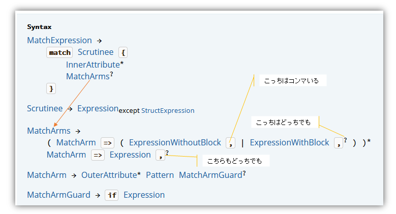

Rust の `clap` でコマンドをコピペで列挙していたのだが、
`match` の各アームをコンマで区切っていないのにエラーになっていないことに気付いた。  
ChatGPT 氏に訊くと改行区切りだという。

エラーにならないならそれでよいのだが、理屈が分からないのは不安だし、
コンマを付けて良いならそっちの方が他のコードと統一できてありがたいのだ。

## サンプルコードはだいたいコンマ区切り

特にこの辺のドキュメントにはそういったことは書かれていない。

* [match - Rust By Example](https://doc.rust-lang.org/stable/rust-by-example/flow_control/match.html)
* [match - Rust By Example(ja)](https://doc.rust-lang.org/stable/rust-by-example/ja/flow_control/match.html)

こっちの文には「各アームは次のアームとカンマで区切られています(Each arm is separated from the next with a comma)」と書いてあった。
ただ、これはサンプルコードがそうなっているので現状を述べているだけかもしれない。

* [match制御フロー演算子 - The Rust Programming Language 日本語版](https://doc.rust-jp.rs/book-ja/ch06-02-match.html)

## リファレンス

BNF かどうかわからないが説明ページがあった。

* [Match expressions - The Rust Reference](https://doc.rust-lang.org/stable/reference/expressions/match-expr.html)

こういうことだよ・・・な？

* 最後の arm はコンマがあってもなくてもよい
* 途中の arm は、
  * ブロックであればコンマがあってもなくてもよい
  * ブロックでないならコンマは必須

言えることは、コンマを付けておけば間違いは無い、だ。  
コンマを必須にしておいてもよいような気はするが、
そうすると JSON の最後の要素がコンマがあってはダメ、みたいなのと同じような面倒さが発生するのかもしれない。

## おまけ 

JSON の最後のコンマ処理を C言語でライブラリなど使わずに書くのが面倒で、
私は `for` 文の最初に「0回目 以外はコンマを付ける」みたいに書いていた。  
しかし今思えば、どうせ `strcat()` などでつないでいたんだろうから
`for` 文の中では毎回コンマ付きで出力して、抜けたときに
1文字戻して `\0` を書いておけば済んだんじゃなかろうか。

そんなどうでもよいことを思い出した。
