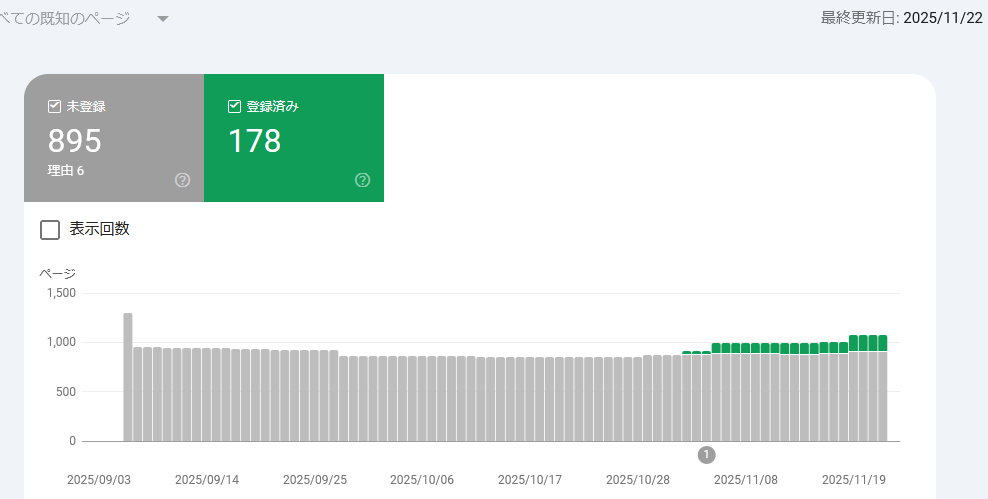
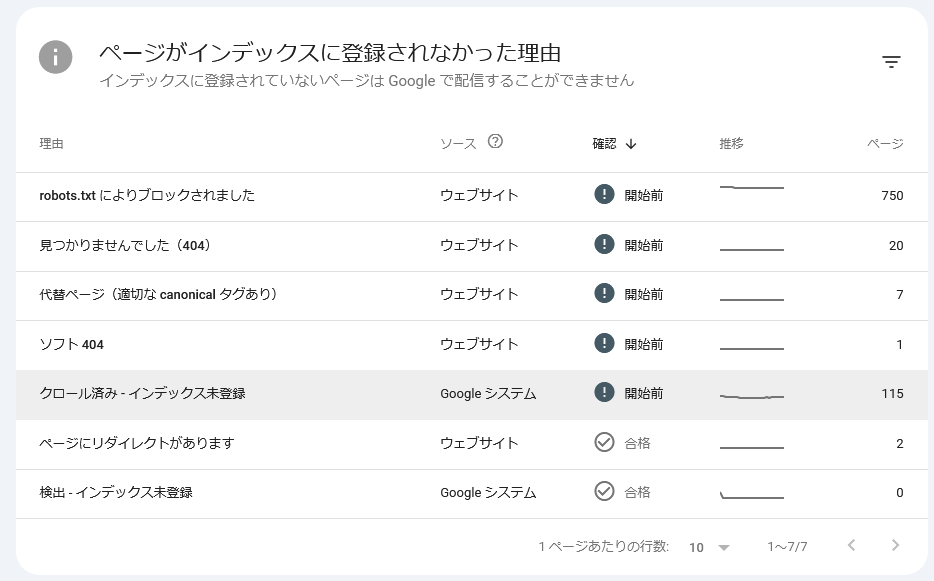
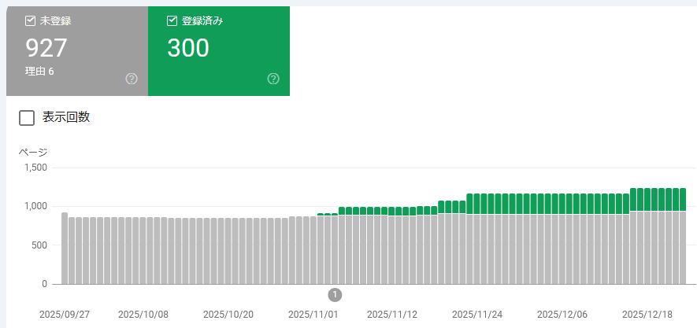
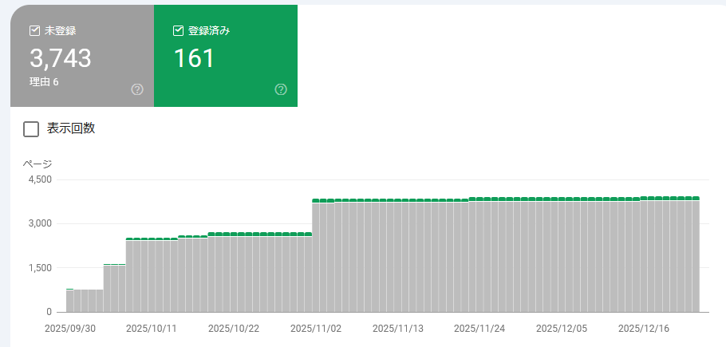
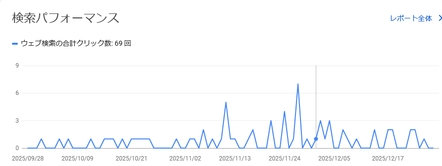
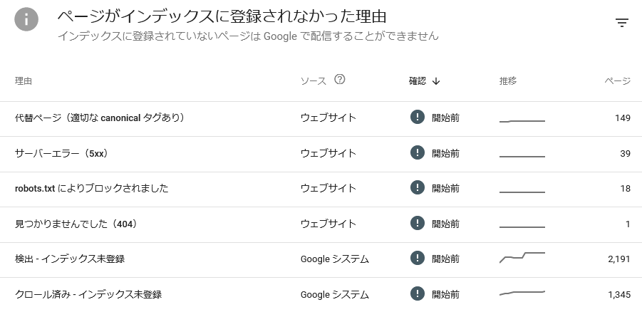
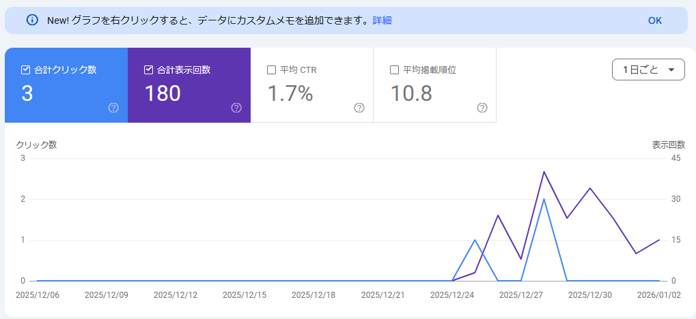

3ヶ月くらい忘れていたが、このサイトの状況報告。

* [web: GitHub Pagesの管理(2025/9月) - hiro99ma blog](https://blog.hirokuma.work/2025/09/20250911-web.html)

## Google Search Console

忘れていたというか変化なくずっとゼロだったし、「一時的に非表示にする」に設定して検索しても見つからなくなっているので放置していたのだ。  
それが最近、検索件数は相変わらずゼロなのだが、インデックスの登録がされるようになっていた。  
なして？

登録され始めたのは 11月の頭くらい。  
「ソフト404でエラーです」というようなメールが届いて気付いた。

* [hiro99ma old blog: ソフト404 ?](https://hiro99ma.blogspot.com/2025/11/404.html)

この時の登録済みが 44件で今が 178件。  
未登録は相変わらず多いが、内訳を見ると 750件が robots.txt ではじいているページ。  
これは過去サイトで使っていたドメインをこっちに持ってきてしまい、そのときのページがリンク切れにならないよう飛ばすためだけのページだから robots.txt で拒否したのだ。

115件の未登録というのも多いといえば多いのだが、半分以上は登録されていると思えば、ね。

一時的な非表示は解除した方がよいのかしら。  
だいたい、クロールされても登録されていないのはページの品質が低いだとか外部から閲覧されず評価が低いだとかいっていたのに、
実は単に数ヶ月の時差があったというだけだったのだろうか。  
よくわからんね。

## 2025/12/26追記

年末の状況を残しておこう。  
あれから24日経過してまた増えていた。  
178件 → 300件。

記事の追加はしたが過去の見直しなどはやっていないので、内容が良くなったから追加されたということはなかろう。  
基準が変わったとか、単にスルーしていたとかだろうか。

関係ないと思うが `robots.txt` はここを見て更新した。  
なんというか、これをちゃんとチェックしているかどうかとかわからんよね。
ブラウザで見ることができる以上、防ぐことはできんだろう。

* [github.com/ai-robots-txt/ai.robots.txt/releases/tag/v1.44](https://github.com/ai-robots-txt/ai.robots.txt/releases/tag/v1.44)
  * [うちの robots.txt](https://blog.hirokuma.work/robots.txt)

Googleから非表示にしておくのも馬鹿らしくなってきたので 2025年9月に設定した非表示設定はキャンセルした。

## 2025/12/29追記(※間違いあり)

**※ 2026/01/04：見るサイトを間違えていた。161件は old blog の方だった。**

Google Search Console で検索から非表示にしていたのを 3日前にキャンセルした。  
その影響かどうか分からないが・・・登録件数が 300件から 161件に減った。

なんなんだ・・・。
嫌がらせか？  
半分になったにも関わらず、グラフの緑の部分にはほとんど変化がない。
つまり前回の 300件あったというのは間違いだったと言いたいのかもしれない。
「内部的な問題のため、このレポートは更新されておらず、最新のデータを反映していません。」というメッセージがずっと消えないので、
増えたのも減ったのも「問題」の一部なのだろうか。

* [ページのインデックス登録の登録済と未登録の数値が反映されない - Google 検索セントラル コミュニティ](https://support.google.com/webmasters/thread/395155397/%E3%83%9A%E3%83%BC%E3%82%B8%E3%81%AE%E3%82%A4%E3%83%B3%E3%83%87%E3%83%83%E3%82%AF%E3%82%B9%E7%99%BB%E9%8C%B2%E3%81%AE%E7%99%BB%E9%8C%B2%E6%B8%88%E3%81%A8%E6%9C%AA%E7%99%BB%E9%8C%B2%E3%81%AE%E6%95%B0%E5%80%A4%E3%81%8C%E5%8F%8D%E6%98%A0%E3%81%95%E3%82%8C%E3%81%AA%E3%81%84?hl=ja)

それとは別に、今までゼロ件だった検索パフォーマンスが急にグラフに現れるようになった。  
9月11日から非表示にしていたのだが、実は設定が意味をなしていなかったのか？ 
これもまた「問題」なのか？？

分らぬ。全く何事も我々には判らぬ。

ちなみに、インデックス未登録の原因数も変わっていた。  
上の方に載せたときには robots.txt 原因の件数がそれっぽかったのだが、今は 18件と全然だ。 

数値は変わっているけれども、正しいんだか何だかさっぱり分からんな。

## 2026/01/04追記

すまぬ・・・Google Search Console のサイト選択を間違えてた。

間違えたのは 12/29 の分。  
見ていたのは [old blog](https://hiro99ma.blogspot.com/) の方だった。  
このブログについては 300件のままだった。
検索パフォーマンスも 12月25日からしかついてなかった。

分かっておらぬのは私の方だったよ。
