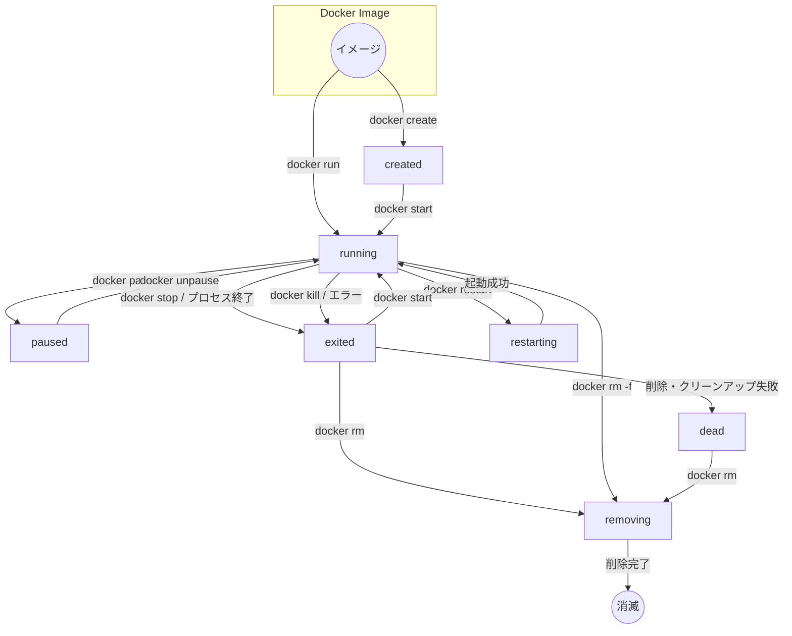

普段の開発は WSL2 上で行っている。つまり x86_64 というか linux/amd64 というか、そういう環境だ。  
テスト用にその環境で動く Dockerイメージを作っていたのだが、そういえば客先は Mac だったことを思い出した。
要求されているわけでもないのだが、Docker環境の方が説明も楽だしよさそうな気がした。

同じ Linux だから動くだろうとなんとなく思っていたのだが、そんなことはなかった。  
そうよね、VM じゃないんだったよね。

動かそうとしたのは bitcoind だ。
自分でビルドしたものでも、既に Docker Hub に上がっているイメージでもなく、公式からバイナリをダウンロードしてイメージを作っている。
このくらいなら許してくれるだろう(誰が?)という気持ちだ。

最初は x86_64 向けだけだったのだが、M1 Mac では rosetta2 エラーになっていた。
OS を判別すればよいだろうと思って詳しく調べていない。  
"macOS (arm64)" があったのでこれだろうとやってみたが、これはこれでファイル形式がダメだというエラーになる。  
正解は "ARM Linux" の aarch64-linux だった。

* [Bitcoin Core :: Download - Bitcoin](https://bitcoincore.org/en/download/)

`Dockerfile` はほぼ Gemini に作ってもらったので特に言うことはない。

```dockerfile
FROM --platform=$BUILDPLATFORM debian:bookworm-slim
ARG TARGETARCH

ENV BITCOIN_VERSION=30.0
ENV BITCOIN_FILE_X86=bitcoin-${BITCOIN_VERSION}-x86_64-linux-gnu.tar.gz
ENV BITCOIN_FILE_AARCH=bitcoin-${BITCOIN_VERSION}-aarch64-linux-gnu.tar.gz
ENV BITCOIN_DATA=/home/bitcoin/.bitcoin

RUN apt-get update && apt-get install -y \
    curl \
    ca-certificates \
    && apt-get clean && rm -rf /var/lib/apt/lists/* \
    && useradd -m bitcoin

RUN if [ "$TARGETARCH" = "amd64" ]; then \
        BITCOIN_FILE=${BITCOIN_FILE_X86}; \
    elif [ "$TARGETARCH" = "arm64" ]; then \
        BITCOIN_FILE=${BITCOIN_FILE_AARCH}; \
    else \
        echo "Unknown ARCH"; \
        exit 1; \
    fi && \
    BITCOIN_URL="https://bitcoincore.org/bin/bitcoin-core-${BITCOIN_VERSION}/${BITCOIN_FILE}"; \
    curl -SLO "$BITCOIN_URL" \
    && tar -xzf ${BITCOIN_FILE} -C /usr/local --strip-components=1 --exclude='*-qt' \
    && rm ${BITCOIN_FILE}

USER bitcoin
RUN mkdir -p ${BITCOIN_DATA}
WORKDIR /home/bitcoin
EXPOSE 18444 18443
CMD ["bitcoind", "-regtest"]
```

docker-compose.yaml のサービスはこんな感じか。
こちらはまあまあ自分で作った。ような気がする。

```yaml
services:
  bitcoind:
    build:
      context: .
      dockerfile: ./Dockerfile
    container_name: bitcoin-regtest
    ports:
      - "18443:18443"
    command: >
      bitcoind
      -regtest=1
      -server=1
      -printtoconsole
      -rpcallowip=0.0.0.0/0
      -rpcbind=0.0.0.0
      -rpcuser=testuser
      -rpcpassword=testpassword
      -fallbackfee=0.000001
```

これにアクセスする `bitcoin-cli` はこんな感じ。  
最初は `docker exec` ではなく `docker run` にしていて、つながらないつながらないと長いこと悩んでいた。

```bash
docker exec -it bitcoin-regtest bitcoin-cli -regtest -rpcuser=testuser -rpcpassword=testpassword $@
```

## おまけ

### 最近の docker-compose.yaml は version を書かないらしい

久しぶりに docker をやったのだが、昔書いた docker-compose.yaml を使うと "version はいらない" みたいな警告が出てきた。

docker compose の v5.0.0 のとき、過去のと決別するので v5.0.0 からにするぜ、みたいなことが書いてあった。

* [v5.0.0 "Mont Blanc"](https://github.com/docker/compose/releases/tag/v5.0.0)

その関係と思ったが、こちらは2025年2月には既にそうなってたようだ。
リンクを見ていくと 2024年3月くらいから？

* [Docker Composeのversion指定が不要になったのはなぜか？ - 動かざることバグの如し](https://blog.turai.work/entry/20250207/1738856223)

以前は `docker-compose` だったのが `docker compose` になったりしていたので、その頃からそういう話が出ていたんだろうか？  
まったく興味が無かったのでいわれるがままハイハイと使っていたよ。  
そうか、前回 docker を触ったは2年以上前ってことか。

では 2025年12月の v5.0.0 はなんだったのだろう？  
確かにその前のバージョンは v2.40.3 で v3 も v4 もスキップしている。  
Java2 みたいに docker compose のバージョンと "docker compose v2" というのは関係ないということ？

"docker compose v2" は 2020年くらいのことらしい。  
コマンドが `docker-compose` から `docker` に取り込まれて `docker compose` で実行できるようになったのが v2 からのようだ。

* [Migrate to Compose v2 - Docker Docs](https://docs.docker.com/compose/releases/migrate/)

それで今まで v2.40.3 のように v2.x.x だったけど、ようやくそういうシリーズから脱却して yaml ファイルも縛りをなくしたのかしら。  
たしかに、docker compose v2 なのにファイルは v3 ってなっていると何が何やらっていうのはあった。

当面は互換性に関して方針が立ったから大丈夫になったのかな。  
こういうみんなが使うツールの大きい変更って緊張するだろうね。

### docker ps で出てこなくて docker ps -a で出てくるやつらは何なの

`docker compose down` などしてコンテナを終わらせる。  
`docker ps` としても何も出てこなくなった。  
しかし！ `docker ps -a` とするといろいろ出てくる。
STATUS は "Exited (0)" なので既に終わっていると思われる。  
終わっているのに残っているこいつらは何なのだろう？

まず `-a(--all)` オプションについて。  
これは help で見ると「 Show all containers (default shows just running)」、
つまり何もしないと動作中のコンテナしか出てこないのでそれ以外を出力させているだけ。

[status](https://docs.docker.com/reference/cli/docker/container/ls/#status)

| status | memo |
| -- | -- |
| created | コンテナはまだ開始してない |
| running | `docker start` か `docker run` で開始したコンテナ |
| paused | 一時停止(`docker pause`?) |
| restarting | コンテナのrestart policyによって開始したコンテナ |
| exited | もはや動いていないコンテナ。コンテナ内のプロセスが完了したり `docker stop` で停止したなど。 |
| removing | 削除中のコンテナ(`docker rm`?) |
| dead | "defunct"コンテナ(機能していないとか現存しないとか)。再開できないので削除しかできない |

シーケンスというかライフサイクルを図にしてくれないだろうか。

* [Gemini](https://gemini.google.com/share/1f2953ae6f4e)



exited はまだ runnning に戻ることができるから `ps -a` に残しているのかな。  
しかしこれ、そのままにしてまた `docker compose up` などすると増える一方だ。  
面倒なので `.bashrc` に `alias` を作って削除できるようにしている。
まあ、何でもかんでも消してしまうけどね。

```bash
alias dockerrm='docker stop `docker ps -qa` && docker rm `docker ps -qa`'
```

そして私の作業後に exited なコンテナがたくさん残っているのは `docker run` で
個別に動かしたコマンドが残っているだけだった。  
`--rm` を付けると残らなくなったが、それはそれで毎回遅くなるんだろうか。
まあ実験だからいいか。
