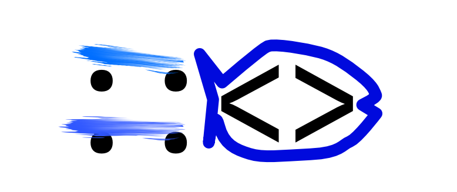

自分の書いたコードに `cargo clippy` したとき、`Vec::<String>` と書いていたところを `Vec<String>` と指摘された。  
いつも `::` いるんだかいらないんだか迷いながら書いていたが、コンパイルは通っていたのでこっちで正しいのだろうと思っていたのだ。
まさかどちらでも書けるとは。

聞いてみると `::` を付けた方は「ターボフィッシュ構文」というものだそうだ。

* [ChatGPT](https://chatgpt.com/share/69551a66-4408-8010-ae66-083c9c52d212)

Rust book には `None` が型不明だと使えないので、みたいな文脈で登場していたと思う。  
シュガーシンタックスではないそうで、最終的には同じ結果にはなったもののあくまで意味は異なる。

* [Turbofish](https://doc.rust-lang.org/reference/glossary.html?highlight=turbo#turbofish)

Google翻訳そのまま載せる。

> Paths with generic parameters in expressions must prefix the opening brackets with a ::. Combined with the angular brackets for generics, this looks like a fish ::<>. As such, this syntax is colloquially referred to as turbofish syntax.
>> 式内の汎用パラメータを含むパスには、左括弧の先頭に :: を付ける必要があります。ジェネリックの山括弧と組み合わせると、これは魚 ::<> のように見えます。そのため、この構文は口語的に Turbofish 構文と呼ばれます。

```rust
let ok_num = Ok::<_, ()>(5);
let vec = [1, 2, 3].iter().map(|n| n * 2).collect::<Vec<_>>();
```

> This :: prefix is required to disambiguate generic paths with multiple comparisons in a comma-separate list. See the bastion of the turbofish for an example where not having the prefix would be ambiguous.
>> この :: プレフィックスは、カンマ区切りのリストで複数の比較を行う汎用パスを曖昧さをなくすために必要です。接頭辞がないと曖昧になる例については、ターボフィッシュの要塞を参照してください。

"turbofish" という名称は魚のように見えるから・・・らしい。


