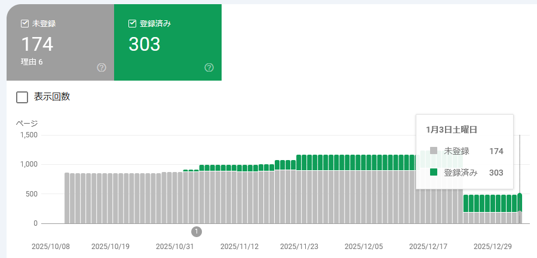
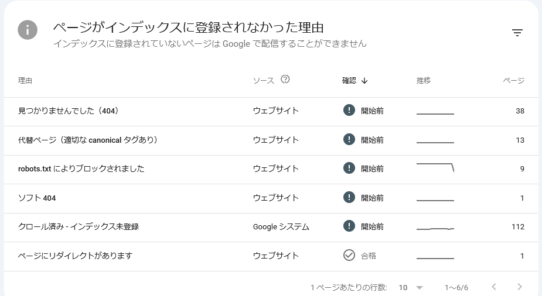

先月から Google Search Console がよくなったのかおかしくなったのか、なんだかよくわからない動きをしていた。  
私が勘違いしていたのもあって記事が分かりづらいが、だいたいこういう感じだ。

* [web: GitHub Pagesの管理(2025/12月) - hiro99ma blog](https://blog.hirokuma.work/2025/12/20251202-web.html)
  * Google Search Console を見るとこのブログのインデックス登録がどんどんなくなり、とうとう0件になった
  * 2025年9月からGoogle検索に載らないようにしていた(非表示)
  * 2025年11月末にインデックス登録され始めた
  * 2025年12月末にはちょうど300件の登録、未登録は927件だった
    * 12月29日の記事は勘違いだから忘れてね

先程見ると、登録は303件と誤差程度の増え方だが、未登録が174件と急に減った。

しかし、未登録が減ったのに登録は増えていない。
理由を見てもわからん。

上のグラフでは2025年12月24日からガクッと減ったように見えるが、2026年1月4日に残した理由のスクリーンショットではそうはなってないのよね。
Google Search Console に不具合があったとずっと載っていたので、それがまだ解消されていないということかな。
