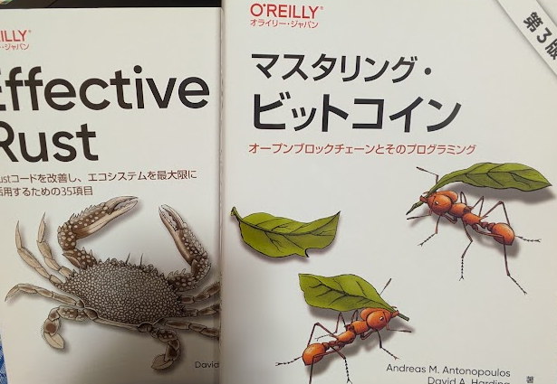

久しぶりに技術書を買った。

* [マスタリング・ビットコイン 第3版 - O'Reilly Japan](https://www.oreilly.co.jp/books/9784814401444/)
* [Effective Rust - O'Reilly Japan](https://www.oreilly.co.jp/books/9784814400942/)

## マスタリング・ビットコイン 第3版

最初の版も持っているのだが、P2PKHの時代なのでさすがに情報が古い。
P2PKHの情報が古くなって今では変わってしまった、とかいうわけではなくP2PKH自体がほとんど使われなくなった。
coinbaseトランザクションの内容も変わったし、つまりwitnessな時代なのだ。

内容としては third_edition_print1 と同じくらいだと思うので、英語が気にならないならそれでもよいかも。
私は・・・ね。それに本になっていると書き込めるし、あとお守り？として安心するという効果もある。

* [bitcoinbook/bitcoinbook at third_edition_print1](https://github.com/bitcoinbook/bitcoinbook/tree/third_edition_print1)

## Effective Rust

Rust はまだcook bookも終わってないし本を買ってもなあと思ったのだが、たまにはよかろうと買った。  
第1刷なのだが、サイトを見ると正誤表の記載がそこそこあった。
致命的なものはほとんどないが、持っている人は眺めておいたほうが良いだろう。

## 年々・・・

本を読むのが辛くなってきた。  
PCだと拡大できるのが良いけど、1ページ1画面に収まらないと読みづらい。
そうなるとディスプレイも大型になってくるけど簡単に買い換えられるものじゃない。

乱視のせいかどうかわからんが、読んでいると文を追っている目がいつの間にか隣の行になったりする。
技術書は横書きだからかまだそこまでないが、縦書きはしょっちゅうずれる。  
メガネを外すと少しよいような気がするが、気のせいだ。左右の目がずれているので首を自然と曲げてしまい、首が痛い。
散髪すると切っている人に首を動かされることがあるので、もうデフォルトが曲がっているのだろう。
乱視と頚椎症の合せ技かもしれん。
