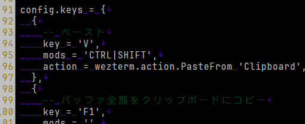

うちのページ、URLが未訪問でも訪問済みでも同じ色だったのでCSSで色を付けてみた。

```css
    a {
        color: #2987f1;
    }
    a:visited {
        color: #ff00ea;
    }
```


背景が黒なのでもっと暗めが良かろうと変更してみると、文字が滲む！

```css
    a {
        color: #2987f1;
    }
    a:visited {
        color: #66015e;
    }
```


これは Windows の ClearType によるものらしい(ChatGPT氏)。  
ClearType のせいというか、ClearType が効かない？条件かなにからしいのでブラウザだけの問題ではない。  
サブピクセルを使ったレンダリングだから仕方ない、みたいなことになってるそうだ。  
Mac は画素が4倍というか高解像度なのでサブピクセルを使わないのでこういうのは起きにくいんだとか。
確かにあちらは座標指定が浮動小数点で `.5` が使えていたように思う。  
なるほどねぇ。

ClearType を無効にしてみたが効果はなかった。
残念だが対処法はないのだろう。

### 見比べ

気になったので RGB のそれぞれでやってみた。  
Windows11 Firefox である。


RGB が偏っていると影響が強いというのはそれっぽい感じがする。  
#c0 くらいになってようやく滲みが少なくなるが、赤と青はけっこうつらい。  
こういうのがあるから Windows の GUI はコントラストが低いというか見分けがつきにくい配色が多いのだろうか。

省エネのためダークモードを推奨している様子はあるのだが、
レンダリングによって暗い文字色が表現できないと使いづらい。  
EmEditor なんかはこんな暗い文字でも滲まずに表示できているが、これは自前でレンダリングしているからだろう。  
ゲームなどでも自前でレンダリングすることで回避しているんじゃなかろうか。

<a href="images/20260124b-4.png"></a>

そうなると画素数によるサブピクセルうんぬんよりもテキストレンダリングの仕方に何かあるのか？  
わからん。。。
