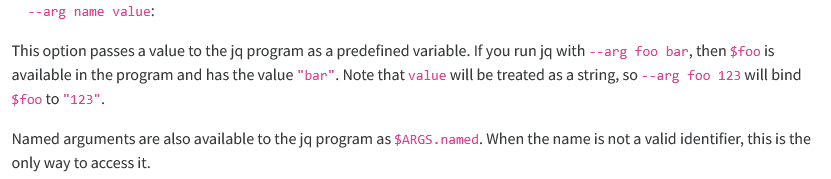

JSONをコマンドラインであれこれしようと思うと `jq` を使うことが多いと思う。  
昨日もコマンドの実行結果がJSONで出力されるのでパイプで `jq` に与えて処理しようとしたのだが、どうにもうまくいかない。  
`select()` で特定のkeyが変数の文字列と同じであるものだけ抽出していたので `echo $JSON | jq '.[] | select(.hoge=="$FUGA")'` のような感じにした。

シングルクォーテーションだと変数が展開できないので、じゃあダブルクォーテーションにするか。。。  
そうすると `$FUGA` を囲んでいるダブルクォーテーションがおかしくなるから `\"` にするか。。。  
ダメだったからシングルクォーテーションにして変数の手前で閉じて再開させるか。。。

などなどやったのだが、なんだかダメだったのだ。  
その部分だけ抜き出して試作するとうまくいくのでやり方が悪いのはわかったのだが、どうやるのが正解かよくわからない。

Gemini先生に泣きついたところ `--arg` というオプションを使うのが良いとのこと。

* [jq 1.8 Manual](https://jqlang.org/manual/#invoking-jq)

直接のリンクがないのでスクリーンショットで。



`--arg` を使うと変数の展開ではないのでシングルクォーテーションの中でも割り当てた方の変数を使うことができる。
どうやら文字列だからといってダブルクォーテーションで囲む必要もなさそうだ。

`echo $JSON | jq --arg fuga $FUGA '.[] | select(.hoge==$fuga)'`

```shell
# 例
$ json=$(cat <<EOS
[
{"hoge": "abc", "fuga": 123},
{"hoge": "def", "fuga": 456}
]
EOS
)
$ echo $json | jq -cr
[{"hoge":"abc","fuga":123},{"hoge":"def","fuga":456}]

# 変数に抽出したい文字列を設定
$ fuga=def

# これはシングルクォーテーションの中で変数が展開されないのでダメ
$ echo $json | jq -cr '.[] | select(.hoge==$fuga)'
jq: error: $fuga is not defined at <top-level>, line 1:
.[] | select(.hoge==$fuga)
jq: 1 compile error

# 変数の前後を区切ってみたが quoting issues なのでダブルクォーテーションがないのがダメなのか？
$ echo $json | jq -cr '.[] | select(.hoge=='$fuga')'
jq: error: syntax error, unexpected ')', expecting IDENT (Unix shell quoting issues?) at <top-level>, line 1:
.[] | select(.hoge==def)
jq: 1 compile error

# ダブルクォーテーションを入れると成功した
$ echo $json | jq -cr '.[] | select(.hoge=="'$fuga'")'
{"hoge":"def","fuga":456}

# --arg を使うと全体としては長くなるが jq への指示は見やすくなる
$ echo $json | jq -cr --arg fuga $fuga '.[] | select(.hoge==$fuga)'
{"hoge":"def","fuga":456}
```
