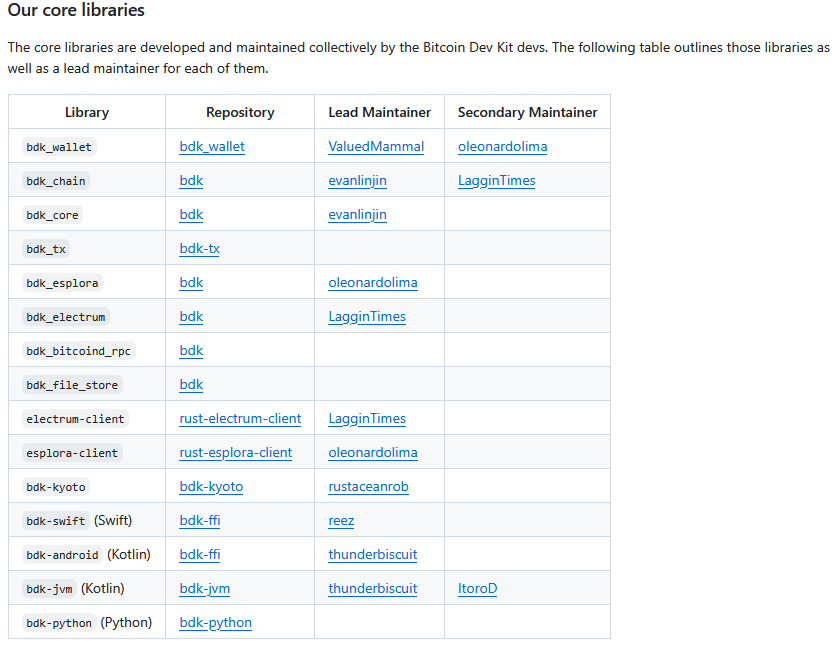

RustのBitcoinライブラリにBDKというものがある。

* [Bitcoin Dev Kit Documentation](https://bitcoindevkit.org/)
* [Bitcoin Dev Kit(GitHub)](https://github.com/bitcoindevkit)

ウォレットを作るのに使用していたので [bdk_wallet](https://github.com/bitcoindevkit/bdk_wallet) を使っていたのだが、
ブロックチェーンのデータを使おうとすると `bdk_wallet` 以外のクレートもすることになる。  
その辺についてAIに質問しながらやっていたのだが、BDK v0系とかv1系とかいう言葉がしばしば出てくる。
いやいや、`bdk_wallet` ライブラリは v2 だし `bdk` も最新リリースは v0.23 とかだよ、何言ってるんですか、と無視していた。

自分の `Cargo.toml` を見ると `bdk` が 0.30 となっていた。
0.30 ってどこから出てきたんだ？？とブランチを見ると[deprecated](https://github.com/bitcoindevkit/bdk/tree/release/0.30?tab=readme-ov-file#-deprecated-)なバージョンになっている。  
AI氏が言っていた "v0系" というのがこの流れである。
そして "v1系" というのは `bdk_wallet` などのクレートに分割された後のことらしい。
なので v2 もそういう視点で言えば v1系という扱いになる。

* [Migrating from 0.X - Book of BDK](https://bitcoindevkit.github.io/book-of-bdk/getting-started/migrating/)

てっきり `use bdk_wallet::bdk::...` は `bdk` の re-export だと思い込んでいたので、なんで同じ名前なのにエラーになるんだろうと不思議に思っていたのだ。  
そういうわけで、特に理由がないのであれば `Cargo.toml` には `bdk_wallet` や `bdk_electrum` のようなものを使うのが良い。

ちゃんと表にまでなっているのに、`cargo add` できるからよいのだろうと思いこんでいたのだ。

