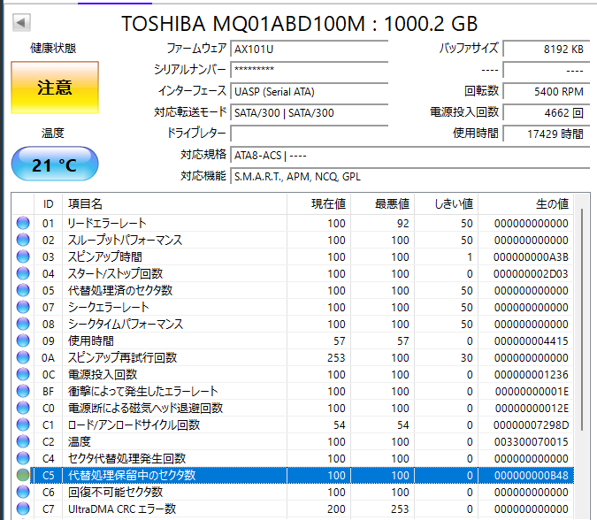

以前、Raspberry Pi4で `bitcoind` を動かすのにあれやこれやした。

* [btc: bitcoindのblocksを別ディレクトリにしたい - hiro99ma blog](https://blog.hirokuma.work/2025/04/20250402-btc.html)

ファイルを個別にSSDに置くなどして高速化を図っていたが、メンテナンスの手間が増えるだけなので `chainstate/` だけSSDに、それ以外はHDDに置いていた。

## 事の発端

年末年始があったのでRaspberry Pi4を止めていたのだが再起動するとelectrsが動いていない。  
エラーが出ていて、あるブロックのデータが取れないという。
`bitcoin-cli getblock` すると確かに取れない。その前後は取れる。  
こういうのは `bitcoind` の再起動でなんとかするんじゃないかと思ったのだがどうにもならない。

最終手段として `bitcoind -reindex` でインデックスの再生成を指示した。  
これが全然進まず・・・。2日目にようやく `getblockcount` で `0` 以外が返ってくるようになり、
3日目で1万ちょっとという進み具合。
4日目が2万になるかどうかだったので、このまま行くと数カ月かかってしまう。

さすがにそれはダメなのでRaspberry Pi4からノートPCにディスクをつなぎ直した。  
HDDがないと立ち上がらないような構成なのでドライブのチェックをするのに不向きだからだ。
また、多少は速くならないかという期待もある。
あったのだが、1日動かしてみてもブロック高の進み方はあまり変わらない。

余っているSSD... SMART でもう寿命宣言されたSSDがあったので `blocks/` をそちらに置いて同期が終わったらHDDに戻そうと考えた。  
そのファイル移動中に "Input/Output error" が出ていた。  
HDDもSSDも疑わしいのだが、ブロックのデータが読めなかった点を考えるとHDDの方があやしそうである。

買い替えるのがよいのはわかっている！  
わかっているのだが...やりたいことがなんでもできるわけではない。

## badblocks

不良セクタとかあるんじゃなかろうかということで `badblocks` で探して登録して使えないようにしてもらおう。  
手順はこんな感じらしい(ChatGPT)。  
いまは2行目の `badblocks` を実行しているのだが、1TB HDD で1時間実行して 6% 程度しか進んでいない。

```shell
$ sudo umount /dev/sdb1
$ sudo badblocks -sv /dev/sdb1 > badblocks.txt
$ sudo fsck.ext4 -l badblocks.txt /dev/sdb1
```

調べずに実行していたがオプションに破壊的検査もあるのか。。。あぶないところだった。  
`-w` が破壊的 R/W、`-n` が非破壊的 R/W、デフォルトは非破壊 Read-Onlyテストらしい。

* [badblocks - ArchWiki](https://wiki.archlinux.jp/index.php/Badblocks)
* [badblocks(8) - Linux manual page](https://www.man7.org/linux/man-pages/man8/badblocks.8.html)

## e2fsck

最近はAI記事ばかりなので多少古い方が信用できるときも多いよねー、と眺めていたら、
直接 `badblocks` を使うよりも `e2fsck` などを使うほうがよいようなことが書いてある。

* [Linux上でHDDの不良ブロックの確認を行う – 記録](https://www.ekesete.net/log/?p=4326)

確かに、↑ の badblocks(8) の "Important note" にもそういうことが書いてある。  
Ctrl+C で `badblocks` を中断して `e2fsck` に切り替えた。

```shell
$ sudo e2fsck -c /dev/sdb1
```

[-c](https://man7.org/linux/man-pages/man8/e2fsck.8.html) は `badblocks` を使うようにするオプションのようで、
実行すると `badblocks` と同じような進捗テキストが現れた。  
bad blockが見つかったらinodeをアロケーションから避けるようにするとも書いてあるので、これ1つでよいのだろう。

### その後

6時間で55%くらいだった。  
2.5インチのHDDだし、あんまり速くないと思う。

その前に実行していた `badblocks` の出力を見たのだが、10%も進んでいなかったのに300個以上も出力があった。。。  
もしかして、進捗テキストの "(xxxx/yyyy/zzzz error)" は "(よし / いまいち / だめ)" とかじゃなくて全部ダメなのか？  
Gemini を信用するなら "(読み取りエラー / 書き込みエラー / 比較エラー)" らしい。  
今やっている `e2fsck` で既に400あるよ。。。

これからHDDのbad blockは増えていく一方だろう。
それならSMARTで寿命扱いされたSSDに乗り換えたほうがマシなのか。  
Bitcoinフルノードの辛いところはブロックファイルを複数のドライブに分散するのが面倒なことだ。
シンボリックリンクなどを活用すればできるけど、ファイル単位でやっていくのが大変。

どうせRaspberry Pi4でしか使わないんだから、USBになった安めのSSDでもいいのかなあ。
安めと言っても十分高いんだが。  
あああ。。。

## 実行結果

朝起きたらほぼ終わっていた。

まず、大丈夫そうなドライブで実行した結果はこちら。  
"non-contiguous"は起動ログで見かけたことがあるので `fsck` の実行結果だろう。

```shell
$ sudo e2fsck -c /dev/sdc1
e2fsck 1.47.0 (5-Feb-2023)
Checking for bad blocks (read-only test): done
/dev/sdc1: Updating bad block inode.
Pass 1: Checking inodes, blocks, and sizes
Pass 2: Checking directory structure
Pass 3: Checking directory connectivity
Pass 4: Checking reference counts
Pass 5: Checking group summary information

/dev/sdc1: ***** FILE SYSTEM WAS MODIFIED *****
/dev/sdc1: 26697/61054976 files (1.8% non-contiguous), 43592820/244190390 blocks
$
```

そして問題がある方。  
こちらは入力待ちで止まっていた。

```shell
$ sudo e2fsck -c /dev/sdb1
e2fsck 1.47.0 (5-Feb-2023)
Checking for bad blocks (read-only test): done                                                 
/dev/sdb1: Updating bad block inode.
Pass 1: Checking inodes, blocks, and sizes
Inode 22560953 extent tree (at level 1) could be shorter.  Optimize<y>? yes
```

`y` を押すと進むのだがまた別のinodeで同じことを聞いてくる。  
これは `yes` コマンドを付けて実行するタイプだったかーと思い始めた頃に "all" が選択肢に出てきて助かった。  
以降もいろいろ出力されているが "all" のあとは自動で進められた。

```
Inode 22561219 extent tree (at level 1) could be shorter.  Optimize<y>? yes
Inode 22562068 extent tree (at level 1) could be shorter.  Optimize<y>? yes
Inode 22562432 extent tree (at level 1) could be shorter.  Optimize<y>? yes
Inode 22562481 extent tree (at level 1) could be shorter.  Optimize<y>? yes
Inode 22562505 extent tree (at level 1) could be shorter.  Optimize<y>? yes
Inode 22563187 extent tree (at level 1) could be shorter.  Optimize ('a' enables 'yes' to all) <y>? yes
Inode 22563200 extent tree (at level 1) could be shorter.  Optimize ('a' enables 'yes' to all) <y>? yes to all
...
......
Running additional passes to resolve blocks claimed by more than one inode...
Pass 1B: Rescanning for multiply-claimed blocks
Multiply-claimed block(s) in inode 22546257: 106467525--106467529
Multiply-claimed block(s) in inode 22546776: 4901632--4901662 4901666
Multiply-claimed block(s) in inode 22566688: 41512
Multiply-claimed block(s) in inode 28312301: 34148--34152
Pass 1C: Scanning directories for inodes with multiply-claimed blocks
Pass 1D: Reconciling multiply-claimed blocks
(There are 4 inodes containing multiply-claimed blocks.)

File /mainnet/bitcoin/data/blocks-raspi/blk05329.dat (inode #22546257, mod time Thu Jan  8 03:27:18 2026) 
  has 5 multiply-claimed block(s), shared with 1 file(s):
	<The bad blocks inode> (inode #1, mod time Tue Feb 10 11:49:55 2026)
Clone multiply-claimed blocks? yes

Error reading block 106467525 (Input/output error).  Ignore error? yes

Force rewrite? yes

Error reading block 106467526 (Input/output error).  Ignore error? yes

Force rewrite? yes
...
......

Pass 1E: Optimizing extent trees
Pass 2: Checking directory structure
Pass 3: Checking directory connectivity
Pass 4: Checking reference counts
Pass 5: Checking group summary information
Free blocks count wrong for group #0 (23395, counted=23352).
Fix? yes

Free blocks count wrong for group #1 (3931, counted=3937).
Fix? yes

Free blocks count wrong for group #149 (8682, counted=8714).
Fix? yes

Free blocks count wrong for group #3249 (9211, counted=9216).
Fix? yes


/dev/sdb1: ***** FILE SYSTEM WAS MODIFIED *****
/dev/sdb1: 11598/61054976 files (91.7% non-contiguous), 207006843/244190390 blocks
$
```

"contiguous"が"連続している"という意味なので"non-contiguous"が91.7%とというのはズタズタな状況ということだろう。  
もうこのディスクはほとんどダメだろうから、壊れても良いので `e4defrag` でデフラグしてみる。  
`fsck` と違ってこちらはマウントしていないと動かせなかった。

すぐ終わったのだが、Success と Failure が出てきた。。。  
`-v` をつけると細かく出力されて、今回の場合はRead-Onlyだからという理由でNGにされていた。
マウントした直後でファイルオープンしているわけでもないし、`ls -l` で見ても `0600` なファイルだった。

なんかもうダメダメなんだろうなあ、と私はここまでやってようやくこのHDDを諦めることができた。  
といいつつCrystalDiskInfoでも見てみた。



ダメだな！  
ディスクのラベルを見ると2016年製造っぽいし、寿命なんだろう。うんうん。

## 全然関係ないけど

ハードディスクを分解すると強力な磁石が入っている。  
3.5インチのはかなり強力で、冷蔵庫に貼り付けると手で引き剥がすのはかなり大変だ。  
2.5インチはサイズが小さいのでそこまではないが、それでもなかなかな磁力である。
