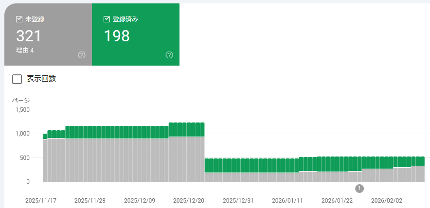
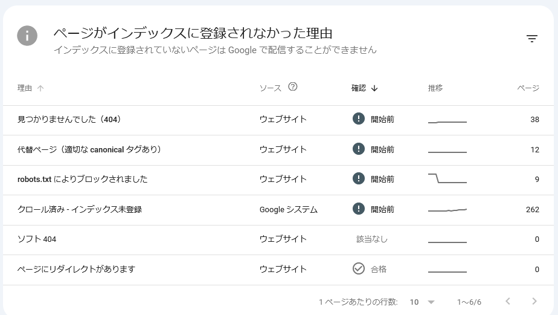

なるべく月初にやっていたこのブログ(GitHub Pages)の管理状況報告だ。

* [web: GitHub Pagesの管理(2026/01月) - hiro99ma blog](https://blog.hirokuma.work/2026/01/20260106-web.html)

## Google Search Console

じわじわ登録件数が減っている。  
そして件数が減る日数が短くなっていくので二次曲線っぽくなってきた。
1回で30件くらい減少しているので、順調(?)に行けば数カ月後にはゼロ件になるんだろうか。

「クロール済み - インデックス未登録」が増えただけのようだ。

Googleが「登録してみたけど、やっぱりダメだわぁ」と思ったのだろうか。  
前回は「非表示」にして数ヶ月すると登録され始めたのだが、
あれは単にそういうタイミングだっただけで非表示にしたことは意味がなかったのだろうか。  
まあ、DuckDuckGoなどに出てくるからいいんだけどね。

## 自分でも検索しなくなってきた

Googleだけというわけじゃないのだが、最近私はあまり検索しなくなってきた。  
検索して出てくる記事がAI生成した記事ばかりなので、
それだったら自分でAIに質問した方が話が早い、というところだ。

なのでインデックスに登録されないのも時代の流れだろう。  
うちのサイトも、上の方にDuckDuckGoで検索できるようにしているが自分のために付けているようなものだ。
