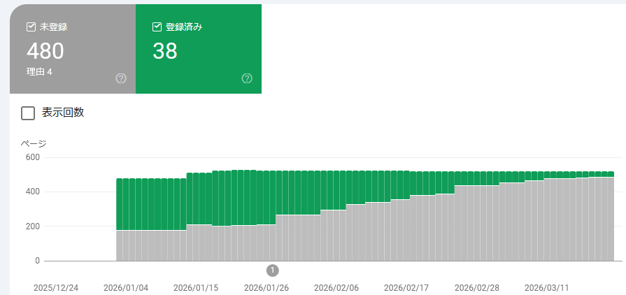
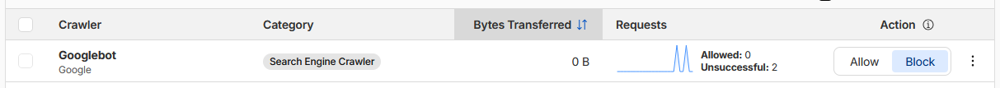

ブログ(GitHub Pages)の管理状況報告だ。

* [web: GitHub Pagesの管理(2026/01月) - hiro99ma blog](https://blog.hirokuma.work/2026/01/20260106-web.html)
* [web: GitHub Pagesの管理(2026/02月) - hiro99ma blog](https://blog.hirokuma.work/2026/02/20260215-web.html)

## Google Search Console

登録インデックス数は1月が303件、2月が198件、と減り 3月は133件である。

理由は「クロール済み - インデックス未登録」が増えただけだ。

## 検索する前にAIに聞くよね

ネットに公開するものはAIの食糧になるだけで、
有名どころはともかく少々のことではメジャーなブログにはならんよね。

有用なことをたとえ書いたとしても AIが吸い取ってお金を回収するかと思うとやる気にならん。
そういいつつ私が書いているのはローカルでメモして検索するよりは楽だからかな。

自分のサイトが確実にAIに取り込まれているとわかったらロイヤリティとかもらえるようにならんだろうか。
広告収入よりももらえそうな気がするが、よほど独自のデータじゃない限りわからんだろうなあ。

## 2026/03/06更新

↑で見た登録インデックス数は2月24日くらいまでの情報だった。
それが更新されて3月3日までの情報が追加されていた。

133件 → 85件と大幅に？同じくらい？ともかく減っていた。  
少なく見ても1回で50件は減るだろうから、5月くらいにはGoogleから消え去っていそうだ。

## 2026/03/17更新

* ～2月24日 : 133件
* 2月25日～3月3日 : 85件(-48)
* 3月4日～3月10日 : 56件(-29)
* 3月11日～3月15日 : 46件(-10)
* 3月16日～3月17日 : 43件(-3)
* 3月18日～ : 38件(-5)

AI 関係を拒否するよう robots.txt を更新したが、インデックスに載らない理由には挙げていないからそっちは原因ではないことになっている。
本当かどうか確認する方法はないがね。

## 2026/03/19更新

CloudflareにAIクローラを禁止することができる設定があるのだが、そこにGooglebotも入っていることに気づいた。

個別に設定できるので外せばよいだけだが、これはこれで面白いのでそのままにしておこう。

先ほど気づいたが、AI Crawl Control には[robots.txt管理](https://developers.cloudflare.com/bots/additional-configurations/managed-robots-txt/)する機能もあるようだ。
お試しでこれも有効にしておこう。
