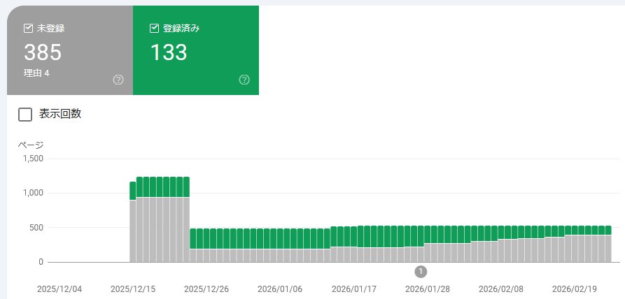
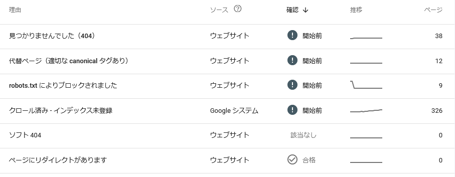

ブログ(GitHub Pages)の管理状況報告だ。

* [web: GitHub Pagesの管理(2026/01月) - hiro99ma blog](https://blog.hirokuma.work/2026/01/20260106-web.html)
* [web: GitHub Pagesの管理(2026/02月) - hiro99ma blog](https://blog.hirokuma.work/2026/02/20260215-web.html)

## Google Search Console

登録インデックス数は1月が303件、2月が198件、と減り 3月は133件である。

理由は「クロール済み - インデックス未登録」が増えただけだ。

## 検索する前にAIに聞くよね

ネットに公開するものはAIの食糧になるだけで、
有名どころはともかく少々のことではメジャーなブログにはならんよね。

有用なことをたとえ書いたとしても AIが吸い取ってお金を回収するかと思うとやる気にならん。
そういいつつ私が書いているのはローカルでメモして検索するよりは楽だからかな。

自分のサイトが確実にAIに取り込まれているとわかったらロイヤリティとかもらえるようにならんだろうか。
広告収入よりももらえそうな気がするが、よほど独自のデータじゃない限りわからんだろうなあ。
