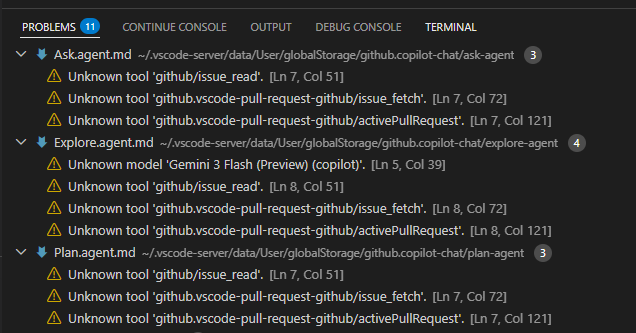

Visual Studio Codeで、PROBLEMSタブにMarkDownファイルのwarningが出るようになった。  
v1.113.0にアップデートしてからだろうか？ 
それとも設定を少し変更したことに影響されたのだろうか？ 
よくわからないが出るものは出るのだ。

`.vscode-server/data/User/globalStorage/github.copilot-chat/` にある `Ask.agent.md`、`Explore.agent.md`、`Plan.agent.md` の3ファイルだ。

それぞれこの3つ。

* "message": "Unknown tool 'github/issue_read'."
* "message": "Unknown tool 'github.vscode-pull-request-github/issue_fetch'."
* "message": "Unknown tool 'github.vscode-pull-request-github/activePullRequest'."

`Explore.agent.md` はこれもある。

* "message": "Unknown model 'Gemini 3 Flash (Preview) (copilot)'."

使ってないからMarkDownファイルを直接編集して消してしまえばいいかと思ったが、vscodeを再起動すると元に戻ってしまう。  
MarkDownのくせに生意気な。。。

## WSL2?

私がWindows環境だからかもしれないが、WSL2側のプロジェクトを開いたときだけのように見える。  
あるいはWindows側のプロジェクトはAI関係を有効にしていないので出ていないだけかも。

## GitHub Pull Requests Extension

まず、このExtensionが有効になっていないと 'github.vscode-pull-request-github' 関連のwarningが出る。  
デフォルトではインストールされていたと思うけど使ってないから削除していたのだ。

インストールしているだけでなく有効になっていないとダメだった。  
使わないのに。。。

## GitHub MCP server

これもデフォルトではインストールされていたと思うが、MCP serverでGitHubが有効になっていないと 'github/issue_read' のwarningが出る。  
Extensionのサイドバーで `@mcp` とすると一覧の中にあるからインストールして有効にしておくとよいだろう。
"Start server"まではしなくてもよさそうだった。

ただこれ、GitHubのアカウントとの連携を有効にしようとしてきた。
面倒だったので有効にしたけどよかったんだろうか。

## これでも1つ残る

'Gemini 3 Flash (Preview) (copilot)' のwarningが残る。
この記事に出てくるが「Copilot Pro, Pro+, Business, and Enterprise」とあるからFree版の私ではどうしようもないのでは。

* [Gemini 3 Flash is now in public preview for GitHub Copilot - GitHub Changelog](https://github.blog/changelog/2025-12-17-gemini-3-flash-is-now-in-public-preview-for-github-copilot/)

GitHub SettingsでもCopilotのところって他に比べるとDisableにできるところが少ないのよね。
なんだかなあと思ってしまう。
