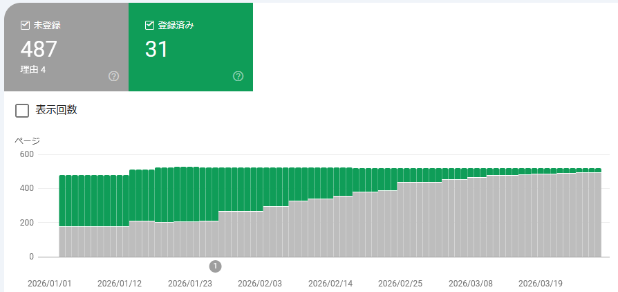
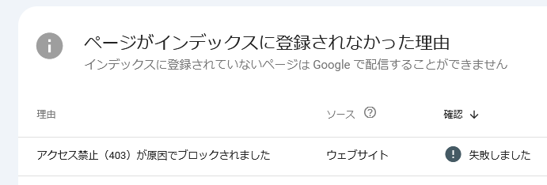
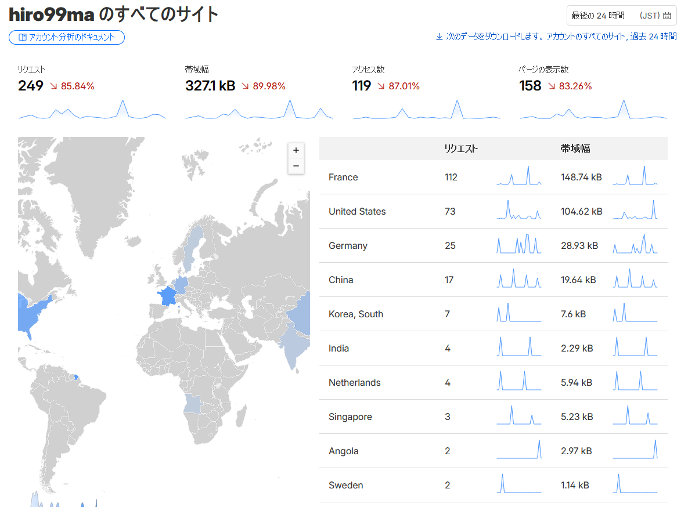
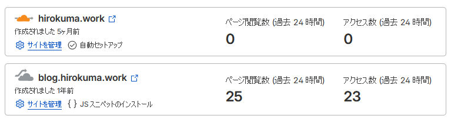
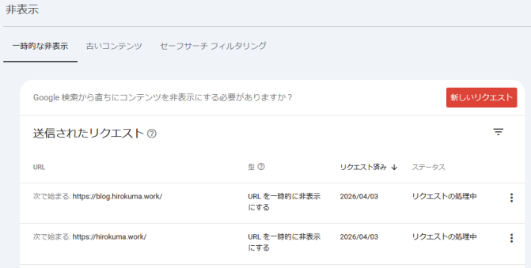
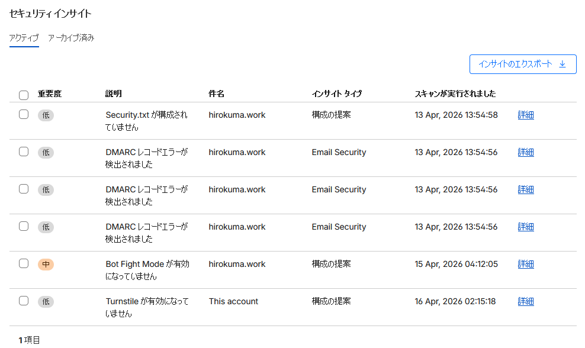

ブログ(GitHub Pages)の管理状況報告だ。

* [web: GitHub Pagesの管理(2026/01月) - hiro99ma blog](https://blog.hirokuma.work/2026/01/20260106-web.html)
* [web: GitHub Pagesの管理(2026/02月) - hiro99ma blog](https://blog.hirokuma.work/2026/02/20260215-web.html)
* [web: GitHub Pagesの管理(2026/03月) - hiro99ma blog](https://blog.hirokuma.work/2026/03/20260304-web.html)

## Google Search Console

登録インデックス数は31件である。
何もいうまい。

これはCloudflareでGoogleBotを遮断しているせいなんじゃないかと思うのだが、
おそらくまったくアクセスできないとGoogle Search Consoleでは403エラーになっているようなのだ(Cloudflareのホスティングで表示しているサイトがそうなので)。

さすがに寂しくなってきたので、Cloudflareで遮断するクローラはAI関係だけにした。
来月には31件から増えているだろうか。増えてないだろうなあ。

## Cloudflare

ドメイン管理をお名前.comからCloudflareに移行したのが2年前。
アカウントがあるのでサイトを登録している。
無料アカウントだとログが24時間しか残らないが、気分で眺めるだけなので特に問題ない。

Botを選択して遮断する機能なんかもあり、自分でサーバを立てて制御しなくても済んでいるようだ。
どういうしくみなんだろう？ 本体はGitHub Pagesで独自ドメイン設定をしているだけなのだ。

Cloudflareの方からだとアクセスがちょいちょいあるのがわかる。
人間がアクセスしているのかどうかはわからんけどね。
いや、日本語でしか書いていないのに海外からしかアクセスがないので人間じゃないと思う。

## 2026/04/03更新

今日も5件減って、インデックス登録数は26件になっていた。  
これはもう登録していても仕方ないな。
かといって特にお金を掛けているわけでもないし、Google Search Consoleのプロパティを削除したらじゃあなんか変わるのかというと、たぶん変わらないんだろう。

こういうときは気分転換にコンテンツの非表示設定をしておこう。

## 2026/04/06更新

CloudflareでGooglebotなども有効に戻したのだが、今日見ると21件になっていた。

うん、もういいよ。  
クローラーはDuckDuckGo以外全部無効にするよ。  
`robots.txt` の設定はまた別にあるから、たぶんそういうのとは別にはじいてくれるんじゃないかな。403エラーとかいう報告だったし。

## 2026/04/20更新

あれから2週間くらい経ったが、まだインデックス登録件数は21件のままだ。
非表示設定にしたので止まったのだろうか？  
Google Search Consoleの動きはよくわからないので気にしても仕方ないか。

Cloudflareの方を見るとアクセスはあるようだ。
日本語でしか書いていないのに日本からのアクセスはないのだ。
これもAIが発達して情報源になってることがあるということなのかな？ 
多少は世の中の役に立っているのだと思うことにしよう。

セキュリティインサイトのページでは、現在のセキュリティ設定で不足している内容を紹介してくれるようだ。

Bot Fight Modeが「中」になっているが、これはBotトラフィックを監視して軽減する無料アプリらしい。
いろいろBotの種類があるので、攻撃するBotだとわかれば守ってくれるのかな？ 
特に拒否する理由もないので有効にした。

DMARC関連の項目が3つあるのだが、これはメールのドメインとして使っていなくてもなりすまされる可能性があるということだろうか。  
よくわからんが、Cloudflareの「DMARC Manager(ベータ)」を有効にするといろいろ設定できるようになった。
これも無料でできるのか。。。おそるべし。  
設定の中に「ドメインはメールの送信に使用されていません」関連の項目があったので推奨される設定をそのまま採用した。
ドメインを取って一応ホームページがあるのだから、それをメールドメインとして使っていても不思議ではないな。

よくわからないのが最後の「Turnstile」だ。  
これはウィジェットらしい。

> Turnstile は、Cloudflare 経由でトラフィックを送信することなく、あらゆる Web サイトに埋め込むことができ、訪問者に CAPTCHA を表示せずに動作します

これもBot攻撃のようなものから守る対策ということだろうか。
CAPTCHAというとユーザが人間かどうか確認するためのあれこれで、
最近はむしろ人間のほうが解くことができないんじゃないかという気がするやつだと思っていたが、
表示せずに動作するということはこっそりなにかやってくれるんだろう。  
これはホームページなどに埋め込むのかと思ったが、サーバとかクライアントとか出てきた。
アプリ作成に関係するものなのかしら？

## 2026/04/28更新

月末になった。インデックス登録件数は17件に減った。

4月1日～20日まで21件で21日から17件である。更新期間がよくわからないが毎週更新しているだけなのか。  
それにしては減り方がこれまでより少ないように思う。
ある程度の閾値を下回ったら監視周期が緩くなるとか、設定を「非表示」にするとそうなるとかかもしれない。
仕様を公開していないのに推察しても仕方ない。

Google Search Consoleではインデックス登録状況などを「プロパティ」という単位で扱っている。
私だと、[このブログ](https://blog.hirokuma.work/)と[仕事用ページ](https://hirokuma.work/)がそれぞれ別のプロパティとしている。  
プロパティにできるのはサイト単位かドメイン単位かのどちらかである。今の私の設定はサイト単位だ。
ブログはGitHub Pages、仕事用ページはCloudflareのサービスで作っているので分けたのだが、ドメインが同じなのでまとめることも可能である。  
ドメイン単位でプロパティを作ってみると、ブログの17件と仕事用ページ1件の合わせて18件がインデックス登録されていると出てきた。
非表示設定も引き継がれている。

このプロパティというのはどういう管理方法になっているのだろうか？ プロパティを削除したら非表示設定は消えてしまうのだろうか。
それとも関係なく保持されるのだろうか。

### robots.txt関連

Cloudflareの設定で、AIクローラーのアクセス制御を `robots.txt` で行うための項目がある。
仕事用ページの方で有効にして `robots.txt` を作ってもらっていたのだが、
`Disallow` などの後ろに自作の `index.html` が混ざり込んでいた。
そういうものなのかどうかわからないが、ブログの方では自分で `robots.txt` を作っているので仕事用ページも自作することにした。

`robots.txt` は単に旗を立てているだけなので、相手の行儀が悪くて無視されても何もできない。
その程度のものだと割り切るしかないのだが、設定がちゃんとできているかは気になる。

* [Content Signals](https://contentsignals.org/)
  * Cloudflareでなくても使えるらしいが、設定はCloudflareだと楽らしい
    * HTTPレスポンスで `Content-Signals:..` を返す
    * `/.well-known/content-signals.json` というファイルを置く
* [Is Your Site Agent-Ready?](https://isitagentready.com/)
  * 簡単にチェックしてくれるようだ

よくわかってないので、使うときは各自調べよう！

## 2026/04/30更新

今日で4月も最後というところでGoogle Search Consoleから通知が来た。  
12件である。仕事用ページを加えても13件。

通知が来た理由は「アクセス禁止（403）が原因でブロックされました」とのこと。
`robots.txt` のことを言ってこないのでCloudflareでの設定が効いたのかな？  
クローラのブロック設定は4月の最初の方に行ったので、時差がありすぎてよくわからないな。
