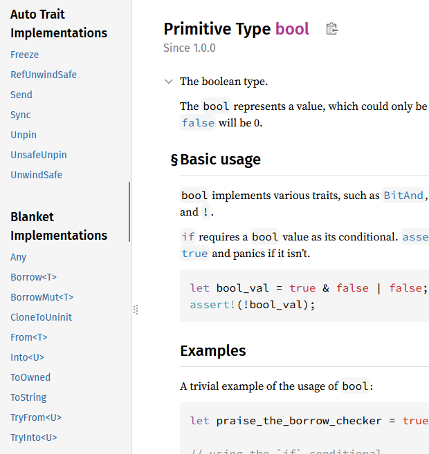
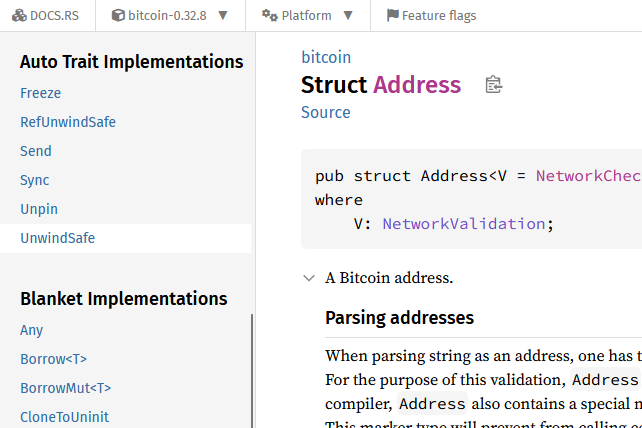

本を読んでいて「ブランケットトレイト実装」という言葉が出てきた。太字で。  
出てきたのは良いのだが「さまざまなブランケットトレイト実装が提供されている」くらいしか使われておらず、
何がブランケットトレイト実装なのかわからない。

太字の次行にコードブロックがあったのでそれがそれなのかもしれないが、
もしそうならこれの何がブランケットトレイト実装なのかわからない。

DuckDuckGoで日本語検索しても、そのものを指すページは出てこなかった。

* [ブランケットトレイト実装 at DuckDuckGo](https://duckduckgo.com/?q=%E3%83%96%E3%83%A9%E3%83%B3%E3%82%B1%E3%83%83%E3%83%88%E3%83%88%E3%83%AC%E3%82%A4%E3%83%88%E5%AE%9F%E8%A3%85&t=newext&atb=v491-1&ia=web)

## ブランケット実装のことか？

「ブランケットトレイト実装」はほぼ出てこなかったが、「ブランケット実装」は出てきた。rust-jp.rs にも出てきた。

* [トレイト：共通の振る舞いを定義する - The Rust Programming Language 日本語版](https://doc.rust-jp.rs/book-ja/ch10-02-traits.html#%E3%83%88%E3%83%AC%E3%82%A4%E3%83%88%E5%A2%83%E7%95%8C%E3%82%92%E4%BD%BF%E7%94%A8%E3%81%97%E3%81%A6%E3%83%A1%E3%82%BD%E3%83%83%E3%83%89%E5%AE%9F%E8%A3%85%E3%82%92%E6%9D%A1%E4%BB%B6%E5%88%86%E3%81%91%E3%81%99%E3%82%8B)

>  トレイト境界を満たすあらゆる型にトレイトを実装することは、ブランケット実装(blanket implementation)と呼ばれ、 Rustの標準ライブラリで広く使用されています。

「ブランケット実装と呼ぶ」と言いつつも実装するのはトレイトだから、この本では「ブランケットトレイト実装」と表現しただけのような気がする。
英語版で検索してもほとんど"blanket implementation"しか出てこないし。

* [blanket trait implementation at DuckDuckGo](https://duckduckgo.com/?q=blanket+trait+implementation&t=newext&atb=v491-1&ia=web)

"blanket"は毛布だが、動詞として「一面を覆う」というような意味もある。
「あらゆる型に」の全面的なところが、トレイト実装で覆っているような雰囲気を醸し出しているので"blanket"と表現したというところか。  
なので「ブランケットトレイト実装」としたのも、トレイト以外の実装で覆うこともありうるので明示的に書いただけなのかな。

## Implementorsはどこに？

先ほど引用したページの続きに「ブランケット実装は、トレイトのドキュメンテーションの「実装したもの」節に出現します。」とある。  
どう見ても直接和訳したものだろうと原文を探すと「Implementors” section」と書いてあった。  
そういう説明ページがあっただろうかと探したが見つからず、AIに聞くとこういうリンクを紹介された。

* [Display in std::fmt - Rust](https://doc.rust-lang.org/std/fmt/trait.Display.html#implementors)

`impl Display for XXX` がずらずらと載っている。  
なるほど、"Documentation"というのは言語の解説ページではなくて docs.rs のようなライブラリのドキュメントで、そのそれぞれにあるということね。

この大量の項目は、全部 `std` クレートの中で `Display` トレイトを実装しているモジュールたちなのだろう。
これだけあると全部のモジュールに実装しているんじゃないかという気がするが、はてさて。

## ブランケット実装って何よ

ブランケット実装は、トレイト境界を満たすあらゆる型にトレイトを実装するということはわかったのだが、それが何なのかピンとこない。
例として `Display` トレイトを実装するあらゆる型に `ToString` トレイトを実装してある、ということだが、例を挙げられてもやはりわからん。  
ブランケット実装だろうとなんだろうとトレイトを実装していたら "Implementors" には出てくるだろうから、
"Implementors" に載っていればブランケット実装である、とは言えないと思う。

もう少し前に戻って、トレイトってなんだっけから始めよう。

### トレイトのおおよその役割

他の言語でいう `interface` みたいなもの、というのがよく見る説明である。

* [トレイト：共通の振る舞いを定義する - The Rust Programming Language 日本語版](https://doc.rust-jp.rs/book-ja/ch10-02-traits.html)

### トレイト境界の復習

* トレイトを定義する → `trait` を使って定義する
* トレイトを型に実装する → `impl トレイト定義名 for 型 {～}` のように特定の型にトレイト定義したシグネイチャの中身を埋める
* `impl Trait` 構文 → 引数にトレイト定義を参照で受け取ってメソッドを呼び出すことで、該当するトレイトが実装された型ならどれでも引数にできる。トレイト境界のsyntax sugar。
* トレイト境界 → `impl Trait` 構文の元

トレイト境界(trait bound)あたりから急にわかりづらくなると思う。

* 引数のアノテーションに直接 `&impl トレイト定義名` を書く(`impl Trait` 構文)
* 引数のアノテーションには `&T` のように書き、メソッド名の後ろに `<T: トレイト定義名>` を書く
* 引数のアノテーションには `&T` のように書き、メソッド名の後ろに `<T>` と略称だけ書き、実装が始まる `{` の前に `where T: トレイト定義名` を書く

### ジェネリックとトレイト境界の違い

これとジェネリックなデータ型が混ざると、もう訳がわからんごとなる。  
`struct` がジェネリック型を持つのと、関数がジェネリック型を持つのと。  
関数の方はトレイト境界の3番目のように書きつつ `where` がないというか、2番目のように書きつつトレイト定義名がないというか。
もしかして、トレイト境界を指定しないのがジェネリック型なのか？

AIに聞くと、どちらかというとジェネリックの方が大きい枠組みで、そこからフィルタリングするのにトレイト境界を使うということらしい。
まあ、確かに何も書かないと足し算も何もできないな。

### 「トレイト境界」は何を指す言葉なのか

結局のところ、トレイト境界というのはトレイト実装の書き方のうちで `where` があるタイプということでよいのだろうか？  
Geminiに聞いたところでは、狭義と広義があり、狭義の方は `impl Trait` 構文以外の Sugar Syntax ではない書き方全般を指し、
広義の方はジェネリクスに対してトレイトで制約すること自体を指すのだとか。

そういうことにしておく。

### これがブランケット実装だッ！

doc.rust-jp.rs に出てきた `Display` トレイトと `ToString` トレイトの例は
次のコードの説明がメインらしい。

```rust
impl<T: Display> ToString for T {
    // --snip--
}
```

普通のトレイト実装は `impl トレイト定義名 for 型` だが、その型もトレイト定義にすることで
特定の型ではなく特定のトレイト境界を持つ型すべてに実装したことになる、ということのようだ。  
↑↑の書き方だと「トレイト境界 `Display` を持つ型すべてのために `ToString` トレイトを実装する」ということか。
なんだかだまされているような気がしてしまう。

これは別のクレートに対しても効果が継続するのだろうか。
独自の `struct` に `Display` トレイトを実装したら `.to_string()` できるかどうかを確認すればよいはずだ。

このコードはコンパイルできない。
エラーメッセージも `std::fmt::Display` がないと言っている。

```rust
struct MyStruct {
    value: i32,
}

fn main() {
    let v = MyStruct { value: 5 };
    println!("{}", v); // ★`MyStruct` doesn't implement `std::fmt::Display` in format strings you may be able to use `{:?}` (or {:#?} for pretty-print) instead
}
```

ならば `Display` を実装すればよい。

```rust
struct MyStruct {
    value: i32,
}

impl std::fmt::Display for MyStruct {
    fn fmt(&self, f: &mut std::fmt::Formatter) -> std::fmt::Result {
        write!(f, "MyStruct is {}", self.value)
    }
}

fn main() {
    let v = MyStruct { value: 5 };
    println!("{}", v);
}
```

これに `.to_string()` を付けてもコンパイルできるし動作する。
噂はほんとうだった。。。

```rust
    println!("{}", v.to_string());
```

あー、 `cargo clippy` で「この `.to_string()` は不要だ」というメッセージが出ることがあるが、
あれは `Display` トレイトが実装されているから書かなくて良いというだったのか？

```
warning: `to_string` applied to a type that implements `Display` in `println!` args
  --> src/main.rs:13:21
   |
13 |     println!("{}", v.to_string());
   |                     ^^^^^^^^^^^^ help: remove this
   |
   = help: for further information visit https://rust-lang.github.io/rust-clippy/rust-1.92.0/index.html#to_string_in_format_args
   = note: `#[warn(clippy::to_string_in_format_args)]` on by default
```

そうだったね。。。修正箇所の指摘しか見てなかったよ。

### 分けなくても良かったのでは

そもそも `Display` トレイトに `to_string` があればよかっただけの話ではなかろうか。

Gemini的には、ヒープが使えない `no_std` だと `to_string` はメモリを確保するので困るとか、
コンパイラの最適化がより効率的にできるとか、そういう話なんだとか。  
へー。

### ブランケット実装されているかどうか

ブランケット実装を持っているかどうかは、ドキュメントのサイドバーに "Blanket Implementations" として載っているらしい。

ひとまず `std` のは載っていた。  
とはいえ、これは doc.rust-lang.org だ。

* [bool - Rust](https://doc.rust-lang.org/std/primitive.bool.html#blanket-implementations)



もっと普通の docs.rs を見てみたがちゃんとある。
なるほどねぇ。

* [Address in bitcoin - Rust](https://docs.rs/bitcoin/latest/bitcoin/struct.Address.html#blanket-implementations)



サイドバーの名称も「ブランケット実装」だからこれが正式名称なんだな。
