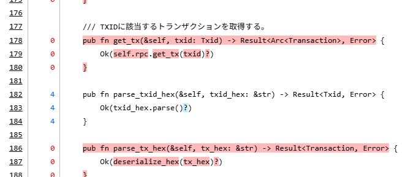

`cargo test`はよいのだが、どこまでカバーしたのかよくわからん。
そういうときはカバレッジを計測するのがよい。

今回対象とするのは作りかけているやつである。

* [hirokuma/rust-btc-keypath-wallet at revise](https://github.com/hirokuma/rust-btc-keypath-wallet/tree/ccadfa46542cffd1a6e931dc24e3fdc858b16247)

## cargo-llvm-cov

cargo-llvm-covが標準だとGeminiは言う。

* [Gemini](https://gemini.google.com/share/42ca398c8909)

"llvm-tools-preview"を勧めてくるのだが、previewじゃなくてもいいんじゃないの？どうなの？  
よくわからんので"llvm-tools"をインストールしてみたがエラーは起きなかった。だから大丈夫なのかどうかはわからんが。

```log
$ cargo install cargo-llvm-cov
$ rustup component add llvm-tools
$ cargo llvm-cov
info: cargo-llvm-cov currently setting cfg(coverage); you can opt-out it by passing --no-cfg-coverage
...(中略)...
running 7 tests
test tests::test_fail_load_not_created ... ok
test wallet::tests::test_descriptor ... ok
test tests::test_fail_load_no_wallet_file ... ok
test tests::test_parse_txid_hex ... ok
test tests::test_fail_load_no_privkey_file ... ok
test tests::test_create_load_with_callback ... ok
test tests::test_create_load ... ok

test result: ok. 7 passed; 0 failed; 0 ignored; 0 measured; 0 filtered out; finished in 0.70s

Filename                      Regions    Missed Regions     Cover   Functions  Missed Functions  Executed       Lines      Missed Lines     Cover    Branches   Missed Branches     Cover
-----------------------------------------------------------------------------------------------------------------------------------------------------------------------------------------
config.rs                          32                32     0.00%           4                 4     0.00%          17                17     0.00%           0                 0         -
electrum.rs                        48                26    45.83%           5                 3    40.00%          33                14    57.58%           0                 0         -
lib.rs                            389               114    70.69%          28                14    50.00%         215                72    66.51%           0                 0         -
wallet.rs                         309                87    71.84%          13                 7    46.15%         166                64    61.45%           0                 0         -
-----------------------------------------------------------------------------------------------------------------------------------------------------------------------------------------
TOTAL                             778               259    66.71%          50                28    44.00%         431               167    61.25%           0                 0         -
```

もうこれでいいかなとは思う。  
どこを通ってないかは目視したい場合は`--html`を付けるとHTMLで結果を出力する。



詳しいことはAIにでも聞けば良いし、今回は「Rustの標準カバレッジツール」というGeminiの言い分を確認しよう。

## The rustc book

DuckDuckGoで検索してRust標準っぽいところ(https://doc.rust-lang.org)だとここが出てきた。  
`rustc`のドキュメントのようだ。
gcov/lcovでカバレッジを取るときのような雰囲気を感じる。


* [Instrumentation-based Code Coverage - The rustc book](https://doc.rust-lang.org/rustc/instrument-coverage.html)

[ツール](https://doc.rust-lang.org/rustc/instrument-coverage.html#installing-llvm-coverage-tools)として`llvm-profdata`と`llvm-cov`を挙げている。
なるほど、ここで`llvm-cov`が出てくるのか。  
わざわざタイトルで「Instrumentation-based」といっているので、他のカバレッジもあるのかもしれないがまあ気にするまい。

さきほど"llvm-tools-preview"のpreviewがいるかどうかだが、[このドキュメント](https://github.com/rust-lang/rust/blob/9ae5f5231868c9a6c0b84ac1d87df2dca7be03ed/src/doc/rustc/src/instrument-coverage.md)は1年前に書かれていて、"llvm-tools-preview"の行は[5年前](https://github.com/rust-lang/rust/commit/e14bd48476bf3d8613f6b1ac1f79d4c7010da6ac)の2022年が最後の更新だ。  
"llvm-cov"はこれがそれなのか。

* [taiki-e/cargo-llvm-cov: Cargo subcommand to easily use LLVM source-based code coverage (-C instrument-coverage).](https://github.com/taiki-e/cargo-llvm-cov)

[CHANGELOG 0.5.0](https://github.com/taiki-e/cargo-llvm-cov/blob/80ef2944fc3145006dbef9ee4c9d3e6d29cb07c6/CHANGELOG.md?plain=1#L447)にはインストールしなくてもなんとかなりそうな。  
がコンポーネントを削除してから実行すると尋ねてきたので、使うか使わんかわからんがインストールしておいたほうがよさそうだ。  
そして進めるとダウンロードするのは"llvm-tools"と出てきた。。。

```shell
$ rustup component remove llvm-tools
info: removing component 'llvm-tools'
$ cargo llvm-cov
info: cargo-llvm-cov currently setting cfg(coverage); you can opt-out it by passing --no-cfg-coverage
I will run `rustup component add llvm-tools-preview --toolchain stable-x86_64-unknown-linux-gnu` to install the `llvm-tools-preview` component for the selected toolchain.
Proceed? [Y/n] y
info: downloading component 'llvm-tools'
(以下略)
```

では -preview はなんなんだろうと見ていくと、"llvm-tools-preview"を通じてllvm-toolsにアクセスするようなことが書かれている。7年前のリポジトリなのでよくわからんがな。

* [phil-opp/llvm-tools: Provides access to the llvm tools installed through the `llvm-tools-preview` rustup component.](https://github.com/phil-opp/llvm-tools)

Geminiによると、"-preview"が付くほうが安定版、付かない方が開発版だそうだ。名前が紛らわしい。。。  
知りたいのはカバレッジについてだけだし深く調べるのは止めよう。

```shell
$ rustup component list | grep llvm-tools
llvm-tools-x86_64-unknown-linux-gnu (installed)
```
