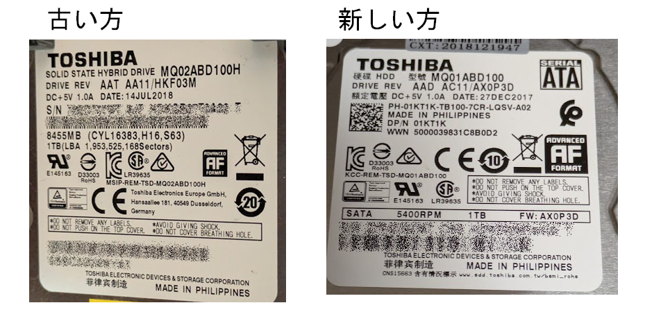

昨日Raspberry Piのディスクが調子よくないということを書いた。

* [raspi: fstabとnofail - hiro99ma blog](https://blog.hirokuma.work/2026/06/20260620-raspi.html)

このディスクにはBitcoin Coreのブロックデータが入っていて、どうもそれがダメになっているようだ。  
`debug.log`にはこういうログが出ていた。

```log
Verification error: ReadBlock failed at 954394, hash=000000000000000000003cffcd09bc0fe3f3ab87ff849968b4e86d38be407f5c 
```

[ブロック954394](https://mempool.space/ja/block/000000000000000000003cffcd09bc0fe3f3ab87ff849968b4e86d38be407f5c)だ。  
これを書いている時点で24時間前ということは、ディスクからの異音が気になったあたりの時間だと思う。

さて、そういう情報があったとしても特定のファイルだけなんとかすればよいというものではない。  
`bitcoin.conf`に`reindex-chainstate=1`を書いて実行中である。  
流れるようにログは出力されているが1秒で100ブロックくらいしか進まない。
今時点の最新は945,555ブロック。まだ265,235ブロックなので先は長い。。。

と思ったらログ出力が止まっていた。  
1分ほど止まってまた進みだした。。。  
ともかくいまが280,000くらいだとして、2時間もかからないくらいか。  
もちろん順調に進んだとしてそのくらいというだけなので、ディスクが死にかかっていることを考えるとだんだん時間がかかるようになるか、その前に止まるかだな。

うむ、だんだん遅くなって100ブロックで5秒くらいかかるようになってきた。  
ディスクから嫌な音がすると止まるし。  
寝よう。

## ダメだ (2026/06/21 6時)

朝の6時です。  
カションカションと音がする中で寝たけど、ずっと終わらず。  
さすがにあきらめて`fsck`に切り替え。
`-cc`が`badblocks`を使う非破壊なやり方だそうだ。

* [badblocks - ArchWiki](https://wiki.archlinux.jp/index.php/Badblocks#%E3%83%95%E3%82%A1%E3%82%A4%E3%83%AB%E3%82%B7%E3%82%B9%E3%83%86%E3%83%A0%E3%81%AE%E3%83%81%E3%82%A7%E3%83%83%E3%82%AF%E6%99%82)

```shell
~ $ sudo umount /dev/sdb1
~ $ sudo fsck -t ext4 -vcck /dev/sdb1
fsck from util-linux 2.38.1
e2fsck 1.47.0 (5-Feb-2023)
```

`-v`を付けているがこのまま何も表示されないのは進んでいるのか全然進んでいないのか。。。

## あきらめた (2026/06/21 13時)

`fsck -v`は進行状況が出力されることはないそうだ。  
`dmesg`で見るとこんな感じの出力がしばしば。  
カションカションという音もしばしば。

```log
[38749.826519] sd 1:0:0:0: [sdb] tag#0 UNKNOWN(0x2003) Result: hostbyte=0x03 driverbyte=DRIVER_OK cmd_age=30s
[38749.826550] sd 1:0:0:0: [sdb] tag#0 CDB: opcode=0x28 28 00 37 00 08 70 00 00 90 00
[38749.826562] I/O error, dev sdb, sector 922749040 op 0x0:(READ) flags 0x80700 phys_seg 18 prio class 2
```

もう・・・ダメだろう。  
私はあきらめた。Ctrl+Cするとその時点までのbad blockは記録してくれるようだ。

```shell
$ sudo fsck -t ext4 -vcck /dev/sdb1
fsck from util-linux 2.38.1
e2fsck 1.47.0 (5-Feb-2023)
^C/dev/sdb1: Updating bad block inode.

/dev/sdb1: ***** FILE SYSTEM WAS MODIFIED *****
$
```

## ノートPCでスキャン(2026/06/23)

1万円のHDDが届いた。  
SMARTで見る限りは電源投入は今回が最初だ。  
左側が異音がする方、右側が今回。  
DATEは今回のほうが古い。。。  
とはいえ、前回買ったのも5年くらい前でそのときから古いのだから今さらだな。



両方つないでできるだけデータコピーしようとしたのだが新しい方を認識しない。  
と書くと不穏な感じがするが、なんとなく電力が不足しているような感じがする。
PCに接続したときは普通に動くのに、Raspberry Piにつなぐとか細い音がするのだ。
セルフパワーのUSBハブを使っているので大丈夫だと思っていたのだが、SSD、HDDx2、CPUファンの4接続はきついのかもしれん。
USB-SATAケーブルはバスパワーなので、USBハブに頑張ってもらうしかないのだよなあ。
SSDはRaspberry Pi直結にして逃がすなどしてもうちょっと分散がいるのかも。

どうしたもんだかと悩んだが、そういえば前世代のノートPCにLubuntuをインストールしたマシンがあることを思い出した。
1年ほど前も同じようなことがあって、そのときもHDDが死にかけていたのだ。  
あのときは最終的にHDDのデータはあきらめ、危険になったので使わなくしていたSSDを使ってノートPCでBitcoin Coreの同期を行い、HDDにデータをコピーしたのだ。  
思えばあれも1週間くらいやっていたものだ。

今回異音がするHDDなのだがWindows PCの方につないでCrystalDiskInfoで見ても正常扱いになった。  
状況は前回と同じだと思っていたが、もしかしたら電力が弱いことがいろいろんが原因かもしれない。

まずはLubuntuノートPCで異音がするHDDを`fsck`させる。  
Raspberry Piのときと同じ`-vcck`でやっているのだが、進行状況が出力されている。  
OSの違いだろうか？  

かかったのは15時間くらいだろうか。

```shell
$ sudo fsck -t ext4 -vcck /dev/sdb1
fsck from util-linux 2.39.3
e2fsck 1.47.0 (5-Feb-2023)
Checking for bad blocks (non-destructive read-write test)
Testing with random pattern: done                                                 
/dev/sdb1: Updating bad block inode.
Pass 1: Checking inodes, blocks, and sizes
Pass 2: Checking directory structure
Pass 3: Checking directory connectivity
Pass 4: Checking reference counts
Pass 5: Checking group summary information

/dev/sdb1: ***** FILE SYSTEM WAS MODIFIED *****

       18340 inodes used (0.03%, out of 61054976)
       10997 non-contiguous files (60.0%)
           3 non-contiguous directories (0.0%)
             # of inodes with ind/dind/tind blocks: 0/0/0
             Extent depth histogram: 12708/5602
   216170111 blocks used (88.53%, out of 244190390)
           0 bad blocks
           1 large file

       17307 regular files
        1002 directories
           0 character device files
           0 block device files
           0 fifos
           0 links
          22 symbolic links (22 fast symbolic links)
           0 sockets
------------
       18331 files
```

bad blocksがゼロ！  
異音をまったく聞かなかった！  
どういうことなんだろうか。。。

ノートPCの方にRaspberry Piで使っていたSSDと異音がしていたはずのHDDを接続してBitcoin Coreの同期をさせることにした。
Raspberry Pi4でやるよりもそっちの方が速いのだ。  
あれだけカションカションと音がしていたのに順調な同期具合である。
