部屋の片付けをしていると[Digilent社のボード](https://digilent.com/shop/system-boards/)のZYBOが出てきた。  
今だと"ZYBO Z7"が売られているが、持っているのは10年ほど前に購入した無印のZYBOだ。2013年のボードっぽい。

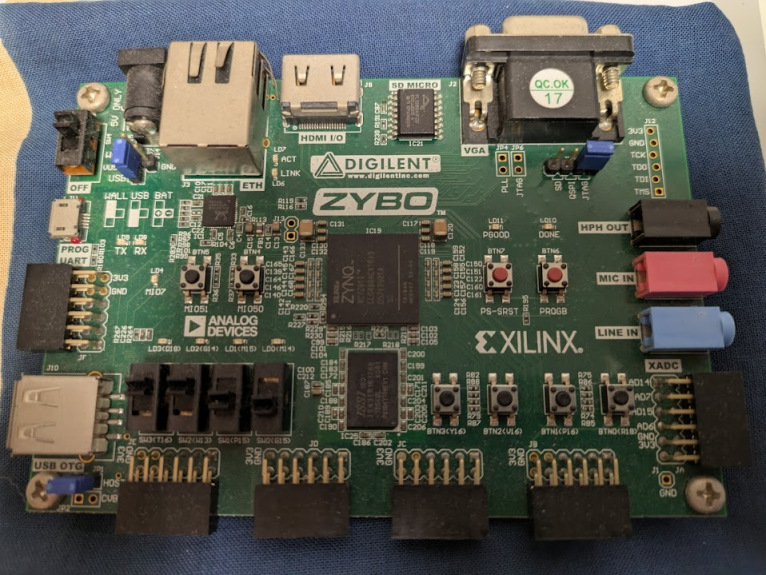

10年ほど前は組み込みソフトウェア専門でやっていたが、受け付けられる業務が減りそうなので「これからはハードウェアのことも！」と思ってFPGA方面に手を伸ばそうとしていたのだ。
オシロスコープなども買ったものの、夢破れて山河あり(?)・・・。

* [hiro99ma old blog: \[zybo\]ZYBOを動かしてみよう](https://hiro99ma.blogspot.com/2017/06/zybozybo.html)

## まだ使えるのか？

Gemini氏によると、まだ使えるそうだ。

* [Gemini](https://share.gemini.google/86ZKLZDLg7li)

ZYNQ XC7Z010というチップが載っているので初代ZYBOというものであっているのだろう。  

そして、当時一緒にライセンス購入したSDSoCはもうなくなってしまったそうだ。
まあ仕方ない。それに今は無料で使えるそうなので環境としては問題ないだろう。

## 当時の環境はたぶん使えない

当時はWindows10環境だっただろうか、一応あれこれ開発環境はダウンロードしていた。  
しかしもう使えなさそうだ。  
あの頃はダウンロードも重たかったし、ファイルサイズも大きいのによく残していたものだ。  
60GBもあったので驚きだ。

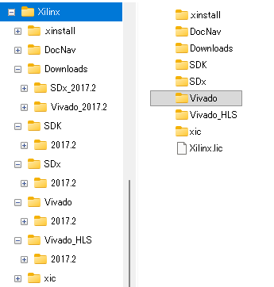

Vivadoの最新版とやらが使えるそうなので、もう削除してよいだろう。  
いや、こういうのは多少なりとも試したあとの方がよい。

## Vivadoの最新版

AMD Vivado。  
そう、Xilinxはもうないのだ。

* [Vivado の概要](https://www.amd.com/ja/products/software/adaptive-socs-and-fpgas/vivado.html)

今の最新バージョンは2026.1だそうだ。  
ダウンロードできそうなのはWindows版とLinux版。
[Installer and OS Support Information](https://www.amd.com/en/support/adaptive-socs-and-fpgas/installer-info-general.html)にはWindows11だとEnterpriseしか載っていない。

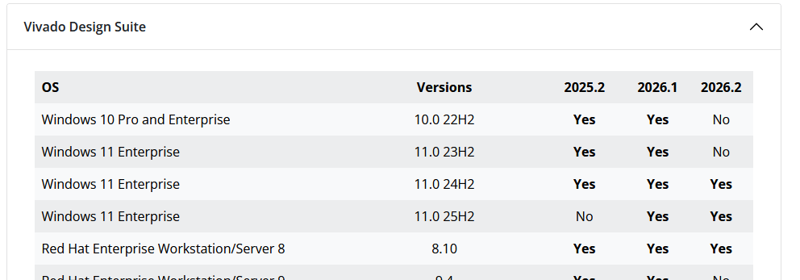

ダウンロードにはAMDアカウントがいるようだ。
アカウントだけでなく所属もいるみたいである。私は個人事業主なので"self-employed"にした。

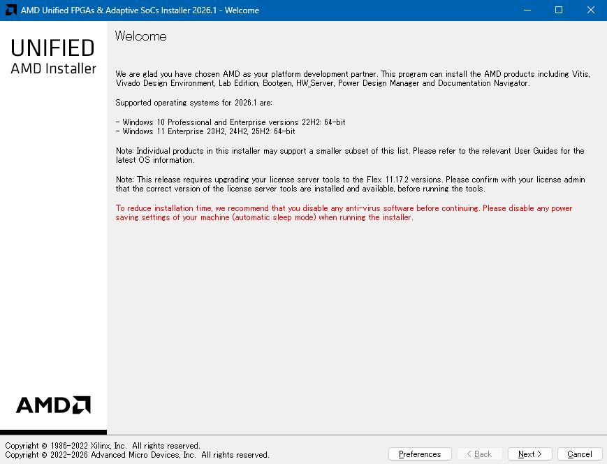

[Vitis](https://www.amd.com/ja/products/software/adaptive-socs-and-fpgas/vitis.html)というのを選ぶとVivado Design Suiteも入っているらしい。
Geminiの説明を見ていると、とりあえずはVitisをダウンロードしておけばなんとかなりそうだ。

ZYNQ 7000シリーズだけはチェックしておく。
第7世代技術という意味らしい。

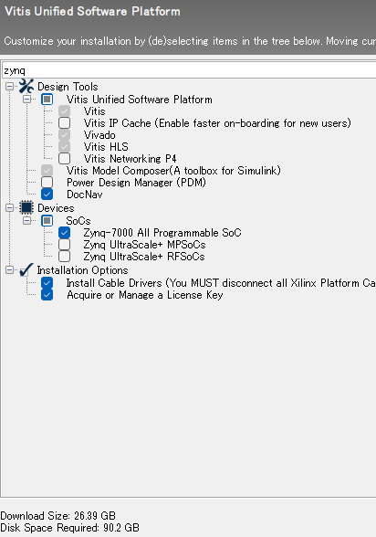

さて、これでインストール開始である。  
Windowsだとウイルスチェックが作動していると非常に重たくなりそうだ。
Cドライブに作られたAMDっぽいディレクトリを除外しておくと多少はマシかも？  
WinPcapのインストールも行われるのだが、

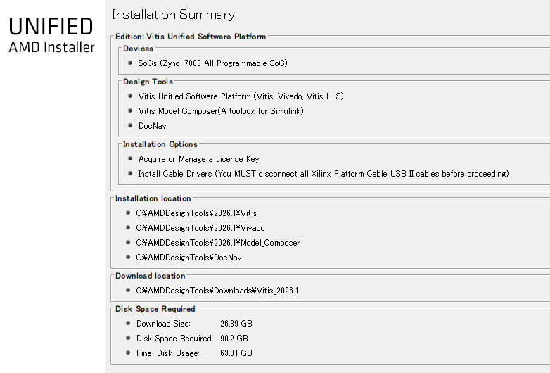

インストールが終わるとライセンスの確認が行われる。  
[Vivadoのライセンス](https://www.amd.com/ja/products/software/adaptive-socs-and-fpgas/vivado/vivado-licensing-options.html)には無償のベーシックがある。  
私は2017年の`Xilinx.lic`ファイルを持っていたのだが、Load Licenseで読み込むと2018年に期限が切れていた。まあね。  

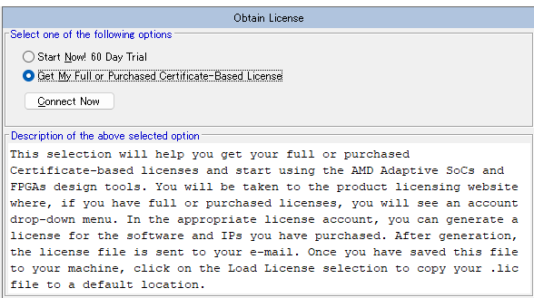

よくわからないが、期限がないものや長いものだけ選んでみた。  
ドングルとかはよくわからんのでありがちなMACアドレスにした。

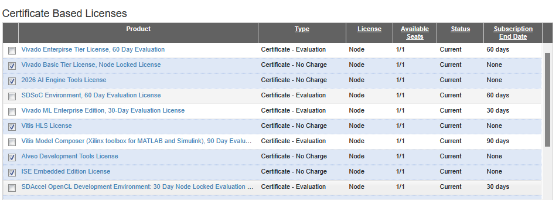
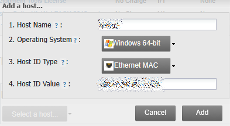

これを登録するとAMDアカウントに登録したメールアドレスに`Xilinx.lic`が添付されて送られてくるので、ライセンスマネージャーでLoad Licenseするとよい。
と思う。

## なにか動かす

初代ZYBOで動くExampleがあればよいのだが、ウィザードで出てきたボードにはなかった。

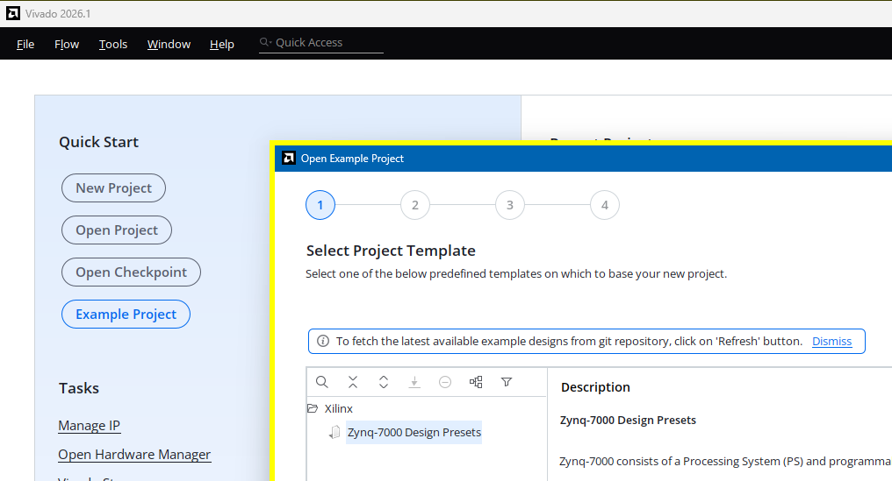

2017年のVivadoで作ったLEDを点滅させそうなプロジェクトが残っていたのでロードした。

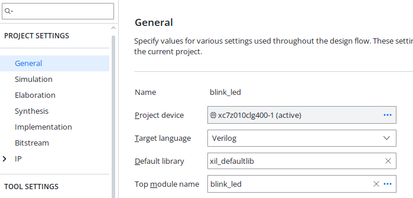

critical warning "[Timing 38-282] The design failed to meet the timing requirements. Please see the timing summary report for details on the timing violations." が出ている。
当時はさすがにwarningは出ていなかったと思いたいのだが、どういうプロジェクトかわからんのでなんとも言えない。

ZYBOボードはVivado Storeから選択するとよさそうだ。
初回は右上の"Go to Git"で更新しないといけなさそう。

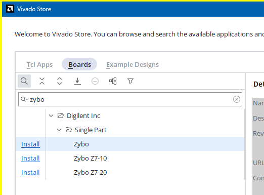

Exampleプロジェクト作成のところではZyboは出てこない。

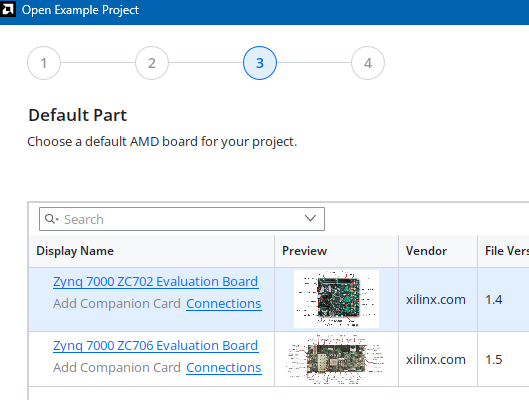

が、一度プロジェクトを作って Settings>General の Project device には出てくる。
新規でプロジェクトを作る場合には全部出てくるようだ。

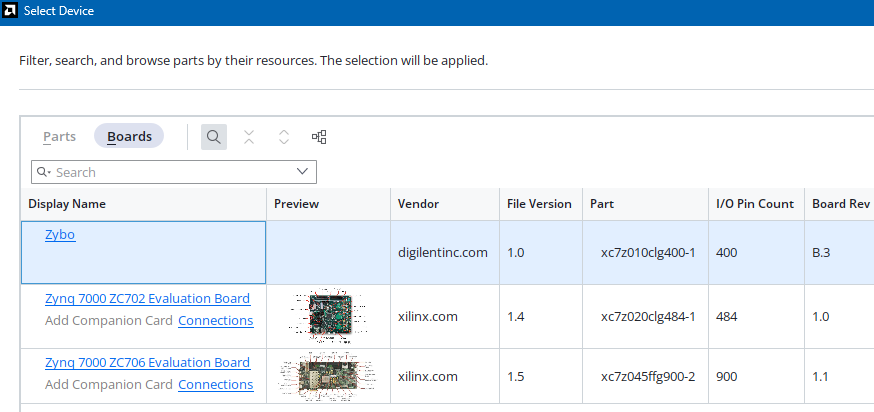

[digilent-xdc](https://github.com/Digilent/digilent-xdc)はConstraintとしてXDCファイルを追加する。
先程のProject deviceではそういうところまではやってくれないようだ。

なにか動かそうと思ったが、今からいろいろ調べるのは面倒。。。  
こちらの手順通りにやると画面は多少違うがそのまま動いた。
ACアダプタを使わずともmicro-BのUSBだけで動作した。

* [ZYBO　PL領域を動かしてみる　Lチカ Lホワ - ケロロ好きなエンジニアのブログ](https://keroctronics.com/blog/5578)
