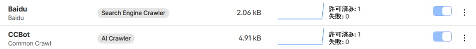
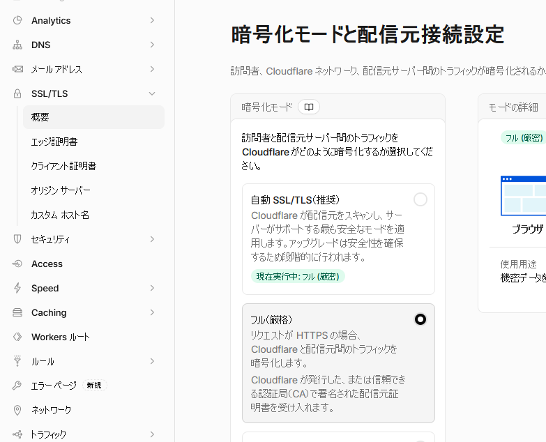

特に何か解決した話ではないですが。

うちのドメインはCloudflareで管理していて、ついでなのであれこれとCloudflareの機能を使っている。  
私に知識がないので簡単そうなところだけ使っているだけだが。

その中にAI Crawl Controlという設定があり、検索エンジンなどのクローラをブロックできるようになっている。
クローラもお金払ってくれるのなら持っていってもらってよいのだけどね。見るのは無料だし。そもそも人来ないし。

そうやってブロック設定していたのだが今日見ると2つほどすり抜け？していた。

ブログの`robots.txt`にはai-robots-txtの設定を仕込んでいるので結構ブロックはしているんじゃないかと思う。

* [Release Add more dark visitor bot categories · ai-robots-txt/ai.robots.txt](https://github.com/ai-robots-txt/ai.robots.txt/releases/tag/v1.46)

そもそも、GitHub Pagesのサイトに名前だけ貸しているような感じだと思うのだけど、
どういうしくみでブロックしようとしてるのだろうね？  
それを調べようとしないところがダメなのか。。。

## DNS

セキュリティインサイトで、DNSのプロキシステータスが「DNSのみ」になっているので「プロキシ済み」にしましょう、と指摘される。  
チェックをONにするだけなのはわかるけど、するとこのブログが見えなくなる。  
本体がGitHub Pagesだから仕方ないんだろうね、と思っていたがGeminiに聞くとSSL/TLS設定を変更するとよいんだとか。

うちはこれで見えるようになった。

あれ、AI Crawl Controlが効かなかったのもそのせいだろうか？
