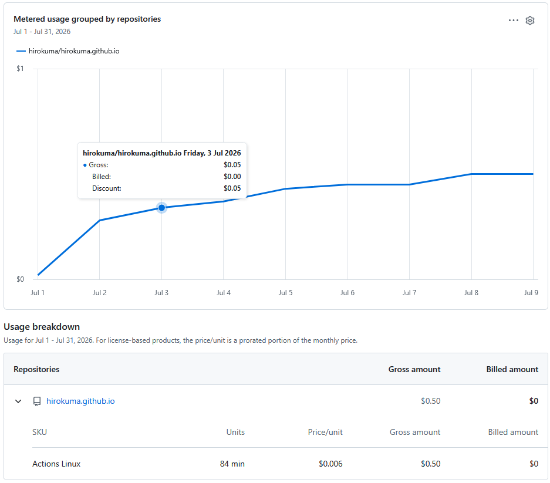

このブログはGitHub Pagesを使っている。  
Markdownなどで書いておくとHTMLになってくれるのだ。

が、それはHTMLに変換する作業を誰かがやってくれているからである。  
私はやっていない。  
やっているのはGitHub Actionsである。  
通常は`.github/workflows/`の下にYAMLファイルを作っておくとそれにそって実行するのだが、
GitHub Pagesはそういうのを自分で書かなくてもやってくれる。  
そのためGitHub Actionsを使っているという意識があまりない。

今日、普通の作業でリポジトリにpushしてPull Requestしてマージしようとした。  
一人でやっているのでローカルでマージすればよいのだけど、まあせっかくだし。  
そのリポジトリではGitHub Actionsで`cargo build`くらいは走らせるようにしていたのだが、いつまで経っても終わらない。
エラーになっているわけでもなく、リトライを繰り返しているわけでもなく、単に進んでいないように見える。  
Settingsのusageを見ると、なんか妙にGitHub Actionsを使っていることに気づいた。

84分って今月に入ってからだろうか？ まだ10日も経ってないのに？  
最近GitHubにpushしてもブログが更新されなかったりエラーになったりすることが多かったのだが、妙にリトライを繰り返していることもあった。
1日で45分くらい使われている日があったので、そういうのが積み重なったようだ。

さて、このブログはアップできるだろうか？

## 自分でビルド

GitHub ActionsでHTMLにできるのだからローカルでも同じ事はできるはず。

* [Jekyll を使用して GitHub Pages サイトを作成する - GitHubドキュメント](https://docs.github.com/ja/pages/setting-up-a-github-pages-site-with-jekyll/creating-a-github-pages-site-with-jekyll?platform=linux)
* [Jekyll を使用して GitHub Pages サイトをローカルでテストする - GitHubドキュメント](https://docs.github.com/ja/pages/setting-up-a-github-pages-site-with-jekyll/testing-your-github-pages-site-locally-with-jekyll)

AIにお願いしたら環境の整え方まで説明してくれそうな気がする。

GitHub Actionsの負荷を減らすにはpushだけにするのがよいのだが、手間は増えるのよねぇ。
