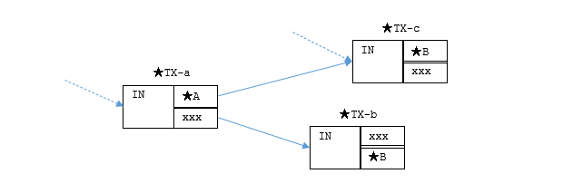

## Electrum Protocol

BitcoinのLight Clientで使うのに便利なElectrum Protocolというものがある。
Bitcoin Coreの外側に立てるElectrum Serverが提供するプロトコルで、自分でBitcoin CoreとElectrum Serverを立てることもできるし、公開されているElectrum Serverを使うこともできる。
ユーザが選択できるというのが大切だ。

* [Electrum Server - hiro99ma blog](https://blog.hirokuma.work/bitcoin/tools/electrum-api.html)

プロトコルにはバージョンがあり、サーバ実装によって提供するバージョンが異なる。
APIがメソッド名で呼び出すのだがバージョンによって名前が変更されることもあるので注意しよう。

* [btc: Electrum Protocolのバージョンに注意 - hiro99ma blog](https://blog.hirokuma.work/2026/07/20260719-btc.html)

## blockchain.scripthash.get_history

v1.4のサーバを使っているのでここではそのメソッド名を使う。  
`blockchain.scripthash.get_history`は指定した`scriptPubKey`(の[script hash](https://blog.hirokuma.work/bitcoin/tools/electrum-api.html#scriptpubkey%E3%81%AFsha256%E3%81%97%E3%81%A6%E9%80%86%E8%BB%A2))に関係する履歴を返す。

`./bs-regtest-docker.sh`というスクリプトを使っているが、だいたい`bitcoin-cli`と同じものだと思っておくれ([Gist](https://gist.github.com/hirokuma/e23f0baf4cf2322fdfe36fa291f6f173))。
regtestで動かしている。

### 前準備

適当にregtestでアドレスを作って`get_history`を呼び出す。  
まだ使われていないアドレスだと空のリストが返ってくる。

```shell
# (★A)アドレスを作って
$ ./bs-regtest-docker.sh getnewaddress
bcrt1qsccyxc0uau8hygyfj6hwqc8jjrwvxajzwg4cra

# scriptPubKeyを取得して
$ ./bs-regtest-docker.sh getaddressinfo bcrt1qsccyxc0uau8hygyfj6hwqc8jjrwvxajzwg4cra | jq .scriptPubKey
"001486304361fcef0f72208996aee060f290dcc37642"

# SHA256してエンティアン逆転して呼び出す
$ echo '{"jsonrpc": "2.0", "method": "blockchain.scripthash.get_history", "params": ["044a2bd6ab14a07dd2375cf2655ef7af250452159115dc22d966c00cb8212f19"], "id": 0}' | socat - TCP4:localhost:50001
{"id":0,"jsonrpc":"2.0","result":[]}
```

### 送金して呼び出す

Blockstream/electrsを使っているのだが、unconfirmed transactionだと返ってこないようだ。
`get_mempool`があるからunconfirmedなものはそちらを使うほうが良いかもしれない。
Electrum Server実装の影響なのかパラメータの影響なのか他の理由があるのかは調べていない。

```shell
# (★TX-a)適当に送金
$ ./bs-regtest-docker.sh sendtoaddress bcrt1qsccyxc0uau8hygyfj6hwqc8jjrwvxajzwg4cra 1
6387f370041b104804d92a5b40a2f83913cd544fc0aede07e655927eccf2cf19

# 送金直後は返ってこない。unconfirmed historyは返ってくるのでは？ regtestだから？
$ echo '{"jsonrpc": "2.0", "method": "blockchain.scripthash.get_history", "params": ["044a2bd6ab14a07dd2375cf2655ef7af250452159115dc22d966c00cb8212f19"], "id": 0}' | socat - TCP4:localhost:50001
{"id":0,"jsonrpc":"2.0","result":[]}

# ブロック生成してから呼び出すとちゃんと現れる
$ ./bs-regtest-docker.sh generate
[ "427be027915be38a5a7071a70e25c23a041ffe3dcef71f7fa2e085189c04ec03" ]
$ echo '{"jsonrpc": "2.0", "method": "blockchain.scripthash.get_history", "params": ["044a2bd6ab14a07dd2375cf2655ef7af250452159115dc22d966c00cb8212f19"], "id": 0}' | socat - TCP4:localhost:50001
{"id":0,"jsonrpc":"2.0","result":[{"height":202,"tx_hash":"6387f370041b104804d92a5b40a2f83913cd544fc0aede07e655927eccf2cf19"}]}
```

### UTXOをspendする

受け取った方と送った方がそれぞれリストに出力されている。

```shell
# (★B)UTXOをspendするために別アドレスを作って送金
$ ./bs-regtest-docker.sh getnewaddress
bcrt1q349mflmxmlvzrf8gd8vkq2q6s2275kmgw6fkdt

# (★TX-b)送金したのだが、これは別のアドレスのUTXOが使われてしまった
$ ./bs-regtest-docker.sh sendtoaddress bcrt1q349mflmxmlvzrf8gd8vkq2q6s2275kmgw6fkdt 0.9999
7fafc9c0f96ec8a84e201c61162021930585f9a36853f2ff32bebbd876f29f68

# (★TX-c)再度送ると最初に作ったアドレスへ送金したUTXOが使われた
$ ./bs-regtest-docker.sh sendtoaddress bcrt1q349mflmxmlvzrf8gd8vkq2q6s2275kmgw6fkdt 0.9999
4c0f32639ddd012fe5c759a3b88cb27111ce8cc399c57f97e54574bfd7efdc9f

# この時点ではどちらもunconfirmedなはずなのだが、★TX-cの送金もリストに現れた。heightが0なのでunconfirmedだと認識している。
$ echo '{"jsonrpc": "2.0", "method": "blockchain.scripthash.get_history", "params": ["044a2bd6ab14a07dd2375cf2655ef7af250452159115dc22d966c00cb8212f19"], "id": 0}' | socat - TCP4:localhost:50001
{"id":0,"jsonrpc":"2.0","result":[{"height":202,"tx_hash":"6387f370041b104804d92a5b40a2f83913cd544fc0aede07e655927eccf2cf19"},{"fee":208,"height":0,"tx_hash":"4c0f32639ddd012fe5c759a3b88cb27111ce8cc399c57f97e54574bfd7efdc9f"}]}

# ブロック生成して承認されると、ちゃんと承認されたheightになった
$ ./bs-regtest-docker.sh generate
[ "6d619865f88ec7f5424c744a45f13c3601bdce284a535aebff6822e84645b451" ]
$ echo '{"jsonrpc": "2.0", "method": "blockchain.scripthash.get_history", "params": ["044a2bd6ab14a07dd2375cf2655ef7af250452159115dc22d966c00cb8212f19"], "id": 0}' | socat - TCP4:localhost:50001
{"id":0,"jsonrpc":"2.0","result":[{"height":202,"tx_hash":"6387f370041b104804d92a5b40a2f83913cd544fc0aede07e655927eccf2cf19"},{"height":203,"tx_hash":"4c0f32639ddd012fe5c759a3b88cb27111ce8cc399c57f97e54574bfd7efdc9f"}]}
```

念のためここで新しく作ったアドレスについて`get_history`する。
こちらも受け取った方と送った方がそれぞれリストに出力されている。

```shell
$ ./bs-regtest-docker.sh getaddressinfo bcrt1q349mflmxmlvzrf8gd8vkq2q6s2275kmgw6fkdt | jq .scriptPubKey
"00148d4bb4ff66dfd821a4e869d960281a8295ea5b68"

$ echo '{"jsonrpc": "2.0", "method": "blockchain.scripthash.get_history", "params": ["0483e9eb39f6c010dd4b1054f4a3edaa07046b5348e67725e4714895b2cf94be"], "id": 0}' | socat - TCP4:localhost:50001
{"id":0,"jsonrpc":"2.0","result":[{"height":203,"tx_hash":"7fafc9c0f96ec8a84e201c61162021930585f9a36853f2ff32bebbd876f29f68"},{"height":203,"tx_hash":"4c0f32639ddd012fe5c759a3b88cb27111ce8cc399c57f97e54574bfd7efdc9f"}]}
```

### こうなった

confirmしていれば、voutの宛先だった場合も、vinとして使われた場合もそれぞれリストに現れた。  
unconfirmのときはちょっとよくわからない。私の使い方だとconfirmのときにわかっていればよいので調べないことにした。



* アドレスAの`get_history`
  * 1回目: TX-a
  * 2回目: TX-a と TX-c
* アドレスBの`get_history`
  * TX-b と TX-c

## まとめ

* `blockchain.scripthash.get_history`はvinもvoutも関係があればリストに現れる
* confirmedなら確実。unconfirmedはよくわからん。
* v1.7からは削除されて`blockchain.scriptpubkey.get_history`という名前になるので注意
