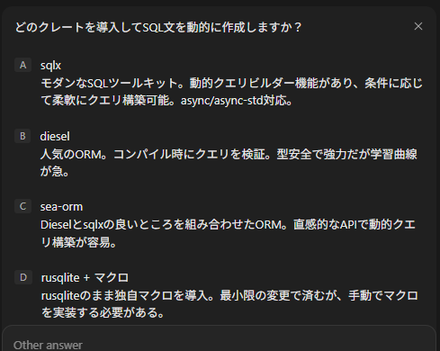

redbを使っていたのだが、bdk_wallet(というかbdk_chain)がrusqliteを使っていたので慣れようとしている。

* [rust: rusqlite - hiro99ma blog](https://blog.hirokuma.work/langs/rust/db_rusqlite.html)

私はあまりSQLを使ったことがない。  
小さい組み込み開発メインだったのでDBを使うことがなく、25年以上やっているが数回しか扱ったことがないと思う。

SQLiteは比較的昔からあり、サーバが不要という意味での組み込み型DBだ(組み込み開発で使うDBというわけではない)。  
最初はSQL文が使えなかったような気がする。
関数呼び出しで全部やっていて、いつからかSQLも使えますよっていう感じだったような？
あるいは私がSQLを使わなかったので気づいてなかっただけかもしれない。

## SQLって使いにくいよね

まったくの個人の感想です。  
文字列で全部構成しないといけないというのが気に食わない。  
もちろん保存するデータはバイナリだったりしてもよいのだが、制御文は文字列だ。

おかげでORMみたいにSQLを隠して使いやすくする分野が発達している。
これはまあ、SQL文に多少方言があったり挙動に依存があったりするせいもありそうだ。

しかしまあ、SQLが見えなくなるのもそれはそれで不安というか、本当にそんなにORMを信用してよいのかという気もする。
が、人間が扱うには難しいと言わざるを得ない。  
それがSQL。

ええ、ほとんど使ってことない人のたわごとですよ。

## SQL文を動的につくりたい

rusqliteはC言語のSQLiteのようなたくさんの関数はなく、主にSQLでDBを操作する。  
パラメータ付きにして値を外部から引き入れることはできるのだが、SQL文本体についてはrusqliteの機能だけでは作るのは難しいんだかできないんだかであった。

Geminiが「sea_queryというのを使うと良いよ」というので、やろうとしていたUPDATE文をお任せしてみた。  
primary keyなidが一致した項目について構造体の値`Option<T>`が`None`でなければそこを更新する、ということをやりたかった。
項目が2つくらいなので`format!()`で自分でやっても良かったのだが、今後のことを考えると作ってもらったほうが良かろう。

そう思っていたのだが・・・1時間経ってもビルドできるコードを作ってくれなかった。  

### ベース

なんか妙に長くなったが、`test.db`というファイルを作って`my_table`というテーブルに、最初は時間だけINSERTし、次に中身をUPDATEするだけである。

```toml
[dependencies]
anyhow = "1.0.104"
rusqlite = "0.40.1"
```

```rust
use anyhow::Result;
use rusqlite::named_params;

struct UpdateData {
    id: u32,
    item1: String,
    item2: [u8; 32],
}

fn main() -> Result<()> {
    let conn = rusqlite::Connection::open("./test.db")?;

    conn.execute(
        "CREATE TABLE IF NOT EXISTS my_table (
            id INTEGER PRIMARY KEY,
            created_at TEXT,
            item1 TEXT,
            item2 TEXT
        )",
        (),
    )?;

    let mut stmt = conn.prepare(
        "INSERT INTO my_table (
                id,
                created_at)
            VALUES (
                :id,
                datetime('now')
            )",
    )?;
    stmt.execute(named_params! {
        ":id": 1234,
    })?;

    let update_data = UpdateData {
        id: 1234,
        item1: "test".to_string(),
        item2: [128u8; 32],
    };
    let mut stmt = conn.prepare(
        "UPDATE my_table SET
                item1 = :item1,
                item2 = :item2
            WHERE id = :id",
    )?;
    stmt.execute(named_params! {
        ":id": update_data.id,
        ":item1": update_data.item1,
        ":item2": update_data.item2,
    })?;

    Ok(())
}
```

確認は`sqlite3`コマンドを使うと楽だろう。
バイナリ値は化けるがそんなものだ。

```shell
$ sqlite3 ./test.db 
SQLite version 3.45.1 2024-01-30 16:01:20
Enter ".help" for usage hints.
sqlite> select * from my_table;
1234|2026-07-22 14:11:55|test|��������������������������������
sqlite> 
```

### Devin

`UpdateData`構造体の一部を`Option<T>`にし、`update_data`の変更まで行ってからDevin Desktopに修正を依頼した。  
素直に要望をかなえるとこうなるようだ。
各フィールドが`None`でなければ`Vec`に追加し、最後は`join()`でコンマつなぎにすることで末尾に不要なコンマが入るのを防いでいる。

```rust
use anyhow::Result;
use rusqlite::named_params;

struct UpdateData {
    id: u32,
    item1: Option<String>,
    item2: Option<[u8; 32]>,
}

fn main() -> Result<()> {
    let conn = rusqlite::Connection::open("./test.db")?;

    conn.execute(
        "CREATE TABLE IF NOT EXISTS my_table (
            id INTEGER PRIMARY KEY,
            created_at TEXT,
            item1 TEXT,
            item2 TEXT
        )",
        (),
    )?;

    let mut stmt = conn.prepare(
        "INSERT INTO my_table (
                id,
                created_at)
            VALUES (
                :id,
                datetime('now')
            )",
    )?;
    stmt.execute(named_params! {
        ":id": 1234,
    })?;

    let update_data = UpdateData {
        id: 1234,
        item1: Some("test".to_string()),
        item2: None,
    };

    // Build dynamic UPDATE statement based on non-None fields
    let mut set_clauses = Vec::new();
    let mut params: Vec<(&str, &dyn rusqlite::ToSql)> = vec![(":id", &update_data.id)];

    if update_data.item1.is_some() {
        set_clauses.push("item1 = :item1");
        params.push((":item1", &update_data.item1));
    }
    if update_data.item2.is_some() {
        set_clauses.push("item2 = :item2");
        params.push((":item2", &update_data.item2));
    }

    if !set_clauses.is_empty() {
        let sql = format!(
            "UPDATE my_table SET {} WHERE id = :id",
            set_clauses.join(", ")
        );
        let mut stmt = conn.prepare(&sql)?;
        stmt.execute(params.as_slice())?;
    }

    Ok(())
}
```

### もっと動的に

これだと何なので、もうちょっとがんばってもらおう。

> structのフィールドが増えるので、別のクレートを導入してSQL文を動的に作成したい。

これは残念ながら実施できなかった。  
一時的か？

> Permission denied: Permission denied: We're currently facing high demand for this model. Please try again later. (trace ID: xxxxxxxxxxxxxxxx)

一時的だったようだ。  
提示した選択肢はどれも魅力的だが私には時間(トークン)がない。



#### sqlx

選んだのは1番上のsqlx。  
golangにもそういうのがなかったっけ。

それはともかく、時間が結構かかったがやりとげてくれた。  
そして全体的に思ってなかったような変更が行われていた。
rusqliteいらないのね。。。

TEXTがBLOBになったり、`?1`が`$1`になったりと文法に違いがあるようだ。
ファイルオープンについても何度も修正が行われて、最初の方はネットワーク風の書き方をしていた。
featureで"sqlite"としているが他のDBでも対応できるということかもしれない。

`query_builder`でUPDATEのSQL文を作っているようだが、`.push()`で文字列を足して`.push_bind()`で右辺値を結合させたりなどけっこう力技のようだ。
SQL文がどうなるのか想像しやすいので、ORMを使ったときのように「動いているけどどう動いているかわからん」という自体は避けられそうだ。  
そうか、ORMはSQLを隠蔽するのでSQLを知らなくてもなんとかなるという利点があったのか。

```toml
[dependencies]
anyhow = "1.0.104"
sqlx = { version = "0.8", features = ["sqlite", "runtime-tokio", "chrono"] }
tokio = { version = "1.0", features = ["full"] }
```

```rust
use anyhow::Result;
use sqlx::{Connection, SqliteConnection, query_builder::QueryBuilder, sqlite::SqliteConnectOptions};

struct UpdateData {
    id: u32,
    item1: Option<String>,
    item2: Option<Vec<u8>>,
}

#[tokio::main]
async fn main() -> Result<()> {
    let options = SqliteConnectOptions::new()
        .filename("test.db")
        .create_if_missing(true);
    let mut conn = SqliteConnection::connect_with(&options).await?;

    sqlx::query(
        "CREATE TABLE IF NOT EXISTS my_table (
            id INTEGER PRIMARY KEY,
            created_at TEXT,
            item1 TEXT,
            item2 BLOB
        )",
    )
    .execute(&mut conn)
    .await?;

    sqlx::query(
        "INSERT INTO my_table (id, created_at) VALUES ($1, datetime('now'))",
    )
    .bind(1234)
    .execute(&mut conn)
    .await?;

    let update_data = UpdateData {
        id: 1234,
        item1: Some("test".to_string()),
        item2: None,
    };

    // Build dynamic UPDATE query using sqlx QueryBuilder
    let mut query_builder = QueryBuilder::new("UPDATE my_table SET ");
    let mut has_fields = false;

    if update_data.item1.is_some() {
        if has_fields {
            query_builder.push(", ");
        }
        query_builder.push("item1 = ");
        query_builder.push_bind(update_data.item1);
        has_fields = true;
    }

    if update_data.item2.is_some() {
        if has_fields {
            query_builder.push(", ");
        }
        query_builder.push("item2 = ");
        query_builder.push_bind(update_data.item2);
        has_fields = true;
    }

    if has_fields {
        query_builder.push(" WHERE id = ");
        query_builder.push_bind(update_data.id);

        let query = query_builder.build();
        query.execute(&mut conn).await?;
    }

    // Test with item2 set
    let update_data2 = UpdateData {
        id: 1234,
        item1: None,
        item2: Some(vec![1, 2, 3, 4]),
    };

    let mut query_builder2 = QueryBuilder::new("UPDATE my_table SET ");
    let mut has_fields2 = false;

    if update_data2.item1.is_some() {
        if has_fields2 {
            query_builder2.push(", ");
        }
        query_builder2.push("item1 = ");
        query_builder2.push_bind(update_data2.item1);
        has_fields2 = true;
    }

    if update_data2.item2.is_some() {
        if has_fields2 {
            query_builder2.push(", ");
        }
        query_builder2.push("item2 = ");
        query_builder2.push_bind(update_data2.item2);
        has_fields2 = true;
    }

    if has_fields2 {
        query_builder2.push(" WHERE id = ");
        query_builder2.push_bind(update_data2.id);

        let query2 = query_builder2.build();
        query2.execute(&mut conn).await?;
    }

    Ok(())
}
```
