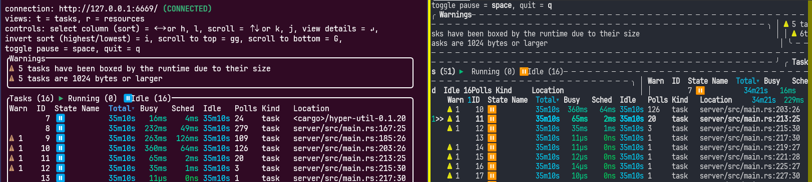

WSL2のターミナルとして[wezterm](https://wezterm.org/)を使っているのだが、[tokio-console](https://github.com/tokio-rs/console)の表示が乱れることに気づいた。  
が、これは`config.window_padding`の設定のせいだった。



"[running the console on windows](https://github.com/tokio-rs/console#running-the-console-on-windows)"のオプションも関係なかった。

うちの環境だとweztermの下の方にゴミが表示されるので、その抑制を調べて追加した設定の1つだ。
効果はなかったのだがそのまま忘れていた。

```lua
config.window_padding = {
  left = 2,
  right = 20,
  top = 0,
  bottom = 0,
}
```

削除するとちゃんと表示された。
