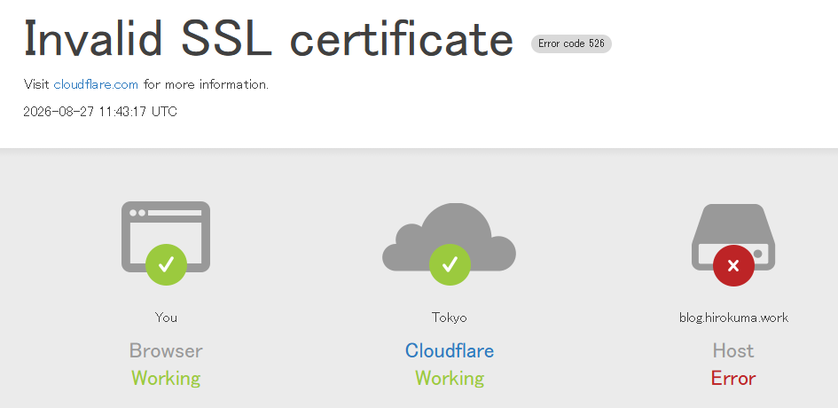
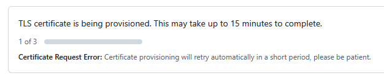
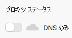

数時間前からこの状況になっていることに気づいた。

私はアップロードしても記事を見ないので、いつまで見えていたのかわからない。
しかし直後は見えていたんじゃないかと思う。

Cloudflareのアドバイス通りであればSSL関連なのだろう。
昔は"SSL"といっていて、いつしか"TLS"と呼ぶのが普通になっていたけど、ここは"SSL"なんだな。

元のデータはGitHub Pagesなのでそちらを見てみる。
数時間前からこうだ。

> TLS certificate is being provisioned. This may take up to 15 minutes to complete.
> Certificate Request Error: Certificate provisioning will retry automatically in a short period, please be patient.

## 一時的にproxiedをはずす

Geminiに質問すると、CloudflareのDNSレコード設定で「プロキシ済み」になってるならはずしてみると更新が成功するかも、ということだった。

はずすと、GitHub Pagesのプログレスが進んで更新できた。  
よかったよかった。

## どうしたものか

90日周期で更新しているそうで、そのときにありがちなのだとか。
Let's EncryptだかDigiCertだかのSSL/TLS証明書自動更新がCloudflareにせき止められるとこうなるらしい。
"プロキシ"なので、Cloudflareが代理人となって表に立つことで後ろを隠して耐えてくれているのだろうが、
そのせいでGitHub Pagesが背後にいるかどうか確認できない、ということかと解釈した。違うかもしれんが。
GitHub Pagesが裏にいたからどうなんだって思うので、ここだけ「DNSのみ」にしておこうかね。

ちなみに、こちらにあった`dig +short CNAME blog.hirokuma.work`は「プロキシ済み」だと何も返ってこなかった。
「DNSのみ」にするとGitHub PagesのURL?が返ってきた。

* [stuck at "TLS certificate is being provisioned. This may take up to 15 minutes to complete." · community · Discussion #171081](https://github.com/orgs/community/discussions/171081)
