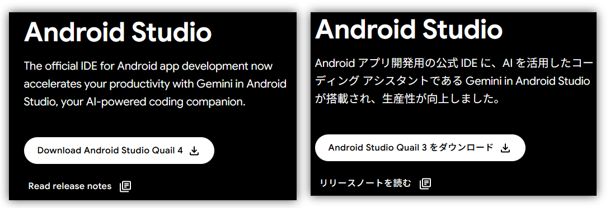
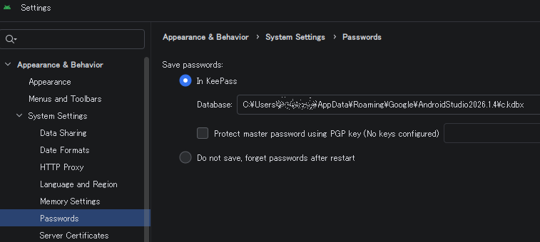
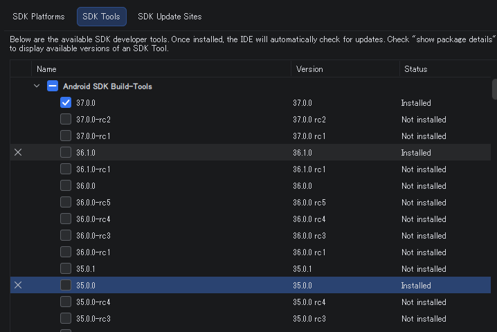

久々にAndroid Studioをアップデートした。
仕事で使いそうだというだけだったのだが、ちょうどアップデートされた直後だったのかもしれない。  
Quail 4だそうだ。

* [Android Studio Release Updates: Android Studio Quail 4 now available](https://androidstudio.googleblog.com/2026/09/android-studio-quail-4-now-available.html)

日本語サイトだとQuail 3だったが英語サイトはQuail 4だ。
フォローしておくと、英語サイト以外はQuail 3のままのようだ。

何も考えずに最新版にしたが、"Quail 4|2026.1.4"のAGP versionは7.1～9.4だそうだ。  
アップデート前の起動画面にはパンダが出ていたので、もしかしたら最小値の範囲が違うかもしれない。

* [Android Studio Quail 4  -  Android Developers](https://developer.android.com/studio/releases)

新しいバージョンの起動画面は鳥が表示されていた。
"quail"はウズラのことらしい。"P"andaの次だから"Q"uailなんかね。
その次は"R"・・・"Ribonfish"(タチウオ)と予想しておこう。。。と思ったらもう"Rabbit"がテスト中だった。そりゃそうだ。

## 設定あれこれ

Settingsで"feed"と"encoding"で検索して改行コードをLFにしていたのだが、
今回は"feed"の方だけで済みそうだった。  
それでも`AndroidManifest.xml`だけはCR/LFになっていたのだが、今回は大丈夫そうに見える。
あまり試していないのだが、このまま続いてくれることを期待する。

パスワードはkeepass形式になったんだ。前からそうだったのかしら？

編集画面で文字列を選択すると一致する文字がハイライトされて助かるのだが、"Address"が"addressInfo"や"myAddress"のように部分一致でもハイライトされるのはちょっと嫌だ。
しかしこれをどう設定したらよいかわからん。  
そういうときは統合されているGeminiに質問できる。統合されているといってもつかうときにはGoogleアカウントと連携が必要だ。
情報漏洩には気をつけよう。

とりあえず、文字が小さいと思った。あ、それも聞けばよいのか。

## SDKはどうしたらよいのか

いつもよくわかっていないのが、SDKだ。  
Android Studioのインストール時に本体はアンインストールしているのだが、SDKは管理されていないはずだ。
今回見ても複数インストール済みが残っていた。

フルパスで指定して特定のバージョンしかダメ、というツールもあるのだろうけど、
ゴミもたくさんありそうだしさっぱりと消してやり直したいのよね。
