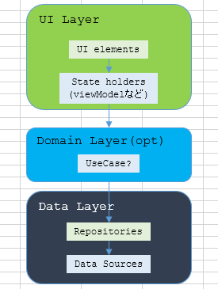
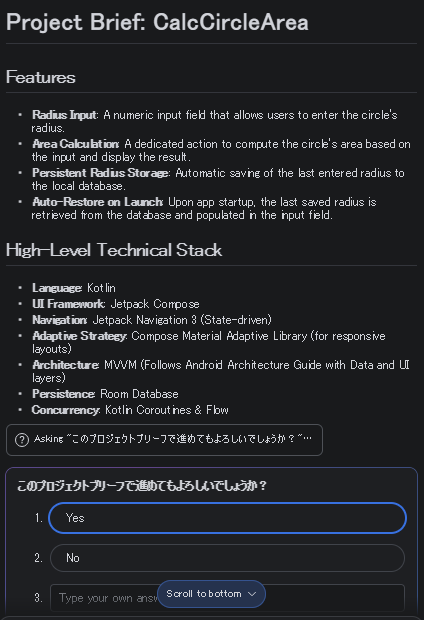

久々にAndroidのアプリを作ることになりそうだ。  
サンプルアプリ程度でよいのだが、AIで適当にお願いしたら程よく作ってくれる、というのはまだ早いと思う。
それに、自分である程度は作ることができないと修正できないし。

ほぼ2年前にやったきりなので、記憶にない。大丈夫か私。

* [Android - hiro99ma blog](https://blog.hirokuma.work/tags/android.html)

## アーキテクチャガイドは変わってない(はず)

[以前](https://blog.hirokuma.work/2024/10/20241002-and.html)も苦しんだアーキテクチャだが、少なくとも内容は変更されていないようだ。
すなわち、UI layer→Domain layer→Data layerという3層構造だ。

* [Guide to app architecture  -  App architecture  -  Android Developers](https://developer.android.com/topic/architecture)
* [アプリ アーキテクチャ ガイド  -  App architecture  -  Android Developers](https://developer.android.com/topic/architecture?hl=ja)

Domain layerはoptionalだが、単にデータをUIに表示したりUIから入力したりするくらいならいらないよ、というところではなかろうか。
UIはもらった値をどう見せるかやそのまま受け取るだけにして、計算したり通信したりはDomainでやり、Data layerはもらったデータをそのまま保存するかそのまま返すかだけ。

円の面積だったらこんな感じか。

* UI layer: テキストボックスで半径を入力
* Domain layer(optional): 半径を引数にして面積を返す関数とかなんとか
* Data layer: もらった半径を保存したり、最後に保存した半径を返したり

全部UI layerだけで実装はできるけど、コンテキストなどを処理しないといけないとかじゃなかったかね。
そういう変なことをせずにlayerごとに処理するようにしましょう、というところだと思う。

おそらく、ある程度大きいプログラムでないと恩恵が得られないような構成なのだと思う。
さっきの円の面積だけのためにこんなにlayerいるのかよ、と感じるのは変ではないだろう。
なので試作アプリみたいにやることが少なかったり決まっていなかったりすると、UI以外はlayerがスカスカになって無駄なことをしている気分になる。

そしてまたlayerでの書き方だったり一般的な技だったりを知らない状態だと、無理やりでもUI layerに押し込められるならそれでいいか、とやってしまいそう。
あるいは、軽い処理だったらUI layerで済ませて一部だけ別のlayerに持っていったりとか。  
そういうことをすると結局わけがわからなくなるので、最初から面倒に思ってもlayerの実装を覚えてやってしまうのがよいはずだ。

### Domain layerはどのくらいoptionalなのか

Domain layerはoptionalとある。
「どうせそんなこと言っても、基本的には存在すべきとかいうんだろう？」と斜め読みしていたのだが、

> 複雑さに対処する場合や再利用性を優先する場合など、必要な場合にのみ使用してください

というくらいにはoptionalみたいだ。

ビジネスロジックはdomainというところに書くのだろうと考えていたのだが、Data layerのところに置くよう書かれている。
Data layerの中で、値を読み書きというのがData Sourcesというブロックに、ビジネスロジックはRepositoriesというブロックに分ける図になっている。  
よく見ればUI layerもUI elementsとState holdersに分かれている。
UIから下に流れる方向はEvent、Dataから上に流れる方向はStateなどと呼ぶようだ。

ならばさっきの面積を返すアプリはこんな感じだろうか。

* UI layer:
  * UI elements: テキストボックスで半径を入力、ラベルに面積出力
  * State holders: 入力された半径と、出力する面積の状態を保持？
* Domain layer(optional): 無し
* Data layer:
  * Repositories: 半径を引数にして面積を返す関数とかなんとか
  * Data sources: もらった半径を保存したり、最後に保存した半径を返したり

前回やったときも、`viewModel`がどうのとか、Repositoriesのところで値を取ろうと思ったら`appContext`がほしいけど使っていいんだっけ、
そもそもどうやって持ってくるんだっけ、みたいなことで悩んでいたように思う。
BLEの制御はRepositoriesくらいしか置くとこがなさそうだけど、こういうのがDomain layerの仕事だったのだろうか。

正解・・・は無いにしても回答例が欲しい。

### 最初からAIに作ってもらいましょう

Geminiと連携したからか、Android Studioでプロジェクトを新規作成する段階でAIを使えるようになっていた。  
ならば、回答例として見せていただこうか！ なお、Gemini 3 Flash previewというモデルらしい。詳しくないので知らん。

> 入力するテキストボックスから円の半径を入力できる。
> 入力後にボタンを押すと、円の面積を表示する。
> 最後に入力した半径はデータベースのRoomに保存する。
> アプリの起動時にはデータベースから最後に保存した半径を読み込み、テキストボックスに反映させる。
>
> アプリアーキテクチャガイド(https://developer.android.com/topic/architecture?hl=ja)の構成に従う。
> UseCaseなどのDomain layerは不要。

まず、入力した司令(プロンプト?)が`plan.md`として保存され、それにGeminiが考えたことが追加されていた(そこは英文)。

* Task_1_DataLayer: Setup Room database, entity, DAO, and Repository for radius persistence
* Task_2_UI_Logic: Implement ViewModel to handle UI state, calculation logic, and Repository interaction
* Task_3_Compose_UI: Build the UI using Jetpack Compose, Navigation 3, and Material Adaptive components
* Task_4_Run_Verify: Perform final run and verification of the application

それぞれの下にstatus欄があり、"IN_PROGRESS"なり"PENDING"なりが進むにつれて書き換わっている。

うぉっ、エミュレータが起動してテストっぽいことをやってる。

完了。なるべくそのまま[GitHub](https://github.com/hirokuma/AndroidCalcCircleArea)に置いた。

これがお前の回答か！ ゆっくり見させてもらおう。

## ボイラープレート

ベストプラクティスにも書いてあるが、同じようなコードを書くようだったらボイラープレートなどを利用しましょう、なのだ。
なのだが、そのボイラープレートがどれを見ればよいか？どこにあるか？そのあたりがよくわからないのだ。  
そしてよくわからないまま調べて自分でもできそうなやつを真似して、ときに深みにはまってしまう。。。

前回はボイラープレートをうまく探し出せずにがんばってみたが、今回はAIの力を借りることでもっと楽に進めたいものだ。
