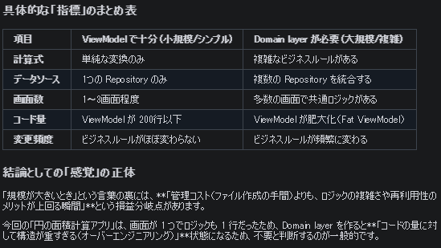

Androidのアプリアーキテクチャガイドを見ている。

* [アプリ アーキテクチャ ガイド  -  App architecture  -  Android Developers](https://developer.android.com/topic/architecture?hl=ja)

Domain layerはoptionalだ。

> 複雑さに対処する場合や再利用性を優先する場合など、必要な場合にのみ使用してください。

難しいことをいう。。。

[前回](https://blog.hirokuma.work/2026/09/20260902-and2.html#%E6%9C%80%E5%88%9D%E3%81%8B%E3%82%89ai%E3%81%AB%E4%BD%9C%E3%81%A3%E3%81%A6%E3%82%82%E3%82%89%E3%81%84%E3%81%BE%E3%81%97%E3%82%87%E3%81%86)AIにアプリを作ってもらったときは「Domain layer抜きで」と指示したのでそうなった。
あのあとで、Domain layerがあったら円の面積計算はそっちに持っていったかどうか聞いてみたところYesという回答。  
複雑でも再利用もないのだが、ノリで答えたのだろうか？ Geminiはどうもユーザの圧というか意図を読みすぎてしまう気がする。

## 指標

そのときのAIにもDomain layerがあるとよいと思うのはどういうときか聞いてみている。
指標は何よ、と。

この指標なら、円の面積はDomain layerを使わないだろう。私に対するおべっかだったのか！

それはともかく、この指標は悪くないと思う。
複数のRepositoryを統合するというのはちょっと悩むかもしれん。
楕円の面積を求めるとして、長軸と短軸が別Repositoryだったとしても私ならState holdersに置きそうだ。

## ViewModelの便利さ

標準的なState holdersとして`ViewModel`がある。
Activityが比較的いなくなりやすいのに対して`ViewModel`はそれよりは長く生きる。  
便利だ。  
それ故にいろいろなものを置きがちになるのを心配しているのだろう。

アーキテクチャは案であって、根底にあるのは「きれいに書きましょう」とか「分離しましょう」とかのはずだ。
Androidのこれだってガイドラインだと念を押している。  
ちょっと調べたところでは、このアーキテクチャもClean Architectureというものとはちょっと違うらしい。
あれだってアーキテクチャの1つに過ぎないのだし、崇める必要はないだろう。

何もなく独自で考えるのは面倒だし、変にやるくらいなら定評があるものを使うのが良かろう。
関係者が納得するなら改造してもよいだろうし。  
ただそういう人に限ってあんまり理解できていなかったり、単に考えるのが面倒だったりするのがやっかいなところだ。
私みたいにね！ 一応自覚はあるので、無知の知とかそういうところにはいると信じたいところだ。

## UseCaseは標準classではない

State holdersに対して`ViewModel`があるように、Domain layerに対して`UseCase`があるのかと思ったがそうではないようだ。
`UseCase`は一般名称かなにかで、特にAndroidとしてclassが用意されているわけではない。

次に書いている`ApplicationContext`だが、Domain layerでは`ApplicationContext`を使うことは非推奨だそうな。
そういうのは上側やら下側やらにやってもらいなさい、と。
BLEみたいなデバイス操作はRepositoriesの方に持っていくので正しいようだ。

## DIとHilt

Repositoriesで`ApplicationContext`を使う場合、コンストラクタで`context`をもらって保持するか、DIなるもので繋いでもらうか。

コンストラクタでもらうパターンは、場所としては[この辺](https://github.com/hirokuma/AndroidCalcCircleArea/blob/abdebc4319fe708d9a58350cb17b08d5d15b49a6/app/src/main/java/work/hirokuma/calccirclearea/AppContainer.kt#L19)だろう。
この`AppContainer.kt`は`AppContainer`を継承して引数で`context`をもらっているが、呼び元は[CalcCircleAreaApplication.kt](https://github.com/hirokuma/AndroidCalcCircleArea/blob/abdebc4319fe708d9a58350cb17b08d5d15b49a6/app/src/main/java/work/hirokuma/calccirclearea/CalcCircleAreaApplication.kt#L18)である。
`CalcCircleAreaApplication`は`Application`を継承していて、`DefaultAppContainer(this)`として呼び出している。なので`context`は`ApplicationContext`でよい。

この、引数で与えることは「[手動DI](https://developer.android.com/training/dependency-injection/manual?hl=ja)」らしい。コメントに書いてある。大げさな！と思うが、そういう用語なのだろう。
HiltはDIを直接書かずにうまいことやってくれるライブラリ？だ。

* [Android での依存関係インジェクション  -  App architecture  -  Android Developers](https://developer.android.com/training/dependency-injection?hl=ja#hilt)

では`AppContainer.kt`で作ったRepositoryのインスタンスはどこでState holderに渡されるかというと[Navigation.kt](https://github.com/hirokuma/AndroidCalcCircleArea/blob/abdebc4319fe708d9a58350cb17b08d5d15b49a6/app/src/main/java/work/hirokuma/calccirclearea/Navigation.kt#L54)で`CircleAreaViewModel`のコンストラクタを呼ぶところである。
`Navigation.kt`でアプリが起動したときの画面`CircleAreaScreen`のコンストラクタに`viewModel`を引数で渡している。  
これでRepository→ViewModel→Screenのつながりができた。
画面が増えたらなんとかScreenが増えていき、そこで共通で使用するViewModelがあれば同じように与えれば良い。

慣れるまでは手動DIでいいかな。
