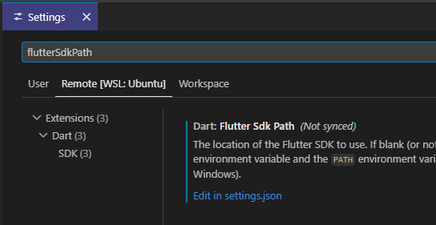

## 私の状況

こういう状況である。

* 試作のようなAndroidアプリを作ることになった
* Android Studioはインストールしたが、どうせiOSの話も出るだろう
* ならばReact NativeかFlutterか
* RNは副作用とかその辺がいまひとつ理解できんかったのでFlutterもやってみよう
* ちゃんとしたアプリは他の人を雇うだろうから、UIはテキストとボタンくらい扱えればいいや

React Nativeわからんと思ったが、Flutterもやっていたら同じような目にあうのだろう。
それでも触ってみていないとわからんのでやってみよう。

## 環境

* Windows + WSL2
  * FlutterはWSL2側
* vscode
  * [Install Flutter using VS Code](https://docs.flutter.dev/install/with-vs-code)

インストール手順がvscode extension経由だったので、そのまま使う予定。  
苦労したインストールについては昨日のブログ参照。
Windows側を使わないのは、使いたいライブラリのプロジェクトがLinux用になっていて考えるのが面倒だったため。

## サンプルプロジェクト

vscodeからFlutterプロジェクトを新規作成すると、どこかのディレクトリの中にアプリ名のディレクトリを作ってそこにファイルなどが詰め込まれる。
なので、Flutterプロジェクト用のディレクトリを作って、その中でアプリを作るのがいいんじゃないかね。
ただプロジェクト名と同じ名前のディレクトリが存在すると失敗する。
私はvscodeではあまり上の方のディレクトリを開きたくないので、プロジェクトにしたいディレクトリを作ってからvscodeを起動して新規作成しようとしたのだが、それはダメだった。  
そういうことをしたいならコマンドラインから`flutter create <プロジェクト名>`でプロジェクトディレクトリを作ってからvscodeを起動するのがよいかな。

インストールしたFlutterのディレクトリを移動したのだが、vscodeを起動するとこういうメッセージが出力された。
`PATH`が通っていればよいというわけではないらしい。  
JSONファイルに"dart.flutterSdkPath"を指定したのだが、グレー表示されているので意味がないと思う。実際に設定しても通知は出た。

```log
The SDK configured in dart.flutterSdkPath is not a valid SDK folder: /home/xxxx/flutter
```

`dart.flutterSdkPath`はグローバル設定？ではなく個別の設定にあるようだ。
私のところではこういうパスだった→`/home/xxxx/.vscode-server/data/Machine/settings.json`  



Javaのパッケージ名のようなやつは"dart.flutterCreateOrganization"で設定できるようで、これは共通のSettingsに反映された。
not syncedな項目が分かれていただけなのかWSL2ならではなのかはちょっと判断がつかない。

関係ないが、設定を探しているときに`~/.dart-tool/dart-flutter-telemetry.config`を見つけた。
気になる人は`0`にしておくとよいのではないかな。

### run

プロジェクトを作った後はコマンドラインから`flutter run`した。
vscodeのコマンドからは見つけられなかったので手入力だ。  
その後5分くらいしてアプリが立ち上がった。

BuildしてapkがでてきてInstallが始まるのだが、なんかInstallが進まない。`adb install`も同様なのでflutterの問題ではない。  
これはどうもUSBIPを使うとそういうことがあるらしく、Windows側で`adb -a server`などでサーバを立ち上げてWSL2はコマンドだけ使うようにするとよいらしい。
Windows側では速度に問題がないので、という前提だがね。実際、私のところはそれでうまく行った。  
高度な保護機能というやつでブロックされている時間が長いのかと思ったが、関係なかったわ。

そしてこの環境でも実機で動かすことができる。
昔に比べるとエミュレータもそこまで重たくないので実機でなくても良いと思うが、エミューレータの画面もそこそこ大きいので気になるのだ。

Dart VM ServiceのURLは`flutter run`に出てくるので、それを[DevTools](https://docs.flutter.dev/tools/devtools/vscode)をブラウザを開いてURL欄に打ち込むとつながった。
今の段階では使わなくてもよさそう。

### "r"で再読み込み

私がこの時点で仕入れているFlutterの情報は「Widgetで表す」だけである。
Dart言語含めて全然わからんが、Android Studioで`@Composable`で書いていくのも謎言語みたいなものなので変わりはせんのだ。

さて、`lib/main.dart`という120行ほどのコードがこのサンプルアプリで見えている部分になる。  
"TRY THIS"と書いてあるところは「やってみましょう」だ。

上から読んでいくと、`seedColor`をgreenにして"r"を押すと更新(hot reload)される、とある。  
どこに"r"を打つのかというと、今回の場合は`flutter run`しているコンソールだ。
ログがいくつか出力されているが、気にせずフォーカスして"r"を押すだけで良い。
さほど時間もかからずにアプリの画面が更新された。

`backgroundColor`を変更すると、タイトルの色は変わるが右下のボタンは緑のままだ。
つまり`seedColor`が使われている。

### "p"はdebug painting

最後の"TRY THIS"は"p"の押下だ。  
やってみるとアプリの上に線が現れる。ブラウザでF11を押してinspectしているときのような見栄えだ。  
"p"の動作はトグルで、もう一度押すと元に戻る。

ここは横から押されて中央に来ているのね、とか4方向から押されてセンタリングされているのね、とかがわかる。
おそらく変更する機能はないと思うがよくわからん。

### このアプリにあるclass

3つ`class`があった。

* `class MyApp extends StatelessWidget`
  * 色とタイトル
* `class MyHomePage extends StatefulWidget`
  * アプリのホームページ
    * というのは、トップ画面？ それともタイトルから下の部分全部という意味？
    * statefulということは状態を持っていてそれによって画面が変わるということかね
    * stateはその下の`_MyHomePageState`
* `class _MyHomePageState extends State<MyHomePage>`

最後の`_MyHomePageState`に画面の要素やボタンを押したときの動作が書いてある。  
ローカルなものはアンダーバーを頭につけるのがDart風なのかな。あるいはそうしておけば外から見えないようになっいるのかもしれん。

### 感想

React NativeみたいなWebっぽい書き方よりは、AndroidのJetpack Composeに近いように見えた。  
今のところこの書き方のほうが好みかな。
